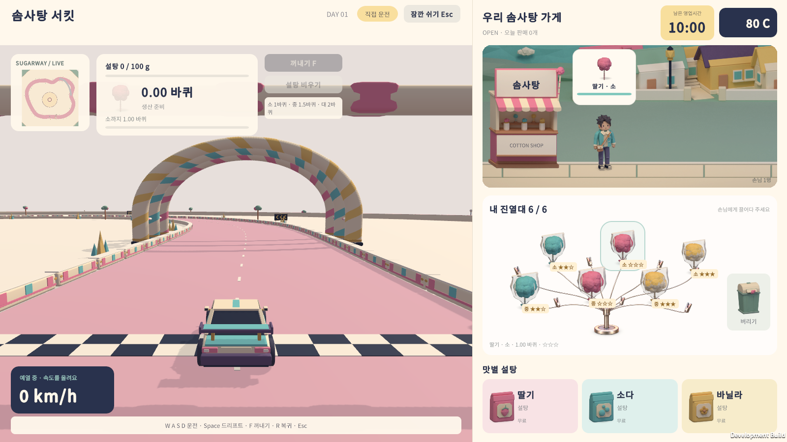
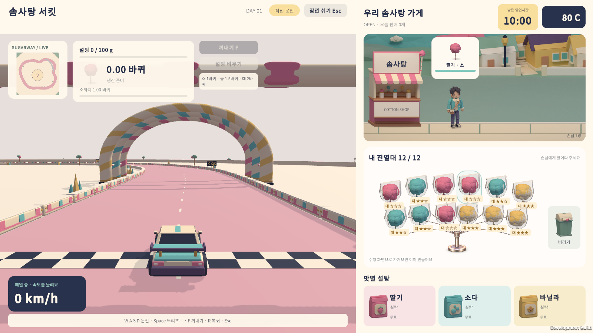

# 노점형 솜사탕 진열대 · 2026-09-28

사용자가 제공한 노점 사진의 중앙 금속 기둥과 부채꼴 꽂이 구성을 UI Toolkit 진열대에 반영했다. 격자 카드 대신 각각의 봉지 솜사탕이 꽂이에 놓이며, 빈 위치에는 카드나 잠금 표시가 없다.

## 구현

- `Business.uxml`의 기존 12개 제품 요소와 제품 ID 연결을 유지한다. 수용량에 따른 6·9·12개 배치는 `Business.uss`에 저장하며 UI Builder에서 편집할 수 있다.
- 금속 받침은 투명 배경 PNG 에셋이다. C#으로 선이나 메시를 그리지 않는다. 생성 출처와 프롬프트는 `Assets/CottonCircuit/UI/Art/CottonCandyFanStand.md`에 기록했다.
- 제품 이미지는 기존 9종 봉지 솜사탕을 재사용한다. 등급과 미완성 태그, 선택 표시, 튜토리얼 강조를 유지한다.
- 빈 꽂이와 장식은 포인터를 가로채지 않는다. 드래그 중 원래 제품 이미지는 숨기고 손에 든 이미지 하나만 표시한다. 취소하면 원래 위치로 돌아오며, 이웃 제품이 제거되어도 제품 ID와 꽂이 위치는 유지된다.
- 진열대 높이를 확보하려고 위쪽 거리 영역을 20px 줄였다. 쓰레기통은 진열대 오른쪽 아래에 배치했다.

## 검증

개발 빌드에서 실제 UI Toolkit 패널의 hit testing과 포인터 이벤트를 사용했다. 운영체제 마우스를 조작한 검사는 아니다. 실행마다 별도 저장 폴더를 사용한다.

| 검사 | 결과 | 기록 |
|---|---|---|
| 진열대 · 1600×900 | 849 통과 / 0 실패 | `Logs/Rack-1600/result.txt` |
| 진열대 · 1280×720 | 849 통과 / 0 실패 | `Logs/Rack-1280/result.txt` |
| 전체 게임 흐름 · 1600×900 | 445 통과 / 0 실패 | `Logs/Rack-full-flow/result.txt` |
| Unity 개발 빌드 | 성공 · 종료 코드 0 | `Logs/rack-development-build.log` |
| Windows 배포 빌드 | 성공 · 종료 코드 0 | `Logs/rack-release-build.log` |

배포 파일: `Builds/Tutorial-Release/CottonCircuit.exe`. Unity 6000.5.3f1로 2026-09-27 18:14:42 UTC(한국 시간 2026-09-28 03:14:42)에 빌드했다. 같은 폴더의 데이터와 DLL을 함께 사용한다. 빌드 기록은 `Builds/Tutorial-Release/build-info.json`에 있다.

진열대 검사는 빈 상태, 가득 찬 6·9·12개, 일부가 제거된 상태, 9종 이미지, 제품별 중앙과 네 지점의 클릭 가능 여부, 드래그 취소·쓰레기통·이어 만들기, 드래그 중 이웃 제품 제거를 포함한다. 전체 흐름 검사는 실제 손님 전달, 튜토리얼, 타이틀 복귀·이어하기, 성장 안내, 알바 동작을 포함한다.

최초 드래그 시각 검사 실패는 스크린샷 캡처 직후 한 프레임만 기다려 UITK 스타일 갱신 전에 값을 읽은 검사 타이밍 문제였다. 두 프레임 경계 뒤에 동일한 조건을 검사하도록 수정했으며, 첫 프레임의 `opacity=1/ghost=false`가 다음 프레임에 `opacity=0/ghost=true`로 바뀌는 로그로 원인을 확인했다. 제품 동작 코드는 이 문제 때문에 변경하지 않았다.

1600×900의 빈 상태·6개·12개·부분 진열과 1280×720의 12개 진열 캡처를 직접 확인했다. 제품과 태그, 금속 받침, 쓰레기통이 진열대 안에 표시되고 아래 설탕 영역을 가리지 않는다.

## 실제 화면

