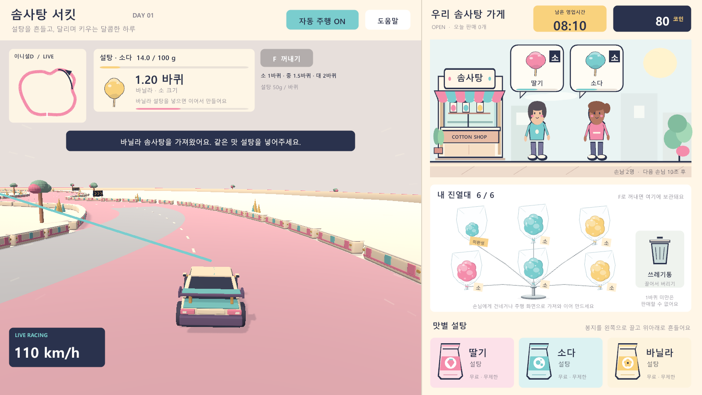
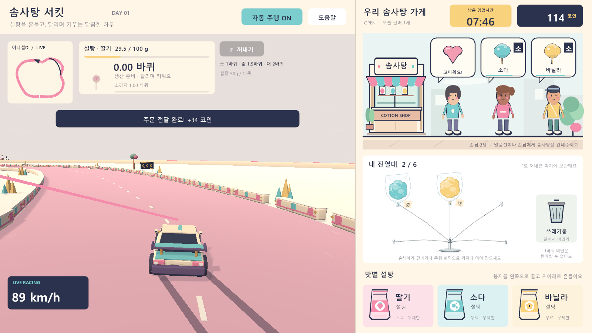
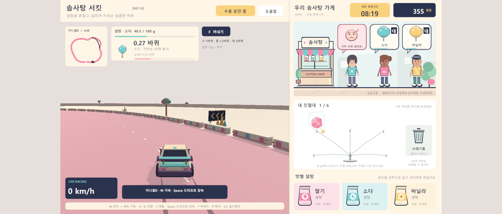

# 솜사탕 재제작·손님 감정 검증

2026-09-23. 실행 파일: `Builds/CandyResume/CottonCircuit.exe`. 영업 플레이어 2,872개와 기존 모드 623개 검사가 통과했다. 배포 빌드 확인은 아래에 기록한다.

## 최종 동작

- 크기는 소 / 중 / 대로 표시한다. 제작 기준은 기존과 같은 1 / 1.5 / 2바퀴다.
- 진열대 솜사탕을 주행 화면에 놓으면 제작을 이어 간다. 제작 중인 솜사탕이 있으면 선택한 제품의 진열 칸으로 옮기고, 선택한 제품을 제작 위치에 넣는다. 진열대가 가득 차 있어도 교환할 수 있고 소보다 작은 제품도 다시 제작할 수 있다.
- 교환과 재추출은 제품 ID, 거리, 맛, 품질을 보존한다. 교환으로 돈을 지급하거나 제품을 추가 생성하지 않는다.
- 투입되어 있던 설탕은 교환 시 그대로 남는다. 재제작할 솜사탕과 맛이 다르면 생산과 품질 변화가 멈춘다. 같은 맛의 설탕을 명시적으로 흔들어 넣으면 기존 맛 교체 규칙에 따라 설탕이 바뀌고 생산을 이어 간다.
- 첫 손님은 즉시 등장하고 이후 도착 간격은 **60초**다. 손님마다 **90초**를 기다린다. 최대 세 자리를 유지하며 자리가 가득 차면 다음 도착 타이머를 멈춰 둔다. 손님이 떠나도 이미 진행 중인 도착 타이머를 초기화하지 않는다.
- 정확한 주문은 한 번만 결제하고 하트를 **1.5초** 표시한 뒤 떠난다. 잘못된 주문은 판매 가능한 제품 하나를 소비하고 돈을 지급하지 않으며 화난 표정을 **1.5초** 표시한다. 시간 초과도 화난 표정을 **1.5초** 표시하지만 재고를 소비하지 않는다. 반응 중인 손님에게는 다시 납품할 수 없다.
- 대기 게이지가 남은 시간을 표시한다. 일시 정지는 제작·도착·대기·감정 타이머를 모두 멈춘다. 영업 종료 시 손님은 비우고 재고·제작 중 제품·설탕은 보존한다.

## 저장 이전

새 저장 형식은 V6이며 V1–V5를 읽는다. V4의 한 손님은 0번 자리로 옮긴다. V4/V5의 기존 2초 도착 타이머는 남은 비율을 유지해 60초 기준으로 확대한다. 예를 들어 0.5초가 남았으면 15초로 바뀐다. 예전 저장에서 세 자리가 가득 차 있던 경우 다음 60초를 보류한다.

이전 대기 손님은 90초를 새로 받으며, 이미 화난 손님의 반응 잔여 시간은 유지한다. 돈·재고·손님 ID·제작 거리와 품질은 보존한다. 이전 형식의 시간 범위와 상태 일관성을 먼저 검사한 뒤 변환하므로 잘못된 옛 타이머를 정상 저장으로 바꾸지 않는다.

V6는 의도적인 설탕/제품 맛 불일치를 허용하고 재제작 ID를 보존한다. 같은 ID가 제작 중 제품과 진열대에 동시에 존재하는 저장은 거부한다. 이미 결제된 하트 손님과 이미 놓친 시간 초과 손님은 미처리 주문 수에서 중복 계산하지 않는다.

## 확보한 검증 근거

| 검사 | 확인된 결과 | 근거 |
|---|---|---|
| 영업 모델 | 36 통과, 0 실패 | `Logs/shop-shift-tests.txt` |
| 생산·경제 모델 | 22 통과, 0 실패 | `Logs/core-tests.txt` |
| 주행 모델 | 33 통과, 0 실패 | `Logs/driving-tests.txt` |
| 주문 모델 | 14 통과, 0 실패 | `Logs/order-tests.txt` |
| 저장 순수 검증 | 58 통과 | `Logs/candy-resume-core-report.md`; Mono 실행, JsonUtility는 예외를 던지는 stub |
| Unity 에디터 통합 | 55 통과 | `Logs/candy-resume-development-build.log` |
| 실제 Unity 저장 검사 | 107 통과, 영업 플레이어 수에 포함 | `ShopShiftSaveChecks.Run`; 최종 로그의 전체 2,872개 중 개별 로그 2,765개를 제외한 수 |
| 기존 모드 플레이어 | 623 통과 | `Logs/Smoke-resume-legacy/result.txt` |
| 독립 코드 검토 | 미해결 지적 없음 | `Logs/candy-resume-final-review.md` |
| 최종 영업 플레이어 | 2,872 통과, 진열대 통합 검사 포함 | `Logs/Smoke-candy-resume-release-check/result.txt` 및 `player.log` |
| Release 빌드 | 종료 코드 0, Release 영수증, 테스트 코드 제외 확인 | `Builds/CandyResume/build-info.json`, `Logs/candy-resume-release-build.log`; `Assembly-CSharp.dll`에 재제작·감정 기능 포함, RuntimeSmoke/ShopShiftSaveChecks/RuntimeCapture/CandyRackRuntimeSmoke 제외 |
| 최종 화면 검토 | 재제작·하트·화남 및 16:9/4:3/와이드 배치 확인 | 아래 캡처 및 `Logs/Smoke-candy-resume-release-check/*.png` |

실제 Unity 저장 검사는 재제작 ID·품질·맛이 다른 설탕의 재로드, 하트와 시간 초과 반응, 기존 화난 반응, V4/V5 이전, V1–V3 호환, 잘못된 저장 거부를 포함한다. 시간 초과 직전·직후와 검사 손님 추가 후에도 저장 유효성을 확인했다.

최초 입력 검사에서는 새로 활성화한 드롭 영역의 native Graphic depth가 숨겨진 플레이어에서 렌더 전까지 -1이었다. 실제 Canvas 렌더 후 HUD 위와 주행 화면 가운데의 EventSystem raycast가 모두 통과했다. 프로덕션 UI의 드롭 영역에는 raycast를 켰고 제품을 끌 때만 활성화한다. 검사 전용 손님의 ID도 실제 발급 규칙인 `shop-N`으로 맞춰 저장 경고가 사라짐을 확인했다.

## 검사 범위와 제한

모델 검사는 작은 tick과 긴 tick의 동등성, 동시에 도래하는 반응/도착 경계, 가득 찬 진열대 교환, 반복 납품 및 재제작 거부, 일시 정지/마감, 설탕 불일치 보존을 확인한다. 추가 임시 검사는 6,000개 연속 타이머 상태의 저장 유효성을 확인했다.

플레이어 입력 검사는 실제 Unity EventSystem raycast 결과와 drag/drop handler를 사용한다. 테스트가 PointerEventData와 이벤트 호출을 생성하므로 물리 마우스나 운영체제 입력 주입으로 플레이한 결과는 아니다. 카메라와 Canvas가 그린 결과를 캡처하며 게임 주행 모델에서 발생한 전진 거리로 생산을 검증한다. 1600×900, 1280×720, 1280×960, 1920×820의 화면 내 배치와 축척을 검사했다. 60초 도착/90초 대기에서 자연 흐름은 보통 1~2명이며, 세 자리의 독립 전달 검사는 별도 손님 데이터로 구성했다.

## 화면

