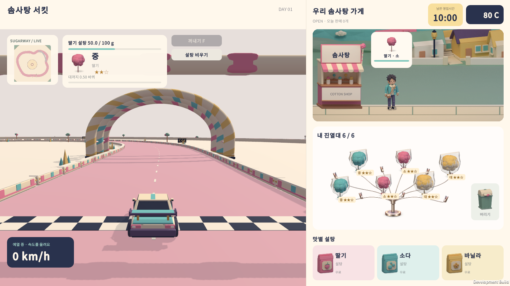
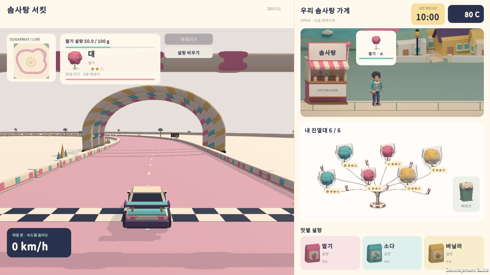

# 영업 HUD 정리 · 2026-09-28

사용자가 X로 표시한 직접 운전 상태 배지, 일시정지 버튼, 크기별 바퀴 안내 카드, 손님 수, 진열대 상단 전달 안내, 진열대 하단 상세 안내, 주행 키 안내 줄을 삭제했다. UI Toolkit 문서와 USS에서 요소를 제거하고 해당 C# 이벤트·텍스트 연결도 정리했다.

제작 패널의 큰 바퀴 수 표시는 `미완성 → 소 → 중 → 대` 단계 표시로 바뀌었다. 실제 `BatchMeters`의 크기 판정을 재사용하고 초과로 감긴 `BatchOverflowMeters`는 단계에 합산하지 않는다. 작은 보조 줄에는 맛과 판매 불가 여부를 표시하며, 아래쪽 다음 단계까지 남은 바퀴·완성 안내와 진행률은 유지했다.

Esc 키의 일시정지 진입과 기존 메뉴의 계속하기·타이틀 복귀는 유지한다. 설탕 비우기와 꺼내기 버튼도 유지한다.

검증 도구: `Tools/verify-uitk.ps1 -Case hud`. 영업 UI에서 0 / 0.5 / 0.999 / 1 / 1.499 / 1.5 / 1.999 / 2 / 2.5바퀴의 단계 및 다음 단계 안내를 확인한다. 첫 기계에서 소 크기로 제한된 상태에 초과 감기 2바퀴를 추가해도 `소`로 표시되는지 확인한다. 일시정지는 Esc가 호출하는 컨트롤러 메서드로 진입하고 계속하기 버튼은 실제 UI Toolkit 포인터 이벤트로 누른다. 운영체제 키 입력 자동화는 하지 않으며 별도 임시 저장 폴더를 사용한다.

| 검사 | 결과 | 기록 |
|---|---|---|
| HUD · 1600×900 | 82 통과 / 0 실패 | `Logs/HUD-1600/result.txt` |
| HUD · 1280×720 | 82 통과 / 0 실패 | `Logs/HUD-1280/result.txt` |
| 전체 게임 흐름 · 1600×900 | 440 통과 / 0 실패 | `Logs/HUD-full-flow/result.txt` |
| Unity 개발 빌드 | 성공 · 종료 코드 0 | `Logs/hud-development-build.log` |
| Windows 배포 빌드 | 성공 · 종료 코드 0 | `Logs/hud-release-build.log` |

갱신된 배포 파일은 `Builds/Tutorial-Release/CottonCircuit.exe`다. Unity 6000.5.3f1로 2026-09-27 18:55:35 UTC(한국 시간 2026-09-28 03:55:35)에 빌드했다. 같은 폴더의 데이터와 DLL을 함께 사용한다.

전체 흐름은 판매·튜토리얼·성장 안내·타이틀 복귀·이어하기·알바 동작을 포함한다. 제거한 일시정지 버튼의 클릭 검사 5개가 빠져 이전 445개에서 440개로 바뀌었다. 단계별 캡처와 축소 해상도 화면을 직접 확인했다.

