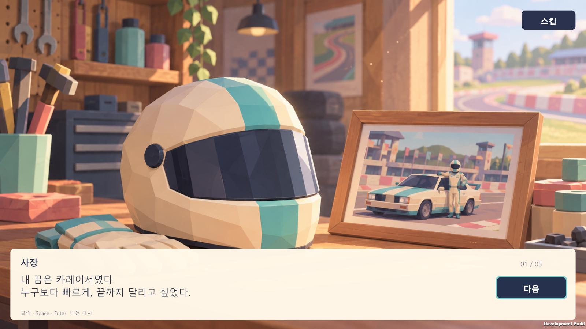
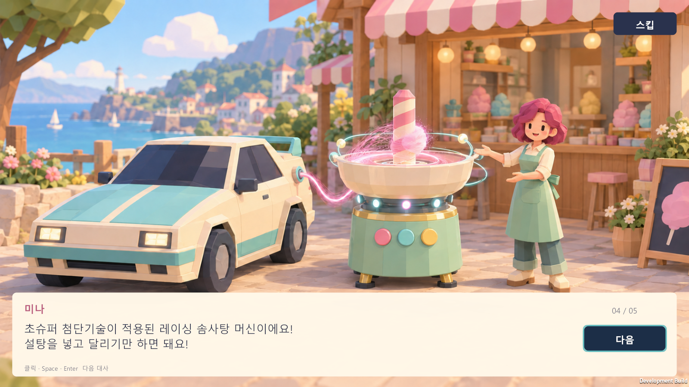
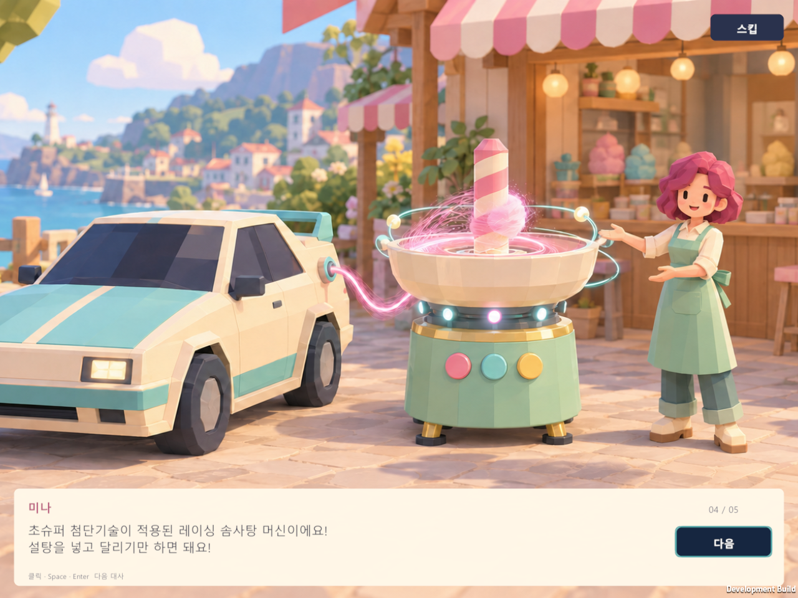
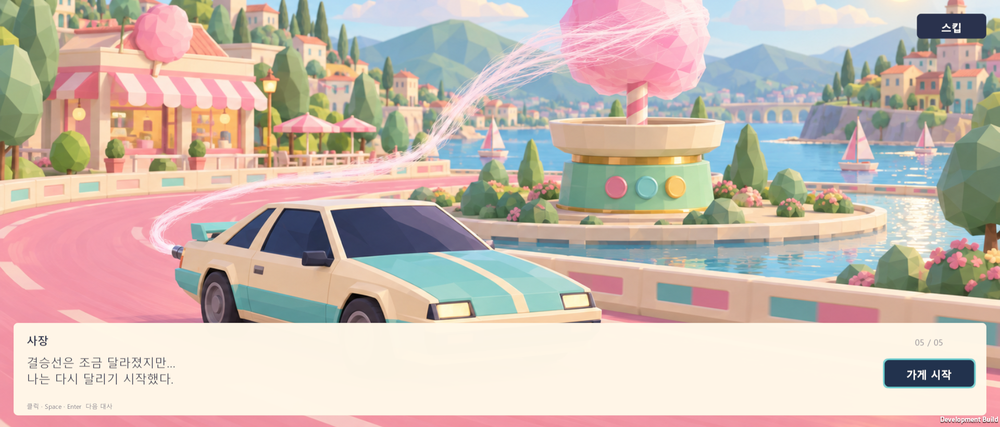

# 새 게임 오프닝 스토리

2026-09-27 · Unity 6000.5.3f1 · Windows

현재 실행 파일: `Builds/Tutorial-Release/CottonCircuit.exe` (같은 폴더의 Data와 DLL 필요).

스토리 완료·스킵 이후에는 첫 솜사탕 판매 튜토리얼로 이어지도록 확장했다. 아래 검증 수치와 캡처는 오프닝을 처음 연결한 `Builds/IntroStory` 시점의 기록이며, 당시에는 첫날 준비 화면으로 바로 이동했다. 현재 스토리 → 튜토리얼 연결, 별도 튜토리얼 스킵·이어하기, 첫날 정산 이후 한 번만 나오는 성장 문구의 검증은 [튜토리얼 검증 기록](tutorial-verification.md)에 정리한다.

## 동작

- 저장이 없을 때 **게임 시작**, 저장이 있을 때 **새 게임 → 새로 시작**에서 재생한다. **이어하기**는 바로 기존 게임으로 연결한다.
- 5장 이미지에 6개 대사를 표시한다. 4번째 장면은 미나의 설명과 사장의 반응으로 나누며, 인물 크기를 수정한 `Intro_04_Machine_v2.png`를 사용한다.
- 그림·대사창 클릭, **다음**, Space 또는 Enter로 넘긴다. 키보드는 선택한 버튼의 Submit 동작을 사용하며 화살표로 다음과 스킵을 선택할 수 있다.
- 오른쪽 위 **스킵**은 어느 페이지에서나 스토리를 끝내고 첫 판매 튜토리얼로 이동한다. 마지막 페이지의 **가게 시작**도 같은 튜토리얼로 연결된다. 튜토리얼 화면에는 독립적인 **튜토리얼 스킵** 버튼이 있다.
- 자동 넘김 없이 읽는 속도에 맞춰 진행한다. 장면 번호는 `01 / 05`부터 `05 / 05`까지 표시한다.
- 스토리 동안 세션·영업 시간·저장 쓰기를 시작하지 않는다. 완료 또는 스킵할 때 기존 저장을 한 번 보관한 뒤 새 게임을 만든다. 스토리를 보는 중 종료하면 기존 파일을 유지한다.
- 배경은 원본 비율을 유지하며 화면을 채운다. 화면 비율에 따라 가장자리 일부가 잘릴 수 있으며 대사와 버튼은 별도 Canvas 좌표를 사용한다.

`IntroStoryUI.cs`가 재생과 입력을 담당하며 `TitleScreenUI.cs`가 새 게임/이어하기와 저장 보관을 연결한다. `GameAssets.IntroScenes`는 `SpriteCatalog`에서 다섯 원본을 참조한다. 기존 직접 `Initialize` 호출과 게임 안의 **새 가게 시작** 흐름은 유지한다.

## 검증

오프닝 초기 구현의 개발 플레이어 `Builds/IntroStory/CottonCircuit.exe`로 아래 시나리오를 실행했다. 모든 실행은 GUID가 다른 별도 저장 폴더를 사용하며 사용자 저장을 읽거나 변경하지 않는다. 표의 첫날 진입 검사는 튜토리얼 추가 전의 준비 화면 진입을 뜻한다.

| 시나리오 | 해상도 | 검사 수 | 결과 폴더 |
|---|---:|---:|---|
| 첫 시작 → 대사 전체 → 첫날 | 1600×900 | 356 | `Logs/IntroStory-final-fresh` |
| 새 게임 확인·취소 → 대사 전체 → 보관·첫날 | 1280×960 | 407 | `Logs/IntroStory-final-reset` |
| 이어하기, 기존 돈·날짜 유지 | 1280×720 | 95 | `Logs/IntroStory-final-saved` |
| 손상된 저장 이어하기·쓰기 보호 | 1920×820 | 94 | `Logs/IntroStory-final-corrupt` |
| 첫 대사에서 스킵 | 1600×900 | 119 | `Logs/IntroStory-skip-0` |
| 두 번째 대사에서 스킵 | 1280×720 | 166 | `Logs/IntroStory-skip-1` |
| 세 번째 대사에서 스킵 | 1920×820 | 213 | `Logs/IntroStory-skip-2` |
| 네 번째 대사에서 새 게임 스킵 | 1600×900 | 313 | `Logs/IntroStory-skip-3` |
| 다섯 번째 대사에서 새 게임 스킵 | 1280×960 | 359 | `Logs/IntroStory-skip-4` |
| 마지막 대사에서 새 게임 스킵 | 1920×820 | 407 | `Logs/IntroStory-skip-5` |

타이틀·스토리 **2,529개**, 기존 성장·영업 스모크 **434개**, 저장 회귀 **20개**, 에디터 통합 **102개**가 통과했다. Development와 Release 빌드 모두 성공했다.

검사 내용: 승인 이미지 순서와 수정본 연결, 대사·화자·장면 번호, 글자 높이와 화면 경계, 스킵의 오른쪽 위 위치, 실제 EventSystem 레이캐스트·Submit·키보드 이동, 포커스 복원, 같은 프레임 중복 입력 방지, 세션 생성 지연, 기존 저장 바이트 유지와 한 번만 보관되는지 확인한다. 네 해상도의 실제 캡처도 확인했다. Space/Enter는 기존 InputManager의 Submit 매핑을 사용하며 자동 입력 검사는 EventSystem Submit을 호출한다.

검증 도구는 Windows 숨김 실행에서 초기 해상도가 목표와 같을 때 검은 프레임이 저장되는 조건을 피하도록, 목표보다 16px 넓게 시작한 뒤 목표 해상도로 변경한다. 각 캡처의 해상도와 실제 렌더된 픽셀도 검사한다. 게임 화면의 구현에는 이 조정이 들어가지 않는다.

구현 전 `Logs/IntroStory-red/result.txt`에서 새 게임 후 스토리 Canvas가 없다는 실패를 확인했다. 저장 보관 실패 시 타이틀 복귀는 코드 검토로 확인했으며 파일 권한 오류를 강제로 유발하는 실행 검사는 하지 않았다.

## 오프닝 초기 검증 명령

아래 경로는 당시 사용한 빌드 이름이다. 현재 소스로 다시 빌드하면 새 게임 스토리 뒤에 튜토리얼이 시작되며, 최신 실행 결과와 명령은 [튜토리얼 검증 기록](tutorial-verification.md)을 따른다.

```powershell
./Tools/build.ps1 -BuildFolder Builds/IntroStory
./Tools/verify-title.ps1 -BuildFolder Builds/IntroStory -Case fresh -OutputFolder Logs/IntroFresh -Width 1600 -Height 900
./Tools/verify-title.ps1 -BuildFolder Builds/IntroStory -Case reset -OutputFolder Logs/IntroReset -Width 1280 -Height 960
./Tools/verify-title.ps1 -BuildFolder Builds/IntroStory -Case saved -OutputFolder Logs/IntroContinue -Width 1280 -Height 720
./Tools/verify-title.ps1 -BuildFolder Builds/IntroStory -Case corrupt -OutputFolder Logs/IntroCorrupt -Width 1920 -Height 820
./Tools/verify-title.ps1 -BuildFolder Builds/IntroStory -Case reset -OutputFolder Logs/IntroSkip -IntroSkipAt 3
./Tools/verify-progression.ps1 -BuildFolder Builds/IntroStory -OutputFolder Logs/IntroProgression
./Tools/test-progression-save.ps1
./Tools/build.ps1 -Release -BuildFolder Builds/IntroStory-Release
```

`IntroSkipAt`은 0부터 5까지이며 생략하면 모든 대사를 읽는다. 아래는 개발 빌드의 원본 캡처다.








