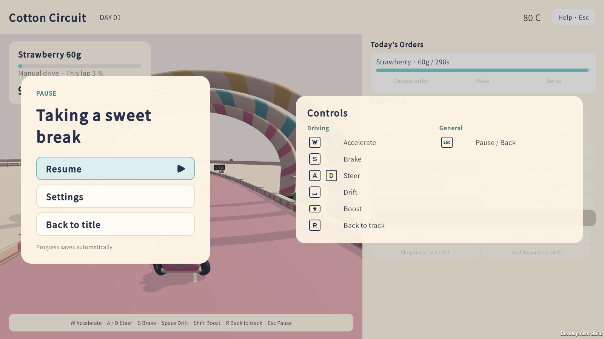

# 영어 커버리지 검사와 릴리스 검증

2026-09-29, Unity 6000.5.3f1 Windows. 브랜치 `claude/localization-settings`. Task 11(기준 커밋 `a0d4283`)에서 처음 기록했고, 브랜치 전체 리뷰 뒤 최종 수정(기준 커밋 `7ff2c20`)에서 넘침 예외·실행 기록·검사 목록을 다시 맞췄다.

## 최종 리뷰 수정에서 바뀐 것

| 번호 | 내용 | 새 검사 |
|---|---|---|
| 1 | 영업 준비 화면의 데이터 지문(`PreparationDataFingerprint`)에 `Strings.Version`을 넣었다. 일시정지 설정창에서 언어를 바꾸면 특성·장비·장소 문구도 새 언어로 다시 그린다. | `settings`: 영업 준비 위에서 언어를 바꾼 뒤 `PreparationTraitCount`, `PreparationMachineName_0`, 바인딩된 `pause.title`이 새 언어인지 보고, 바꾼 화면을 `settings-pause-switched.png`로 캡처(영어로 바뀌면 한글 누출 검사도 적용)한 뒤 되돌려 다시 본다. 지문 줄을 뺀 임시 빌드에서는 이 검사가 실패했다. |
| 2 | 넘침 검사의 측정 방법을 고치고 예외를 한 개만 남겼다. | 아래 "넘침 검사"와 "기존 한국어 넘침" 참고. |
| 3 | 설정창이 마지막으로 초점을 가진 행을 기억해, 카드 빈 곳이나 어두운 바깥을 눌러 초점이 사라지면 그 행에 초점을 돌려준다. 행 안의 화살표·음소거·슬라이더는 원래도 누르면 그 행에 초점을 줬다. | `settings`: 언어 화살표, 슬라이더 누르기, 음소거 버튼, 카드 빈 곳, 바깥 클릭 뒤 정확히 어느 행에 초점이 있는지 확인. 스모크의 `Key()`는 초점이 없으면 실제 입력처럼 패널 루트로 보낸다. 가드를 빼고 돌리면 카드 빈 곳 클릭 뒤 초점이 없어 실패했다. |
| 4 | 슬라이더를 끄는 동안은 값만 바로 적용하고 `settings.json`은 손을 뗄 때(`PointerCaptureOutEvent`), 키보드로 값을 바꿀 때, 창을 닫을 때 쓴다(`SettingsStore.Apply(change, persist: false)`, `SettingsStore.Save()`). | `settings`: 슬라이더 값을 바꾼 직후 파일은 그대로, 음악 슬라이더 트랙을 눌렀다 떼면 파일에 새 값. |
| 5 | Tab·Shift+Tab(`Next`/`Previous`)은 값을 바꾸지 않고 ↓·↑처럼 행만 옮긴다. | `settings`: Tab, Shift+Tab 뒤 초점 행과 음량. |
| 6 | 없는 키를 처음 요청하면 `Strings.MissingKey`가 한 번 알리고, `Localization`이 개발 빌드·에디터에서 `Debug.LogWarning`으로 남긴다. | Core 테스트: 키마다 한 번만 알림. 열두 번의 스모크 로그에 경고 없음. |
| 7 | `Strings.Validate`가 `string.Format`이 거부하는 값(짝 없는 중괄호)도 찾는다. | Core 테스트: 중괄호가 남은 값은 문제 1건, `{{…}}`는 문제 없음. |
| 8 | `Art/UI/kenney_input-prompts_1.5.zip`을 다른 Kenney 압축 파일처럼 커밋했다. | — |
| 9 | 일시정지 조작 안내에 `공통`(`pause.common`, `General`) 묶음을 따로 두고 `Esc`를 옮겼다. 가게 묶음 아래 같은 라벨 열에 있고 모든 모드에서 보인다. 이전 모드는 가게 묶음 전체를 숨긴다. | `full`: 영업 일시정지에서 가게·공통 묶음이 보임. `full`·`legacy`: 이전 모드 일시정지(`11-legacy-pause.png`)에서 공통 묶음만 보이고 가게 제목이 없음. |
| 10 | 영어 문구 네 곳: `tutorial.step3.cue`, `trait.stick_quality.desc`/`trait.quality_focus.desc`(`%p` → `pts`), `notice.drift.kart`, `business.grade`(`Grade {0} sugar`). 한국어는 그대로다. | — |
| 11 | 설계 문서의 키캡 가져오기 설정과 검사 위치 설명을 실제와 맞췄다(아래 3절). | — |
| 12 | 쓰지 않는 `Strings.Keys`를 지우고 `GameSettings.Clamp`를 `if`로 풀어 썼다(동작 같음). | Core 테스트: ±무한대가 1과 0으로 제한됨. |

## 변경

### 1. 모든 캡처에 영어/문구 넘침 검사 추가

`ToolkitRuntimeSmoke.Capture(name)`가 스크린샷을 찍기 직전에 `CheckVisibleText(name)`을 부른다. 모든 `UIDocument`의 화면에 보이는 `TextElement`를 모두 훑어서 다음을 확인한다.

- 영어일 때 한글이 남아 있으면 실패.
- `MeasureTextSize`로 잰 글자 크기가 요소 내용 상자를 넘으면 실패. 줄바꿈 라벨(`white-space: normal`, `pre-wrap`)은 내용 폭 + 1.5px에서 잰 높이만, 줄바꿈하지 않는 라벨은 폭과 높이를 1.5px 여유로 비교한다. 이름이 `OverflowExempt`에 있는 요소는 제외한다.
- `Strings.Missing`에 키가 남아 있으면 실패.

이 검사는 `full`·`legacy`·`rack`·`hud`·`music`·`settings` 여섯 케이스가 찍는 모든 캡처(한 언어에 50곳, 해상도 스윕 포함 — 두 언어 합쳐 100번)에 자동으로 적용된다. 새 `06-closing-receipt.png` 캡처(영업 마감 직후, `businessNextDay`를 누르기 전)도 `full` 케이스에 추가해 `business.result.*` 영수증 카드를 커버했다.

### 2. 폭 처리 항목(컨트롤러가 넘긴 6가지)

1. **공백 붕괴** — `title.eyebrow`, `title.footer`, `Preparation.uxml`의 정적 `prep-eyebrow` 텍스트("C O T T O N   C I R C U I T")는 모두 `white-space: normal`(Shared.uss의 전역 `Label` 규칙)을 물려받는 라벨인데, 실제 UI Toolkit 렌더링에서는 이 세 요소의 공백이 (한 칸이든 여러 칸이든) 전부 사라져 "COTTONCIRCUIT", "SWEETRACINGSHOP", "↑ ↓ 메뉴 선택 Enter 선택"처럼 붙어 나왔다(수정 전 `01-title.png` 캡처로 확인). U+00A0(NBSP)로 바꾸니 렌더링에서 살아남아 의도한 간격이 그대로 나왔다 — 한국어·영어 모두, `· ` 대체 없이 해결됨. `title.eyebrow`/`title.footer`는 `strings.tsv`의 두 언어 칸 모두, `prep-eyebrow`는 UXML의 정적 텍스트(언어 공용이라 표에 없음)를 고쳤다. 한국어 문구 자체는 바꾸지 않았다.
2. **일시정지 조작 안내 정렬** — `.pause-keys`(글자 키 1개 또는 A/D 2개를 담는 줄)가 자동 폭이라 1키 줄(44px)과 2키 줄(88px)의 라벨 시작 위치가 달랐다. `.pause-keys { width: 88px; }`로 고정해(가장 넓은 A/D 그룹 기준) 모든 줄의 라벨이 한 열로 맞춰지도록 했다. 마지막 키의 자체 여백(4px) + `.pause-keys`의 `margin-right`(8px) = 12px 간격은 그대로다. 최종 수정에서 새로 생긴 `공통` 묶음의 `Esc` 줄도 같은 규칙을 쓰므로 가게 묶음과 같은 열에 맞는다.
3. **`pause.sugar` 한글 줄바꿈** — 1280×720에서 "설탕 봉지를 주행 화면으로 끌어 흔들 / 기"처럼 "흔들기" 한 단어 중간이 잘렸다. 한국어 값에 공백 위치(화면으로 / 끌어) 그대로 `\n`을 넣어 "설탕 봉지를 주행 화면으로\n끌어 흔들기"로 고쳤다. 영어 값은 문장이라 그대로 두고 자동 줄바꿈에 맡겼다. 1280×720·1600×900·1920×820(설정 케이스의 해상도 스윕)에서 한국어·영어 모두 캡처로 확인했다 — 단어 중간에서 끊기지 않고 두 줄 안에 들어간다.
4. **구현자 영문 톤 점검** — `tutorial.*`, `notice.*`, `prep.*`, `trait.*`, `effect.*`, `machine.*`, `location.*` 영어 칸(약 210행)을 전부 다시 읽었다. 이때 고친 곳은 `tutorial.guide.pick`: `"① Press and hold here"` → `"① Press and hold"`. `.tutorial-guide-label`이 `white-space: nowrap`이라 실제로 잘리지는 않지만 마커 폭(209px)보다 넓어(221px) 옆으로 삐져나왔다(오배송 방지를 위한 실제 캡처로 확인). 다른 안내 문구(`② Drag to the track`, `③ Shake up and down`)와 같은 짧은 동사구 톤으로 맞추면서 폭도 해결했다. 최종 리뷰에서 네 곳을 더 다듬었다(위 표 10번). 한국어·키는 그대로다.
5. **`Legacy.uxml` 미리보기 언어 통일** — `Legacy.uxml`의 바인딩된 요소(예: `business.title`, `legacy.pause`, 주문·재고·크기·맛·차량 버튼, 조작 안내, 결과 화면) 전부가 영어 미리보기 텍스트("Cotton Circuit", "Help · Esc", "Choose order" 등)를 쓰고 있었다. `Title.uxml`·`Preparation.uxml`·`Game.uxml`은 바인딩된 요소에 한국어 미리보기를 쓴다(예: `title.new`의 `text="새 게임"`). `Legacy.uxml`의 18개 바인딩 요소 전부를 해당 키의 한국어 값으로 바꿔 통일했다. `legacyMakeStock`처럼 C#이 직접 쓰는(바인딩 없는) 요소는 룰링 R1대로 영어 미리보기를 그대로 뒀다. `Business.uxml`의 `business.title`(`biz-title`)도 같은 방식(영어 미리보기)을 쓰고 있었지만 이번 항목이 지목한 대상이 아니라 손대지 않았다.
6. **영업 마감 영수증과 알림 토스트** — `business.result.*` 영수증 카드는 "1. 모든 캡처에..." 절에 적은 새 `06-closing-receipt.png`로 실제 커버했다(새 검사도 통과). 알림 토스트(`notice.nextday.legacy`, `notice.lap.done.waiting`)는 캡처를 추가하지 못했다: 전자는 레거시(비연속·비진행형) 영업일을 실제로 마감하고 `StartNextDay()`까지 불러야 하는데 지금 `Legacy.uxml`에는 스모크가 누를 수 있는 "다음 날" 버튼이 없고, 후자는 연속 모드에서 진열대가 가득 찬 채로 한 바퀴 생산을 완주해야 해 둘 다 "적은 코드로" 재현할 수 있는 범위를 넘는다. 대신 `Game.uss`의 CSS로 넘침 가능성을 따졌다: `.notice-toast { position: absolute; left: 400px; right: 400px; bottom: 27px; ...; -unity-text-align: middle-center; font-size: 17px; }` — 높이가 고정이 아니라(`height` 없음) 줄바꿈된 내용만큼 위로 자라고, 폭은 뷰포트에 따라 `뷰포트 폭 − 800px`로 정해진다(1280px 폭이면 480px, 1600px 기본 해상도면 800px, 1920px면 1120px). 두 알림 중 가장 긴 영어 문구는 `notice.nextday.legacy`("New business day! Cleared the shelf, sugar, and candy in progress — new customers are here.", 91자)이고 `notice.lap.done.waiting`("Lap done! Candy stored · Reward +{0} coins · Shelf is full, production is waiting.", 자리표시자 포함 82자)이 그 다음이다. 둘 다 `·`나 쉼표로 자연스럽게 끊기는 짧은 단어들의 나열이라 가장 좁은 480px에서도 단어 중간이 아니라 단어 경계에서 여러 줄로 접히고, 높이가 고정이 아니므로 잘리지 않는다. 같은 `.notice-toast`/`NoticeText` 메커니즘은 스모크가 실제로 띄우는 다른 알림(예: `pause.png`에 보이는 `notice.extract.none`)에서 이미 새 검사를 통과했다.

### 3. `docs/superpowers/specs/2026-09-29-localization-settings-pause-design.md` 갱신

"4. 검증"의 "에디터 통합 검사(`Editor/IntegrationChecks.cs`)" 절을 "정적 검사(`python Tools/check-localization.py`)" 절로 바꿨다. 문구 넘침 절도 실제로 구현한 범위(모든 케이스·모든 언어·모든 캡처, `Label`/`Button`뿐 아니라 모든 `TextElement`, 1.5px 여유)로 고쳤다.

Task 11 때는 "키캡 스프라이트 가져오기 설정 확인만 `IntegrationChecks.cs`에 남는다"고 적었지만 사실이 아니었다. `IntegrationChecks`의 스프라이트 수 검사는 `Assets/CottonCircuit/Sprites/`만 훑고, 새 키캡 이미지는 스프라이트도 아니다(`KeyF.png`처럼 기본 텍스처, 밉맵 켜짐, 알파 투명). 최종 수정에서 설계 문서를 "자동 검사는 없고, 아홉 개 `.meta`가 guid 말고는 `KeyF.png.meta`와 같다는 것을 파일 비교로 확인했다"로 고쳤다. 정적 검사기가 표의 형식(머리글·칸 수·중복 키)만 보고, 빈 칸·자리표시자·형식 문자열은 Core 테스트(`Strings.Validate`)가 본다는 점도 바로잡았다.

## 넘침 검사 — 측정 방법 수정

Task 11에서는 줄바꿈 라벨을 `MeasureTextSize(text, box.width, Exactly, ...)`, 즉 레이아웃이 정한 폭 그대로 다시 쟀다. 자동 폭/`flex-shrink` 라벨은 상자가 글자에 딱 맞게 잡히는데, 레이아웃이 폭을 픽셀 격자로 반올림하기 때문에 같은 폭에서 다시 재면 한 줄이 두 줄로 넘어가 높이가 넘친다고 잘못 판단했다(예: `PreparationDay` "DAY 01 / Prep"). 그래서 이 브랜치가 새로 만들거나 문구를 바꾼 요소 16개를 예외로 넣었었다: `PreparationDay`, `PreparationWallet`, `PreparationTraitCount`, `PrepLegendRequired`, `PrepLegendDone`, 그리고 일시정지 조작 안내의 `PauseAccelerateLabel`, `PauseBrakeLabel`, `PauseSteerLabel`, `PauseDriftLabel`, `PauseBoostLabel`, `PauseRecoverLabel`, `PauseSugarLabel`, `PauseDeliverLabel`, `PauseExtractLabel`, `PauseEmptyLabel`, `PauseEscapeLabel`.

최종 수정에서 줄바꿈 라벨을 비교할 때 쓰는 여유와 같은 값(`FitTolerance` = 1.5px)만큼 넓혀서 재도록 바꾸고, 줄바꿈 라벨은 높이만 비교한다(`Exactly` 모드는 넘겨 준 폭을 그대로 돌려주므로 폭 비교는 의미가 없다). `white-space: pre-wrap`도 줄바꿈 라벨로 본다. 이 16개를 예외에서 빼고 열두 번 모두 통과했다.

예외가 실제로 필요한지는 따로 확인했다. 예외 이름을 건너뛰는 대신 넘치면 로그만 남기는 임시 빌드(`Builds/Loc-Probe`, 커밋하지 않음)로 열두 번을 돌렸다(`Logs/Loc-probe-*`).

- `BusinessTitleEyebrow`: 40번 넘침. 글자 높이 37px, 상자 32px(두 언어 모두). 실제 넘침이다.
- `TraitDetailsBody`: 2번(`graph-hover.png`, 두 언어). 영어 297×82가 290×102 상자에, 한국어 309×82가 같은 상자에 들어가지 않는다고 나왔다. 이 라벨은 `white-space: pre-wrap`인데 검사가 `normal`만 줄바꿈으로 보고 한 줄로 재서 생긴 오판이다. 캡처에서는 상자 안에서 정상적으로 줄바꿈된다. 검사가 `pre-wrap`을 줄바꿈으로 보도록 고치자 예외 없이 통과했다.

## 기존 한국어 넘침 — 이 브랜치가 손대지 않은 레이아웃

이제 `OverflowExempt`에는 한 개만 남는다.

| 이름 | 위치 | 사유 |
|---|---|---|
| `BusinessTitleEyebrow` | `Business.uxml`의 `business.title`(`솜사탕 서킷` / `Cotton Circuit`) | `.biz-title-row`가 `height: 32px`로 고정인데 볼드 25px 글자는 37px가 필요하다. 이 CSS는 병합 기준 커밋(`e1c344a`)과 동일 — 이번 브랜치는 물론 로컬라이제이션 작업 전체가 손대지 않았다. 한국어 문구도 브랜치 이전과 같다. (`Legacy.uxml`의 같은 `business.title` 라벨은 `LegacyTitle`로 따로 이름을 붙였고 `.legacy-header`가 `height: 90px`라 예외 없이 통과한다.) |

예외 수는 18개(Task 11 기록은 16개라고 잘못 적었다)에서 1개로 줄었다.

## 검증

### 열두 번의 스모크 실행

`Tools/build.ps1 -BuildFolder Builds/Loc-Final`로 비어 있는 폴더에 개발 빌드를 새로 만든 뒤(141개 통합 검사 통과), 여섯 케이스 × 두 언어를 전부 돌렸다. 격리 저장 폴더는 실행마다 새 GUID를 쓴다.

| 케이스 | 언어 | 결과 | 통과 수 | 캡처 | 기록 |
|---|---|---|---:|---:|---|
| full | ko | PASSED | 928 | 25 | `Logs/Loc-fix-full-ko` |
| full | en | PASSED | 928 | 25 | `Logs/Loc-fix-full-en` |
| legacy | ko | PASSED | 33 | 3 | `Logs/Loc-fix-legacy-ko` |
| legacy | en | PASSED | 33 | 3 | `Logs/Loc-fix-legacy-en` |
| rack | ko | PASSED | 878 | 5 | `Logs/Loc-fix-rack-ko` |
| rack | en | PASSED | 878 | 5 | `Logs/Loc-fix-rack-en` |
| hud | ko | PASSED | 106 | 6 | `Logs/Loc-fix-hud-ko` |
| hud | en | PASSED | 106 | 6 | `Logs/Loc-fix-hud-en` |
| music | ko | PASSED | 18 | 0 | `Logs/Loc-fix-music-ko` |
| music | en | PASSED | 18 | 0 | `Logs/Loc-fix-music-en` |
| settings | ko | PASSED | 242 | 11 | `Logs/Loc-fix-settings-ko` |
| settings | en | PASSED | 242 | 11 | `Logs/Loc-fix-settings-en` |

각 언어 쌍의 통과 수가 같다. Task 11 기록(921, 27, 878, 106, 18, 184)과 비교하면 `full`은 +7(영업 일시정지의 묶음 검사 1개, 이전 모드 일시정지 검사 1개와 그 캡처 5개), `legacy`는 +6(이전 모드 일시정지 검사와 캡처), `settings`는 +58(Tab 이동, 초점 유지 6곳, 슬라이더 저장, 영업 준비 위 언어 전환 두 번과 그 캡처)이다. 모든 `player.log`에 예외·오류와 `Missing localization key` 경고가 없다.

### Core 테스트와 정적 검사

```powershell
powershell -ExecutionPolicy Bypass -File Tools/test-all.ps1
python Tools/check-localization.py
```

- `Tools/test-all.ps1`: 18개 스크립트 전부 PASS. `test-localization.ps1`은 20개 테스트(최종 수정에서 형식 문자열·누락 키 알림 2개 추가, 범위 제한 테스트에 ±무한대 추가).
- `python Tools/check-localization.py`: 프로젝트 전체 56개 파일, 0 problem.

### Release 빌드와 실행

```powershell
powershell -ExecutionPolicy Bypass -File Tools/build.ps1 -Release -BuildFolder Builds/Loc-Release
```

비운 폴더에 `Build ready: Builds\Loc-Release\CottonCircuit.exe`(`build-info.json`의 `configuration`이 `Release`). 다음으로 실행 파일을 직접 띄워 10초 뒤 종료했다. 사용자의 `Player.log`를 덮어쓰지 않도록 로그는 작업 폴더로 돌렸다.

```powershell
Builds\Loc-Release\CottonCircuit.exe -screen-fullscreen 0 -screen-width 1600 -screen-height 900 --language=en -logFile Logs\Loc-fix-release-launch\Player.log
```

10초 동안 실행 중이었고, 로그(37줄)에 `Exception`·`Error`·`Missing localization` 문자열이 없다. Direct3D 12 장치 초기화, 물리 백엔드, 입력 시스템까지 정상적으로 로그를 남겼다(강제 종료라 `Application.Quit` 로그는 없다).

### 캡처 시각 확인

영어·한국어의 일시정지(`pause.png`, 해상도 스윕 `pause-*.png`, `11-legacy-pause.png`), 설정창(`settings-title.png`, `settings-pause.png`, `settings-*.png`, `settings-pause-switched.png`), 영업 준비(`07-preparation-traits.png`, `08-preparation-equipment.png`, `graph-hover.png`) 캡처를 직접 열어 확인했다. `공통` 묶음은 가게 묶음 아래 같은 라벨 열에 있고, 이전 모드에서는 가게 제목 없이 공통 묶음만 오른쪽 위에 선다. 한국어로 시작해 영어로 바꾼 `settings-pause-switched.png`는 영업 준비 화면 전체(제목, `DAY 01 / Prep`, 성장 지도 탭, 오른쪽 목록)가 영어다. 버튼·HUD 문구가 겹치거나 잘리는 곳은 없었다. 대표 캡처를 `docs/screenshots/`에 다시 복사했다.

| 파일 | 출처 |
|---|---|
| `localization-title-en.png` | `Logs/Loc-fix-full-en/01-title.png` |
| `localization-business-en.png` | `Logs/Loc-fix-full-en/09-worker-driving.png` |
| `localization-prep-en.png` | `Logs/Loc-fix-full-en/07-preparation-traits.png` |
| `localization-pause-ko.png` | `Logs/Loc-fix-full-ko/pause.png` |
| `localization-pause-en.png` | `Logs/Loc-fix-full-en/pause.png` |
| `localization-settings-ko.png` | `Logs/Loc-fix-settings-ko/settings-title.png` |
| `localization-settings-en.png` | `Logs/Loc-fix-settings-en/settings-title.png` |
| `localization-pause-1920x820.png` | `Logs/Loc-fix-settings-ko/pause-1920x820.png` |
| `localization-legacy-pause-en.png` | `Logs/Loc-fix-legacy-en/11-legacy-pause.png` |
| `localization-prep-switched-en.png` | `Logs/Loc-fix-settings-ko/settings-pause-switched.png` |

### 빌드 후 diff

빌드마다 `ProjectSettings/*`, `NotoSansKR.asset`, `PanelSettings.asset`, `PanelTextSettings.asset`, `UniversalRenderPipelineGlobalSettings.asset`과 소재·메시·프리팹·`CottonCircuit.unity`가 다시 쓰였다. 씬을 뺀 파일은 `git diff --ignore-all-space`로 보면 바뀐 내용이 없었고, 씬은 줄 수 164421·GameObject 697개로 `HEAD`와 같아 알려진 비결정적 재생성으로 보고 모두 `git checkout --`로 되돌렸다.

## 명령

```powershell
powershell -ExecutionPolicy Bypass -File Tools/test-all.ps1
python Tools/check-localization.py
powershell -ExecutionPolicy Bypass -File Tools/build.ps1 -BuildFolder Builds/Loc-Final
powershell -ExecutionPolicy Bypass -File Tools/verify-uitk.ps1 -BuildFolder Builds/Loc-Final -Case full -Language ko -OutputFolder Logs/Loc-fix-full-ko
powershell -ExecutionPolicy Bypass -File Tools/verify-uitk.ps1 -BuildFolder Builds/Loc-Final -Case full -Language en -OutputFolder Logs/Loc-fix-full-en
# legacy · rack · hud · music · settings, 두 언어 모두 같은 방식(Logs/Loc-fix-<케이스>-<언어>)
powershell -ExecutionPolicy Bypass -File Tools/build.ps1 -Release -BuildFolder Builds/Loc-Release
```





