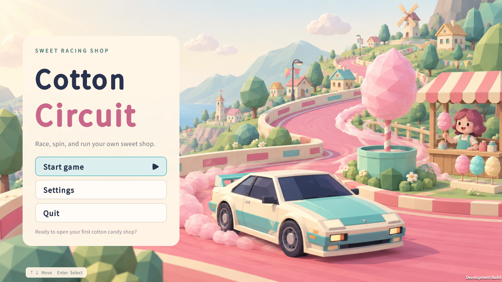
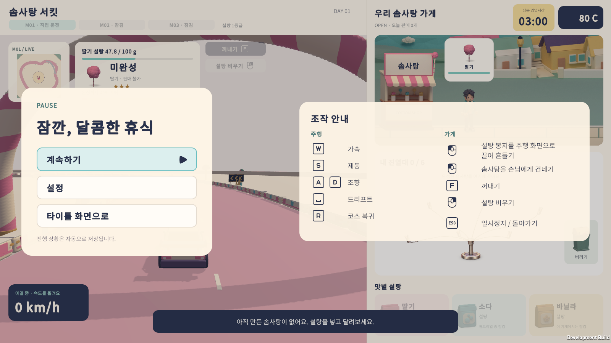
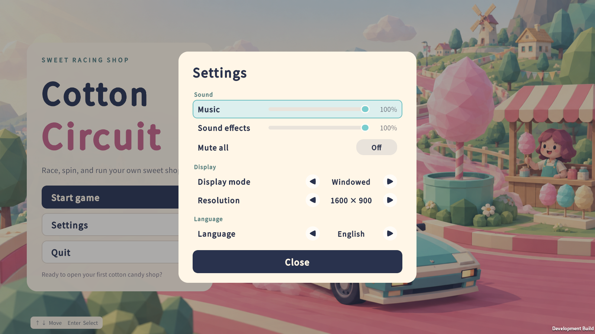

# 영어 커버리지 검사와 릴리스 검증

2026-09-29, Unity 6000.5.3f1 Windows. 브랜치 `claude/localization-settings` (Task 11, 기준 커밋 `a0d4283`).

## 변경

### 1. 모든 캡처에 영어/문구 넘침 검사 추가

`ToolkitRuntimeSmoke.Capture(name)`가 스크린샷을 찍기 직전에 `CheckVisibleText(name)`을 부른다. 모든 `UIDocument`의 화면에 보이는 `TextElement`를 모두 훑어서 다음을 확인한다.

- 영어일 때 한글이 남아 있으면 실패.
- `MeasureTextSize`로 잰 글자 크기가 요소의 내용 폭(줄바꿈 라벨은 높이)을 넘으면 실패. 이름이 `OverflowExempt`에 있는 요소는 제외한다.
- `Strings.Missing`에 키가 남아 있으면 실패.

이 검사는 `full`·`legacy`·`rack`·`hud`·`music`·`settings` 여섯 케이스가 이미 찍던 모든 캡처(약 30곳, 해상도 스윕 포함)에 자동으로 적용된다. 새 `06-closing-receipt.png` 캡처(영업 마감 직후, `businessNextDay`를 누르기 전)도 `full` 케이스에 추가해 `business.result.*` 영수증 카드를 커버했다.

### 2. 폭 처리 항목(컨트롤러가 넘긴 5가지)

1. **공백 붕괴** — `title.eyebrow`, `title.footer`, `Preparation.uxml`의 정적 `prep-eyebrow` 텍스트("C O T T O N   C I R C U I T")는 모두 `white-space: normal`(Shared.uss의 전역 `Label` 규칙)을 물려받는 라벨인데, 실제 UI Toolkit 렌더링에서는 이 세 요소의 공백이 (한 칸이든 여러 칸이든) 전부 사라져 "COTTONCIRCUIT", "SWEETRACINGSHOP", "↑ ↓ 메뉴 선택 Enter 선택"처럼 붙어 나왔다(수정 전 `01-title.png` 캡처로 확인). U+00A0(NBSP)로 바꾸니 렌더링에서 살아남아 의도한 간격이 그대로 나왔다 — 한국어·영어 모두, `· ` 대체 없이 해결됨. `title.eyebrow`/`title.footer`는 `strings.tsv`의 두 언어 칸 모두, `prep-eyebrow`는 UXML의 정적 텍스트(언어 공용이라 표에 없음)를 고쳤다. 한국어 문구 자체는 바꾸지 않았다.
2. **일시정지 조작 안내 정렬** — `.pause-keys`(글자 키 1개 또는 A/D 2개를 담는 줄)가 자동 폭이라 1키 줄(44px)과 2키 줄(88px)의 라벨 시작 위치가 달랐다. `.pause-keys { width: 88px; }`로 고정해(가장 넓은 A/D 그룹 기준) 모든 줄의 라벨이 한 열로 맞춰지도록 했다. 마지막 키의 자체 여백(4px) + `.pause-keys`의 `margin-right`(8px) = 12px 간격은 그대로다.
3. **`pause.sugar` 한글 줄바꿈** — 1280×720에서 "설탕 봉지를 주행 화면으로 끌어 흔들 / 기"처럼 "흔들기" 한 단어 중간이 잘렸다. 한국어 값에 공백 위치(화면으로 / 끌어) 그대로 `\n`을 넣어 "설탕 봉지를 주행 화면으로\n끌어 흔들기"로 고쳤다. 영어 값은 문장이라 그대로 두고 자동 줄바꿈에 맡겼다. 1280×720·1600×900·1920×820(설정 케이스의 해상도 스윕)에서 한국어·영어 모두 캡처로 확인했다 — 단어 중간에서 끊기지 않고 두 줄 안에 들어간다.
4. **구현자 영문 톤 점검** — `tutorial.*`, `notice.*`, `prep.*`, `trait.*`, `effect.*`, `machine.*`, `location.*` 영어 칸(약 210행)을 전부 다시 읽었다. 용어집과 어긋나거나 번역투인 곳은 없었다. 유일한 수정은 `tutorial.guide.pick`: `"① Press and hold here"` → `"① Press and hold"`. `.tutorial-guide-label`이 `white-space: nowrap`이라 실제로 잘리지는 않지만 마커 폭(209px)보다 넓어(221px) 옆으로 삐져나왔다(오배송 방지를 위한 실제 캡처로 확인). 다른 안내 문구(`② Drag to the track`, `③ Shake up and down`)와 같은 짧은 동사구 톤으로 맞추면서 폭도 해결했다. 한국어·키는 그대로다.
5. **`Legacy.uxml` 미리보기 언어 통일** — `Legacy.uxml`의 바인딩된 요소(예: `business.title`, `legacy.pause`, 주문·재고·크기·맛·차량 버튼, 조작 안내, 결과 화면) 전부가 영어 미리보기 텍스트("Cotton Circuit", "Help · Esc", "Choose order" 등)를 쓰고 있었다. `Title.uxml`·`Preparation.uxml`·`Game.uxml`은 바인딩된 요소에 한국어 미리보기를 쓴다(예: `title.new`의 `text="새 게임"`). `Legacy.uxml`의 18개 바인딩 요소 전부를 해당 키의 한국어 값으로 바꿔 통일했다. `legacyMakeStock`처럼 C#이 직접 쓰는(바인딩 없는) 요소는 룰링 R1대로 영어 미리보기를 그대로 뒀다. `Business.uxml`의 `business.title`(`biz-title`)도 같은 방식(영어 미리보기)을 쓰고 있었지만 이번 항목이 지목한 대상이 아니라 손대지 않았다.

### 3. `docs/superpowers/specs/2026-09-29-localization-settings-pause-design.md` 갱신

"4. 검증"의 "에디터 통합 검사(`Editor/IntegrationChecks.cs`)" 절을 "정적 검사(`python Tools/check-localization.py`)" 절로 바꿨다. 키캡 스프라이트 가져오기 설정 확인만 `IntegrationChecks.cs`(개발 빌드)에 남는다고 명시했다. 문구 넘침 절도 Task 11에서 실제로 구현한 범위(모든 케이스·모든 언어·모든 캡처, `Label`/`Button`뿐 아니라 모든 `TextElement`)로 고쳤다.

## 기존 한국어 넘침 — 이 브랜치가 손대지 않은 레이아웃

새 검사가 이 브랜치 이전부터 있던 한국어 넘침을 찾아냈다. 레이아웃을 다시 설계하지 않고 이름으로 예외 처리했다(`OverflowExempt`).

| 이름 | 위치 | 사유 |
|---|---|---|
| `BusinessTitleEyebrow` | `Business.uxml`/`Legacy.uxml`의 `business.title`("솜사탕 서킷") | `.biz-title-row`가 `height: 32px`로 고정인데 한국어 볼드 25px 글자는 37px가 필요하다. 이 CSS는 병합 기준 커밋(`e1c344a`)과 동일 — 이번 브랜치는 물론 로컬라이제이션 작업 전체가 손대지 않았다. |
| `TraitDetailsBody` | `Preparation.uxml`의 특성 상세 툴팁(성장 지도 호버) | `.trait-details { width: 330px }`는 이 SDD의 Task 1(`488b583`)보다 앞선 `82c6538`(성장 지도 UI Toolkit 복원)에서 그대로 들어왔고 이후 바뀐 적이 없다. |

## `MeasureTextSize` 측정 오차로 확인된 항목

일시정지 조작 안내(`.pause-row-label`, `flex-shrink: 1`)와 영업 준비 헤더/범례(`.prep-day`, `.prep-wallet`, `.prep-trait-count`, `.prep-legend-item`, 모두 내용에 맞춰 자동으로 폭이 정해지는 라벨)에서 `MeasureTextSize(text, box.width, Exactly, ...)`가 실제 렌더링보다 넓은 폭을 필요로 한다고 계산해, 한 줄이면 되는 텍스트를 두 줄로 잘못 예측하는 경우가 있었다(예: `PreparationDay`가 1600×900에서 20px 박스에 38px가 필요하다고 보고했지만, 그 순간의 `pause-1600x900.png` 캡처를 보면 "DAY 01 / Prep"이 한 줄로 멀쩡하게 나온다). 자동 폭 라벨의 박스 자체가 콘텐츠에 딱 맞게 잡혀 있어, Yoga가 확정한 폭과 `MeasureTextSize`를 별도로 다시 호출했을 때의 줄바꿈 판단이 서브 픽셀 경계에서 어긋나는 것으로 보인다. 실제 화면(1280×720·1600×900·1920×820, 한국어·영어)을 스크린샷으로 하나씩 대조해 전부 한 줄로, 잘리거나 겹치지 않고 나오는 것을 확인한 뒤 이름을 붙여 제외했다: `PreparationDay`, `PreparationWallet`, `PreparationTraitCount`, `PrepLegendRequired`, `PrepLegendDone`, `PauseAccelerateLabel`, `PauseBrakeLabel`, `PauseSteerLabel`, `PauseDriftLabel`, `PauseBoostLabel`, `PauseRecoverLabel`, `PauseSugarLabel`, `PauseDeliverLabel`, `PauseExtractLabel`, `PauseEmptyLabel`, `PauseEscapeLabel`. 요소들은 전부 이름이 없었어서(`text.name` 매칭을 쓰려면 필요) `Game.uxml`/`Preparation.uxml`에 `name`만 추가했고, 문구나 레이아웃은 바꾸지 않았다.

## 검증

### 열두 번의 스모크 실행

`Tools/build.ps1 -BuildFolder Builds/Loc`로 개발 빌드를 한 번 만든 뒤, 여섯 케이스 × 두 언어를 전부 돌렸다. 격리 저장 폴더는 실행마다 새 GUID를 쓴다.

| 케이스 | 언어 | 결과 | 통과 수 | 기록 |
|---|---|---:|---:|---|
| full | ko | PASSED | 921 | `Logs/Loc-final-full-ko2` |
| full | en | PASSED | 921 | `Logs/Loc-final-full-en2` |
| legacy | ko | PASSED | 27 | `Logs/Loc-final-legacy-ko` |
| legacy | en | PASSED | 27 | `Logs/Loc-final-legacy-en` |
| rack | ko | PASSED | 878 | `Logs/Loc-final-rack-ko` |
| rack | en | PASSED | 878 | `Logs/Loc-final-rack-en` |
| hud | ko | PASSED | 106 | `Logs/Loc-final-hud-ko` |
| hud | en | PASSED | 106 | `Logs/Loc-final-hud-en` |
| music | ko | PASSED | 18 | `Logs/Loc-final-music-ko` |
| music | en | PASSED | 18 | `Logs/Loc-final-music-en` |
| settings | ko | PASSED | 184 | `Logs/Loc-final-settings-ko` |
| settings | en | PASSED | 184 | `Logs/Loc-final-settings-en` |

각 언어 쌍의 통과 수가 정확히 같다(921/921, 27/27, 878/878, 106/106, 18/18, 184/184) — 두 언어가 같은 화면·같은 개수의 검사를 통과했다는 뜻이다. `full en`은 첫 실행에서 `tutorial.guide.pick` 넘침으로 한 번 실패했고(위 "구현자 영문 톤 점검" 참고), 고친 뒤 재실행해 통과했다.

### Core 테스트와 정적 검사

```powershell
powershell -ExecutionPolicy Bypass -File Tools/test-all.ps1
python Tools/check-localization.py
```

- `Tools/test-all.ps1`: 18개 스크립트 전부 PASS.
- `python Tools/check-localization.py`: 프로젝트 전체 56개 파일, 0 problem.

### Release 빌드와 실행

```powershell
powershell -ExecutionPolicy Bypass -File Tools/build.ps1 -Release -BuildFolder Builds/Loc-Release
```

`Build ready: Builds\Loc-Release\CottonCircuit.exe`. 다음으로 실행 파일을 직접 띄워 10초 뒤 종료했다.

```powershell
Builds\Loc-Release\CottonCircuit.exe -screen-fullscreen 0 -screen-width 1600 -screen-height 900 --language=en
```

`%USERPROFILE%\AppData\LocalLow\SugarRoad Studio\Cotton Circuit\Player.log`에 `Exception`·`Error` 문자열이 없다. Direct3D 12 장치 초기화, 물리 백엔드, 입력 시스템까지 정상적으로 로그를 남기고 조용히 종료됐다(강제 종료라 `Application.Quit` 로그는 없다).

### 캡처 시각 확인

`full` 케이스 영어 캡처 전체와 `settings` 케이스의 해상도 스윕 캡처를 직접 열어 용어집과 대조했다. 버튼·HUD 문구가 겹치거나 잘리는 곳은 없었다. 대표 캡처를 `docs/screenshots/`에 복사했다.

| 파일 | 출처 |
|---|---|
| `localization-title-en.png` | `Logs/Loc-final-full-en2/01-title.png` |
| `localization-business-en.png` | `Logs/Loc-final-full-en2/09-worker-driving.png` |
| `localization-prep-en.png` | `Logs/Loc-final-full-en2/07-preparation-traits.png` |
| `localization-pause-ko.png` | `Logs/Loc-final-full-ko2/pause.png` |
| `localization-pause-en.png` | `Logs/Loc-final-full-en2/pause.png` |
| `localization-settings-ko.png` | `Logs/Loc-final-settings-ko/settings-title.png` |
| `localization-settings-en.png` | `Logs/Loc-final-settings-en/settings-title.png` |
| `localization-pause-1920x820.png` | `Logs/Loc-final-settings-ko/pause-1920x820.png` |

### 빌드 후 diff

빌드 두 번(`Loc`, `Loc-Release`) 모두 `ProjectSettings/*`, `NotoSansKR.asset`, `PanelSettings.asset`, `PanelTextSettings.asset`, `UniversalRenderPipelineGlobalSettings.asset`과 소재·메시·프리팹·`CottonCircuit.unity`가 다시 쓰였다. `git diff --ignore-all-space --stat`로 보면 실제 내용 변경은 없고(씬은 줄 수 164421·GameObject 697개로 `HEAD`와 동일), 알려진 비결정적 재생성 노이즈와 일치해 전부 `git checkout --`로 되돌렸다.

## 명령

```powershell
powershell -ExecutionPolicy Bypass -File Tools/build.ps1 -BuildFolder Builds/Loc
powershell -ExecutionPolicy Bypass -File Tools/verify-uitk.ps1 -BuildFolder Builds/Loc -Case full -Language ko -OutputFolder Logs/Loc-final-full-ko2
powershell -ExecutionPolicy Bypass -File Tools/verify-uitk.ps1 -BuildFolder Builds/Loc -Case full -Language en -OutputFolder Logs/Loc-final-full-en2
# legacy · rack · hud · music · settings, 두 언어 모두 동일한 방식
powershell -ExecutionPolicy Bypass -File Tools/test-all.ps1
python Tools/check-localization.py
powershell -ExecutionPolicy Bypass -File Tools/build.ps1 -Release -BuildFolder Builds/Loc-Release
```






