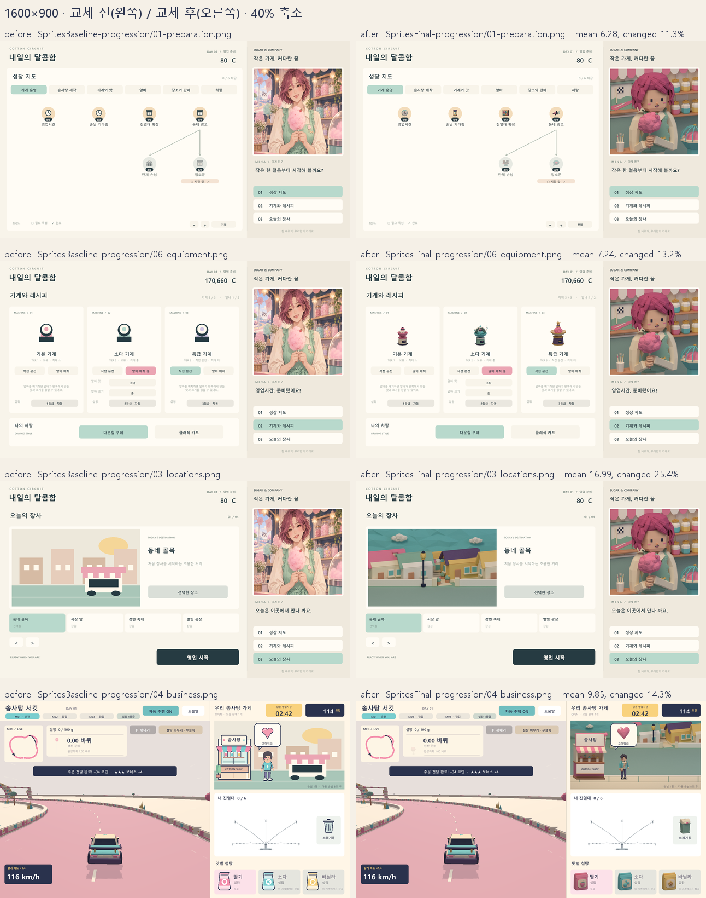
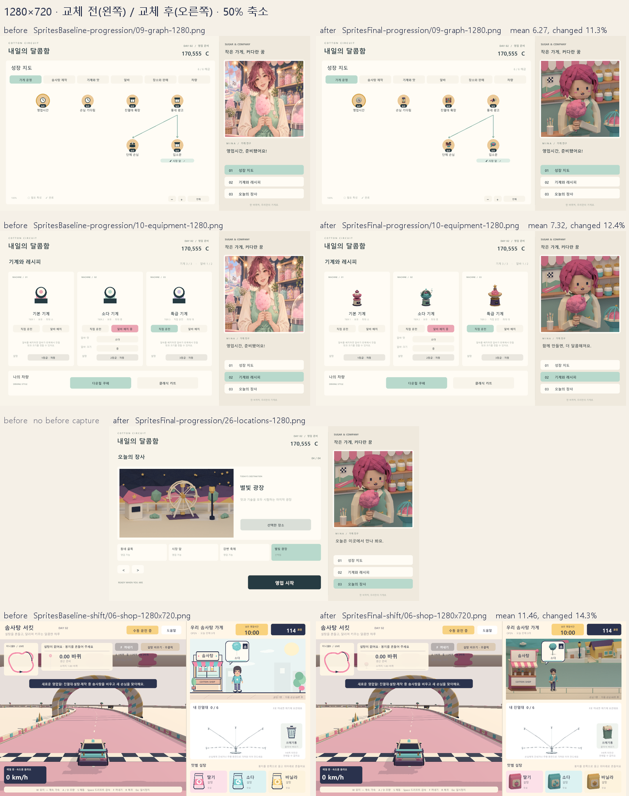
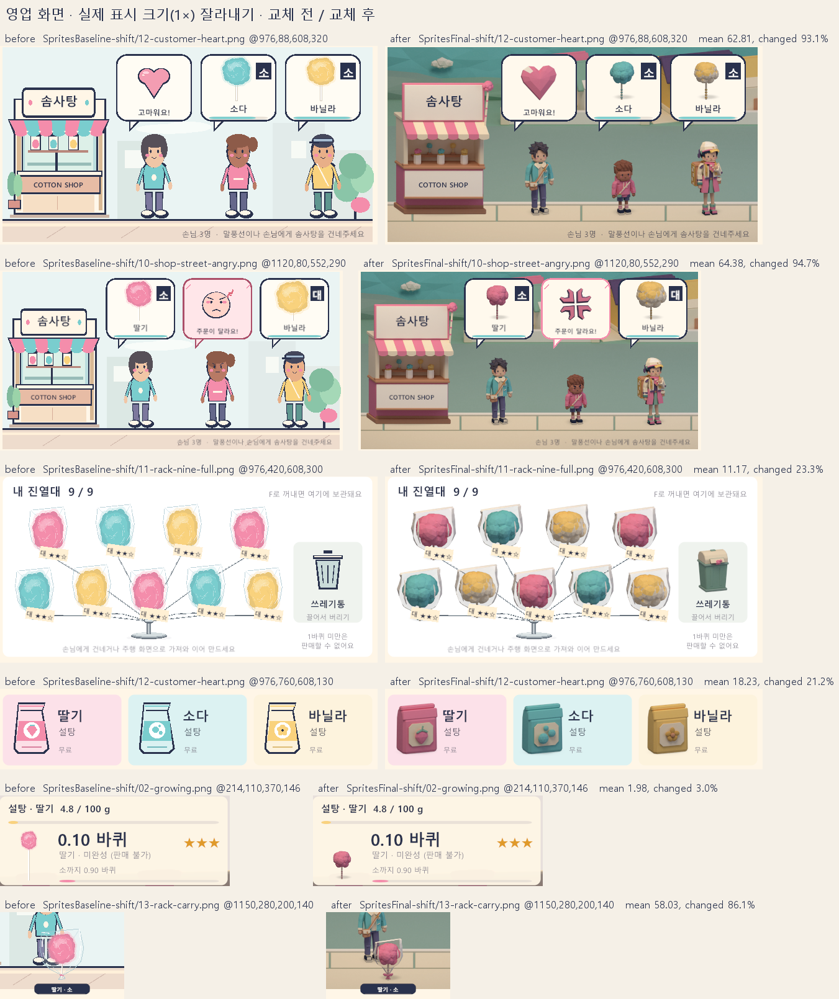
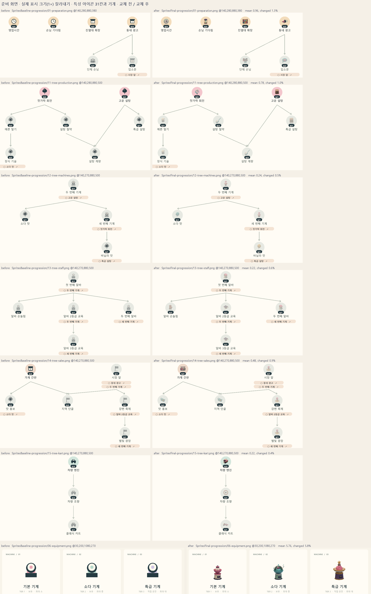
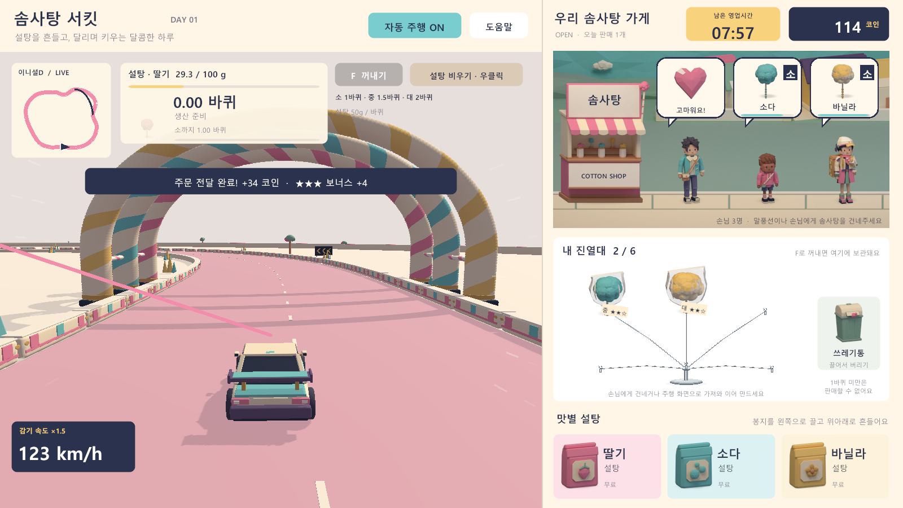

# 로우폴리 UI 스프라이트 교체 검증

2026-09-27 · Unity 6000.5.3f1 · URP 17.5.0 · Blender 5.2.2 LTS · Python 3.13 · Windows · 기준 커밋 `18eabd1` (브랜치 `claude/lowpoly-ui-sprites`)

게임의 2D 그림은 세 가지 시각 언어가 섞여 있었다. 미나 초상화는 페인팅이었고, 가게·손님·제품·아이콘·지역 풍경은 `ShopArtGraphic`, `ShopStreetGraphic`, `ProgressionArtGraphic`이 코드로 그린 도형이었으며, 레이싱 화면만 파스텔 로우폴리 3D였다. 이번 작업은 [아트 명세](superpowers/specs/2026-09-26-lowpoly-art-concept-design.md)대로 이 그림 66장을 승인된 두 손님과 같은 "파스텔 토이" 로우폴리 렌더로 바꾸고, UI 배치와 게임 규칙은 그대로 두었다. 이 문서는 명세의 완료 기준 8개를 차례로 확인한 기록이다.

## 변경 내용

- Blender에서 스프라이트 66장을 렌더했다. 손님 6장(남자 V0, 어린이 V1, 여자 탐험가 V2의 기본·화남), 미나 초상화 1장, 솜사탕·포장 솜사탕·설탕 봉지 21장, 가게 외관·쓰레기통·감정 표시 4장, 지역 4곳의 준비·영업 구도 8장, 기계 3장, 특성 아이콘 23장이다. 파일은 `Assets/CottonCircuit/Sprites/<폴더>/<id>.png`에 있고, 만드는 방법은 [UI 스프라이트 안내](../Art/Blender/UI_SPRITES.md)에 있다.
- `SpriteImport`가 가져오기 설정(Sprite, 밉맵 없음, 알파 투명, 고품질 압축)을 강제한다. `SpriteCatalog`가 66장을 `GameAssets`에 연결하고, `IntegrationChecks`가 연결을 검사한다.
- 런타임은 `UiArt`로 스프라이트를 찾는다. 손님·가게 외관·거리 배경·감정 표시는 `StreetSprite`(Image)로, 솜사탕·포장 솜사탕·설탕 봉지·쓰레기통은 `Image`를 상속한 `ShopArtGraphic`으로, 준비 화면의 기계·지역·특성 아이콘·초상화는 `Image`로 그린다. 표시 위치와 크기, 화남 상태와 맛·크기에 따른 선택, 달린 거리에 따른 솜사탕 크기 변화(막대 아래 끝 기준), 진열대 매듭 위치(`ClipPoint`)는 그대로다.
- 도형 그리기 코드와 `Resources/Progression/NpcPortrait.png`를 삭제했다. 말풍선, 특성 원판, 진열대 철사, 미니맵, 성장 지도 연결선, 속도선은 명세대로 UI 도형으로 남겼다. 말풍선은 색만 팔레트(White `#FFF9ED`, Navy·Strawberry 테두리)에 맞췄다.
- 작업 10 이후 아트 다듬기(커밋 `cde2568`..`18eabd1`)에서 포장 솜사탕의 셀로판, 바닐라 솜, 어린이 손님의 머리·눈썹, 화남 표시, 영업 구도의 아래 띠, 아이콘 5종을 고쳤다. 이 문서의 캡처는 모두 다듬은 뒤의 빌드로 찍었다.

## 완료 기준별 결과

| # | 명세의 완료 기준 | 결과 | 근거 |
|---|---|---|---|
| 1 | `validate_ui_sprites.py` 통과 | 통과, 66/66 | `UI_SPRITES_VALID 66/66`, `Art/Blender/ui-sprites-validation.json` |
| 2 | 모든 그림이 스프라이트로 표시되고 대체된 그리기 코드가 없음 | 통과 | 아래 grep 결과, 게임 캡처 대응표 |
| 3 | 에디터 검증에서 스프라이트 참조 연결 | 통과, 스프라이트 검사 14개 포함 98개 | `Logs/SpritesFinal-build.log` |
| 4 | 준비 화면 세 페이지와 영업 화면의 1600×900·1280×720 교체 전후 비교 | 통과, 겹침·잘림·크기 변화 없음 | 캡처 비교표, 비교 이미지 2장 |
| 5 | 실제 표시 크기의 밝은 배경·잉크 배경 가독성, 최종 판단은 게임 캡처 | 통과, 약점은 아래에 기록 | 1× 잘라내기 비교 이미지 2장, `Art/Blender/previews/all.png` |
| 6 | 레이싱 화면 옆 영업 화면이 같은 게임으로 보임 | 통과 | 1600×900 분할 화면 캡처 |
| 7 | 기존 테스트와 플레이 스모크 통과 | 통과 | 검사 표 |
| 8 | README의 Blender 원본 목록 갱신 | 통과 | `README.md` Blender 원본 절 |

### 1. 스프라이트 검사

```
> python Art/Blender/validate_ui_sprites.py --complete
UI_SPRITES_VALID 66/66
Report: D:\UnityProjects\RacingTycoon\Art\Blender\ui-sprites-validation.json
```

보고서의 오류와 참고 메시지는 0건이다. 분류 목록 파일 5개(`items`, `shop`, `locations`, `machines`, `icons`)의 렌더 설정·팔레트·재질 레시피가 기준과 같고, 스프라이트 폴더에 카탈로그 밖 PNG는 없다. 투명 스프라이트의 가장자리 투명 여백은 최소 5px(`BaggedCandy_Soda_Large`)로 규칙(2px 이상)을 지키고, 알파 128 이상 면적은 16.5%(`Trait_Kart`)에서 77.6%(`Storefront`) 사이다. 지역 풍경 8장과 초상화는 모든 픽셀이 불투명하다. 접지 그림자가 있는 32장은 모두 beauty 패스의 불투명 픽셀과 같다(바뀐 픽셀 0).

승인된 두 손님의 기본 스프라이트가 승인 PNG와 같은지는 단위 시험(`test_approved_neutrals_are_pixel_identical`)과 Blender 렌더 동일성 시험으로 확인했다. 동일성 시험은 남자·여자 모두 `RENDER_IDENTITY max_abs_diff=0 differing_pixels=0`이고, 호환 래퍼 경로도 같은 결과다.

### 2. 삭제한 그리기 코드

```
> grep -rnwE "..." --include=*.cs Assets/CottonCircuit/Scripts | grep -E "void (DrawCustomer|DrawStorefront|DrawBackdrop|DrawHeartEmote|DrawAngryEmote|Person|Bag|Bin|BaggedCandy|FluffyCotton|PaperStick|Jar|Portrait|Scene|Quad|Triangle|Lobe|Puff|Candy)\b"
(결과 없음, 종료 코드 1)
> grep -rn "NpcPortrait\|Resources.Load" --include=*.cs Assets/
(결과 없음, 종료 코드 1)
```

`Assets/CottonCircuit/Resources/` 폴더도 없다. `OnPopulateMesh`가 남은 클래스는 명세가 유지하라고 한 기능 그래픽뿐이다: `CandyRackGraphic`(진열대 철사), `ProgressionArtGraphic`(특성 원판 `disc`만), `RaceMapGraphic`(미니맵), `ShopStreetGraphic`(말풍선만), `SpeedLinesGraphic`(속도선), `UpgradeGraphGraphic`(성장 지도 연결선).

교체 대상 표의 그림은 다음 캡처에서 스프라이트로 확인했다. 성장 스모크 캡처는 `Logs/SpritesFinal-progression`, 영업 스모크 캡처는 `Logs/SpritesFinal-shift`에 있다.

| 교체 대상 | 스프라이트 | 확인한 캡처 |
|---|---|---|
| 손님 | `Customer_V0/V1/V2_Neutral`, `Customer_V0_Angry`, `Customer_V1_Angry` | 영업 `09-shop-street`, `12-customer-heart`, `04-angry`(V0 화남), `10-shop-street-angry`(V1 화남), 성장 `08-third-map`(V2) |
| 가게 외관 | `Storefront` | 모든 영업 캡처. 간판의 "솜사탕", 계산대의 "COTTON SHOP"이 읽힌다 |
| 거리 배경(성장 모드가 없을 때) | `Location_0_Street` | 영업 스모크의 모든 영업 캡처 |
| 지역 풍경 | `Location_0_Prep`, `Location_3_Prep`, `Location_0_Street`, `Location_3_Street` | 성장 `03-locations`, `07-starlight`, `26-locations-1280`, `04-business`, `08-third-map` |
| 솜사탕 | 말풍선의 딸기·소다·바닐라 소·중·대, 생산 패널의 성장 중 솜사탕 | 영업 `09-shop-street`, `02-growing`, 성장 `08-third-map` |
| 포장 솜사탕 | 진열대 6·9·12칸, 끌기 중인 봉지 | 영업 `10-rack-full-6/9/12`, `12b-rack-mixed-*`, `13-rack-carry`, `14-resume-drag` |
| 설탕 봉지 | `SugarBag_*` 3장 | 모든 영업 캡처 |
| 쓰레기통 | `Trash` | 모든 영업 캡처 |
| 감정 표시 | `Emote_Heart`, `Emote_Angry` | 영업 `12-customer-heart`, `04-angry`, `13-customer-timeout` |
| 기계 | `Machine_0/1/2` | 성장 `06-equipment`, `10-equipment-1280` |
| 특성 아이콘 | 23장, 특성 31칸 | 성장 `01-preparation`, `11-tree-production`, `12-tree-machines`, `13-tree-staff`, `14-tree-sales`, `15-tree-kart` |
| 미나 초상화 | `Mina_Portrait` | 모든 준비 화면 캡처. 성장 스모크가 `CompanionPortrait`의 스프라이트 이름을 검사한다 |

스모크가 거치지 않아 캡처에 없는 스프라이트는 `Location_1/2_Prep`, `Location_1/2_Street`, `Customer_V2_Angry`, 잠긴 기계(35% 알파) 상태다. 이 스프라이트들은 `GameAssets` 연결 검사와 `Art/Blender/previews/` 보드로만 확인했다.

### 3. 에디터 검사

`./Tools/build.ps1 -BuildFolder Builds/SpritesFinal`는 51초 만에 끝났고 `COTTON_EDITOR_CHECKS_PASSED 98`, `COTTON_BUILD_SUCCESS`를 출력했다. 교체 전 베이스라인은 84개였다. 작업 9가 스프라이트 연결·가져오기 검사 13개를, 작업 10이 `Resources` 폴더 삭제 검사 1개를 더했다.

- `GameAssets.CustomerNeutral`, `CustomerAngry`, `LocationPrep`, `LocationStreet`, `CottonCandy`, `BaggedCandy`, `SugarBags`, `Machines`, `TraitIcons`와 `Storefront/Trash/HeartEmote/AngryEmote/MinaPortrait`가 카탈로그 스프라이트를 순서대로 가진다(10개).
- `TraitIcons`의 id 순서가 `TraitIcons.All`과 같고, 특성 31칸이 모두 아이콘 스프라이트로 풀린다(2개).
- 66장이 단일 스프라이트, 밉맵 없음, 알파 투명, 고품질 압축으로 가져와진다(1개).
- `Assets/CottonCircuit/Resources`가 없고 미나 초상화는 `GameAssets.MinaPortrait`에서 온다(1개).

### 4. 교체 전후 캡처 비교

교체 전 캡처는 스프라이트 작업을 시작하기 전(작업 9 첫 단계) 빌드의 스모크 결과 `Logs/SpritesBaseline-*`이고, 교체 후는 이번 빌드의 `Logs/SpritesFinal-*`이다. `Tools/compare-captures.py`로 이름이 같은 PNG를 모두 비교했다. 표의 평균 차이는 모든 픽셀과 RGB 채널의 절대 차이 평균(0~255), 변경 비율은 한 채널이라도 달라진 픽셀의 비율이다.

| 스모크 | 비교한 쌍 | 평균 차이 | 변경 비율 | 결과 |
|---|---|---|---|---|
| 성장 | 25쌍(+ 새 캡처 `26-locations-1280` 1장) | 4.66~19.69 | 10.9~28.8% | 바뀐 곳은 모두 그림 칸 |
| 영업 | 35쌍 | 6.91~12.70 | 10.7~17.1% | 바뀐 곳은 모두 그림 칸 |
| 레거시 | 20쌍 | 0~1.86 | 0~7.5% | 가게 캡처 4장은 같고 도움말(`02-help`)은 1픽셀만 다르다. 레이싱·분할 화면의 차이는 실행 시점 차이 |

바뀐 픽셀(채널 차이 8 초과)을 8px 격자로 묶어 연결 영역도 구했다(`compare-captures.py --threshold 8 --regions`, 결과는 `Logs/SpritesFinal-regions-*/regions.tsv`). 성장·영업 캡처 60쌍에서 나온 영역은 아래 세 가지 실행 시점 차이를 빼면 모두 그림 칸이다. 초상화(1600×900에서 408×392), 지역 풍경 칸(600×360), 영업 화면의 거리(608×320), 특성 원판 위 아이콘(약 40×40), 기계(약 72×104), 설탕 봉지 카드의 봉지(약 72×96), 쓰레기통(64×72), 진열대 봉지, 말풍선 속 솜사탕과 감정 표시, 생산 패널의 솜사탕(24×40)이다. 말풍선은 색만 바꿨으므로 거리 영역에 포함된다. 글자, 버튼, 패널, 진열대 철사, 성장 지도 연결선의 위치와 크기는 그대로다. 그림 칸 밖의 차이는 다음 세 가지다.

- `10-equipment-1280`: 미나의 대사가 "영업시간, 준비됐어요!"에서 "함께 만들면, 더 달콤해져요."로 바뀌었다. `OutgameUI`는 임시 대사를 일정 시간만 보여 주므로, 캡처 시점에 따라 다른 대사가 찍힌다. 작업 10 빌드의 캡처는 교체 전과 같은 대사였다.
- `21-weak-shake-one-gram`, `22-strong-shake-ten-grams`, `23-optional-kart-booster`: 버튼과 기계 칩의 색 전환이 서로 다른 프레임에서 찍혔다. 글자와 위치는 같다.
- `08-drift-slowdown`: 레이싱 절반에 20px 미만의 점 13개가 있다. 드리프트 입자다.





1280×720의 오늘의 장사 페이지(`26-locations-1280`)는 작업 10에서 추가한 캡처라 교체 전 짝이 없다. 별빛 광장 풍경과 초상화가 칸 안에 온전히 들어가고, 장소 카드와 영업 시작 버튼과 겹치지 않는다. 1280×720 영업 화면은 성장 스모크에 없어 영업 스모크의 `06-shop-1280x720`으로 비교했다. 레거시 스모크의 1280×960, 1920×820 가게 캡처는 교체 전과 픽셀이 같다. 영업 스모크의 1280×960, 1920×820 캡처도 그림 칸만 바뀌었다.

### 5. 가독성

게임 캡처의 1× 픽셀을 그대로 잘라 교체 전과 나란히 놓았다. 판단은 이 이미지와 원본 캡처로 했다.





- **손님:** 청록 거리 배경 위에서 세 손님이 키, 머리 모양, 옷 색으로 바로 구분된다. 화난 표정의 눈썹은 1×에서 1~2px의 어두운 선으로 보인다(V0는 `04-angry`, V1은 `10-shop-street-angry`). 기본 표정과 구분되지만 크게 두드러지지는 않고, 화남은 말풍선의 화남 표시와 분홍 테두리가 함께 알린다.
- **가게 외관:** 간판과 계산대의 밝은 띠 위에 부모 UI가 쓰는 "솜사탕", "COTTON SHOP"이 1600×900과 1280×720 모두에서 읽힌다.
- **말풍선 속 솜사탕(80×77):** 맛 색과 소·중·대 크기가 구분된다. 바닐라는 밝은 면이 금색이라 교체 전의 연노랑보다 캐러멜에 가깝게 보인다(알려진 한계).
- **생산 패널 솜사탕(77×88):** 0.10바퀴에서는 작게 시작하지만 막대와 솜이 읽히고, 막대 아래 끝을 기준으로 커진다.
- **진열대 포장 솜사탕:** 흰 진열대 위에서 맛 색과 셀로판 윤곽이 보인다. 교체 전보다 솜이 진하고 셀로판에 옅은 회색 기운이 있다. 등급 종이표가 매듭을 가리는 것은 교체 전과 같다. 끌기 중인 봉지는 거리 배경과 주행 화면 위에서 모두 형태가 읽힌다.
- **설탕 봉지·쓰레기통:** 맛 카드 색 위에서 딸기, 소다 거품, 바닐라 꽃 문양이 읽힌다. 쓰레기통은 민트 카드 위에서 뚜껑과 통이 구분된다.
- **감정 표시:** 흰 말풍선 안에서 하트와 화남 기호가 선명하다.
- **기계:** 흰 카드 위에서 크기, 색, 거품 돔, 별 장식으로 세 등급이 구분된다.
- **특성 아이콘:** 분류 원판 6색 위에서 31칸 모두 형태가 읽힌다. 아직 열 수 없는 칸은 교체 전과 같은 규칙으로 55% 알파가 되어 흐린 회색 원판 위에서 대비가 약하다. 이는 의도한 비활성 표시다.
- **지역 풍경·초상화:** 칸을 꽉 채우고, 1280×720에서도 잘리지 않는다. `Location_3_Street`의 관람차는 영업 중 두 번째 말풍선에 대부분 가려진다.

게임 화면에는 스프라이트가 잉크색 위에 놓이는 곳이 없다. 그래서 잉크 배경은 `Art/Blender/previews/all.png`(모든 스프라이트의 2배 캔버스와 실제 표시 크기를 크림·잉크·특성 원판 6색 위에 놓은 보드)로 확인했다. 모든 스프라이트의 형태가 읽히고, 약점은 `Machine_0/1`의 Tire 받침과 몇몇 아이콘의 Navy 부품이 잉크와 비슷하다는 점이다. 이 보드는 sRGB에서 알파를 섞고 Unity는 선형 공간에서 섞는다. 두 방식은 완전히 불투명한 픽셀에서는 같고, 부분 투명 픽셀(그림자, 가장자리, 셀로판)만 다르다. 투명 스프라이트 57장을 2배 캔버스에서 두 방식으로 잉크 위에 합성해 보니, 부분 투명 픽셀의 평균 차이가 스프라이트별 중앙값 5.4, 최대 12.3단계(0~255)였다. 형태 판단을 뒤집을 만한 차이는 아니다.

### 6. 레이싱 화면과 영업 화면



영업 스모크의 `12-customer-heart.png`(1600×900) 그대로다. 왼쪽 레이싱 절반의 분홍 도로, 크림 지면, 줄무늬 아치와 소다색 차량, 오른쪽 가게 외관·손님·솜사탕·설탕 봉지가 같은 팔레트(Strawberry, Soda, Vanilla, Cream, Navy)와 윤곽선 없는 면 음영으로 그려져 있다. 두 절반 모두 위쪽 면이 밝고 옆면이 한 단계 어두운 조명이라 한 게임으로 보인다. 차이는 레이싱 절반이 원근 카메라와 옅은 원경 때문에 채도가 조금 낮고, 스프라이트에는 짧은 접지 그림자가 있다는 정도다. 레이싱 화면의 3D 모델, 재질, 조명은 바꾸지 않았다. 교체 전후 비교에서도 실행 시점 차이와 끌기 중인 봉지를 빼면 레이싱 절반에서 바뀐 곳은 생산 패널의 솜사탕 한 칸뿐이다.

### 7. 테스트와 스모크

| 검사 | 교체 전 | 교체 후 | 근거 |
|---|---|---|---|
| Unity 에디터·씬·저장 검사 | 84개 통과 | 98개 통과 | `Logs/SpritesBaseline-build.log`, `Logs/SpritesFinal-build.log` |
| 성장 개발 플레이어 | 430개 통과 | 434개 통과 | `Logs/SpritesBaseline-progression`, `Logs/SpritesFinal-progression` |
| 영업 모드 개발 플레이어 | 3223개 통과 | 3319개 통과 | `Logs/SpritesBaseline-shift`, `Logs/SpritesFinal-shift` |
| 레거시 개발 플레이어 | 625개 통과 | 625개 통과 | `Logs/SpritesBaseline-legacy`, `Logs/SpritesFinal-legacy` |
| `Tools/test-*.ps1` 16개 | — | 모두 종료 코드 0, 실패 0 | `Logs/SpritesFinal-test-*.txt` |
| Blender 쪽 Python 단위 시험 | — | 29건 중 28건 통과, 1건 건너뜀 | 건너뛴 렌더 동일성 시험은 Blender로 따로 실행 |
| 렌더 동일성(Blender) | — | 남자·여자, 래퍼 경로 모두 차이 0 | `Logs/SpritesFinal-render-identity.log` |
| 스프라이트 검사 | — | 66/66 | `Art/Blender/ui-sprites-validation.json` |

- 성장 +4는 작업 10에서 추가한 오늘의 장사 1280×720 캡처(페이지 이동 확인 3개와 캡처 픽셀 확인 1개)다.
- 영업 +96은 작업 10에서 추가한 확인이다. 자라는 솜사탕이 막대 아래 끝을 기준으로 커지는지 1개, 진열대 봉지의 매듭이 고정 위치(`ClipPoint`)에 놓이는지 95개다.
- 세 스모크의 `player.log`에 예외는 0건이다(교체 전도 0건).
- `Tools/test-*.ps1` 16개는 acceleration 17, booster 11, collection 9, continuous 22, core 22·33·14, feel 28, maps 37, progression 16, progression-maps 3, progression-save 20, progression-shift 458, recipes 17, shop-shift 46, sugar-shake 23, trait-icons 6, upgrade-tree-layout 15건이 모두 통과했다.

### 8. README

`README.md`의 "Blender 원본" 절을 고쳤다. 초기 샘플(`UiSprites.blend`, `ui-sprites-preview.png`, `ui-sprites-native.png`, `audit_ui_sprite_scene.py`)과 승인하지 않은 `GameCustomerFemaleFaceted` 줄을 지우고, 여자 탐험가 설명을 현재 승인본(곡선형 머리카락, 작은 점 눈)에 맞췄다. 새 파이프라인 파일, 분류 모듈, 손님 세 폴더, `MinaPortrait/`, `Assets/CottonCircuit/Sprites/`를 추가하고 PNG가 `GameAssets`로 UI에 연결되어 있다고 적었다. 같은 작업에서 [UI 스프라이트 안내](../Art/Blender/UI_SPRITES.md)의 최종 수치와 명세의 "파일 구조", "승인본과 비교 보드 재생성" 절도 실제 파일에 맞췄고, 명세의 비교 보드 두 장을 새 스프라이트와 어린이 손님을 넣어 다시 만들었다.

## 알려진 한계

- **솜사탕 회전 연출:** 달린 거리에 따라 솜사탕 실이 돌던 연출은 정지 스프라이트로 바뀌면서 사라졌다. 명세의 "이후 과제"에 적힌 대로다. 크기가 커지는 연출은 유지된다.
- **바닐라 솜의 색:** 바닐라 솜은 빛을 받는 면이 금색 Vanilla `#F9D27D`로, 그늘진 면이 Cream으로 렌더된다. 공용 팔레트에 옅은 노랑이 없어서, 게임 크기에서 교체 전의 연노랑보다 캐러멜에 가깝게 보인다. 새 색을 추가하지 않고 이대로 두었다.
- **이음매 벽 변경은 별개다:** 작업 트리에 커밋하지 않은 `Assets/CottonCircuit/Scripts/Core/ArcadeDrive.cs`, `RaceCourse.cs`, `Tools/Tests/MapTests.cs`의 이음매 벽 충돌 수정이 있다. 이번 작업의 변경이 아니며, 파일 수정 시각(2026-09-27 00:01~00:34)이 베이스라인 빌드(08:00)보다 앞서므로 교체 전과 교체 후 빌드에 모두 들어 있다. 레거시 스모크의 레이싱·분할 화면 차이(평균 최대 1.86, 변경 최대 7.5%)는 자동 주행 캡처 시점의 차이다. 결과 화면의 3D 솜사탕 모양과 차량 위치만 조금 다르고 숫자와 UI는 같다. 스프라이트를 쓰지 않는 레거시 가게 캡처는 교체 전과 같다. 스프라이트 작업이 없던 베이스라인과 작업 9 빌드 사이에도 같은 종류의 차이(평균 최대 0.54, 변경 최대 5.6%)가 있었다.
- **캡처가 없는 상태:** `Location_1/2`의 준비·영업 구도, `Customer_V2_Angry`, 잠긴 기계는 스모크가 지나가지 않아 게임 캡처로 판단하지 못했고 검토 보드로만 확인했다.
- **다듬을 여지:** 최종 검토로 넘긴 작은 아트 항목이 남아 있다. 포장 솜사탕 셀로판의 회색 기운, `Location_3_Street` 관람차가 말풍선에 가려지는 문제, 잉크 배경에서 `Machine_0/1`의 Tire 받침, 화남 표시의 작은 Navy 김이 그것이다. 모두 형태 판단에는 영향이 없다.

## 재현

```powershell
python Art/Blender/validate_ui_sprites.py --complete
python -m unittest discover -s Art/Blender/tests -p "test_*.py"
& 'C:/Program Files/Blender Foundation/Blender 5.2/blender.exe' -b --factory-startup --python-exit-code 1 -P Art/Blender/tests/test_render_identity.py
& 'C:/Program Files/Blender Foundation/Blender 5.2/blender.exe' -b --factory-startup --python-exit-code 1 -P Art/Blender/tests/test_render_identity.py -- --customer explorer --wrapper
python Art/Blender/preview_ui_sprites.py
Get-ChildItem Tools/test-*.ps1 | ForEach-Object { & $_.FullName }
./Tools/build.ps1 -BuildFolder Builds/SpritesFinal
./Tools/verify-progression.ps1 -BuildFolder Builds/SpritesFinal -OutputFolder Logs/SpritesFinal-progression
./Tools/verify-player.ps1 -BuildFolder Builds/SpritesFinal -OutputFolder Logs/SpritesFinal-shift -ShopShift
./Tools/verify-player.ps1 -BuildFolder Builds/SpritesFinal -OutputFolder Logs/SpritesFinal-legacy
python Tools/compare-captures.py Logs/SpritesBaseline-progression Logs/SpritesFinal-progression Logs/SpritesFinal-compare-progression
python Tools/compare-captures.py Logs/SpritesBaseline-shift Logs/SpritesFinal-shift Logs/SpritesFinal-compare-shift
python Tools/compare-captures.py Logs/SpritesBaseline-legacy Logs/SpritesFinal-legacy Logs/SpritesFinal-compare-legacy
python Tools/compare-captures.py Logs/SpritesBaseline-progression Logs/SpritesFinal-progression Logs/SpritesFinal-regions-progression --threshold 8 --regions
python Tools/compare-captures.py Logs/SpritesBaseline-shift Logs/SpritesFinal-shift Logs/SpritesFinal-regions-shift --threshold 8 --regions
```

교체 전 캡처는 스프라이트를 연결하기 전 커밋 `b3b88bf`의 빌드(`Builds/SpritesBaseline`)에서 같은 스모크 명령으로 만든다. 이 문서의 비교 이미지는 `compare-captures.py --board`로 만들었다. 예를 들어 1600×900 비교는 다음과 같다. 나머지 세 장도 각 행 제목에 원본 파일과 잘라내기 영역이, 이미지 제목에 축소 비율이 적혀 있다.

```powershell
$b = 'Logs/SpritesBaseline-progression'; $a = 'Logs/SpritesFinal-progression'
python Tools/compare-captures.py --board docs/screenshots/lowpoly-sprites-prep-1600.png --scale 0.4 --title "1600×900 · 교체 전(왼쪽) / 교체 후(오른쪽) · 40% 축소" `
  "$b/01-preparation.png" "$a/01-preparation.png" "$b/06-equipment.png" "$a/06-equipment.png" `
  "$b/03-locations.png" "$a/03-locations.png" "$b/04-business.png" "$a/04-business.png"
```
