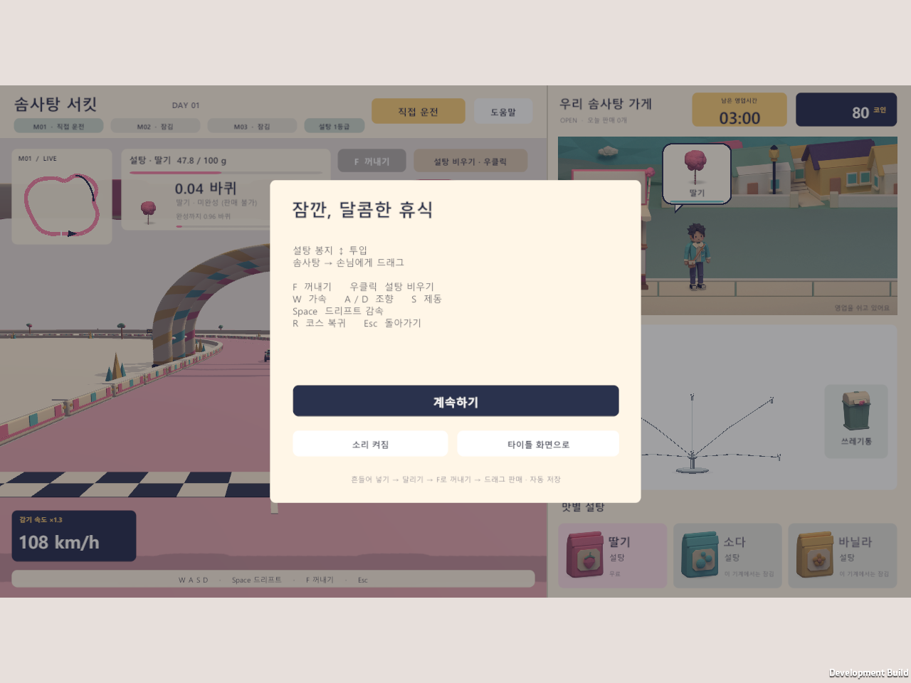
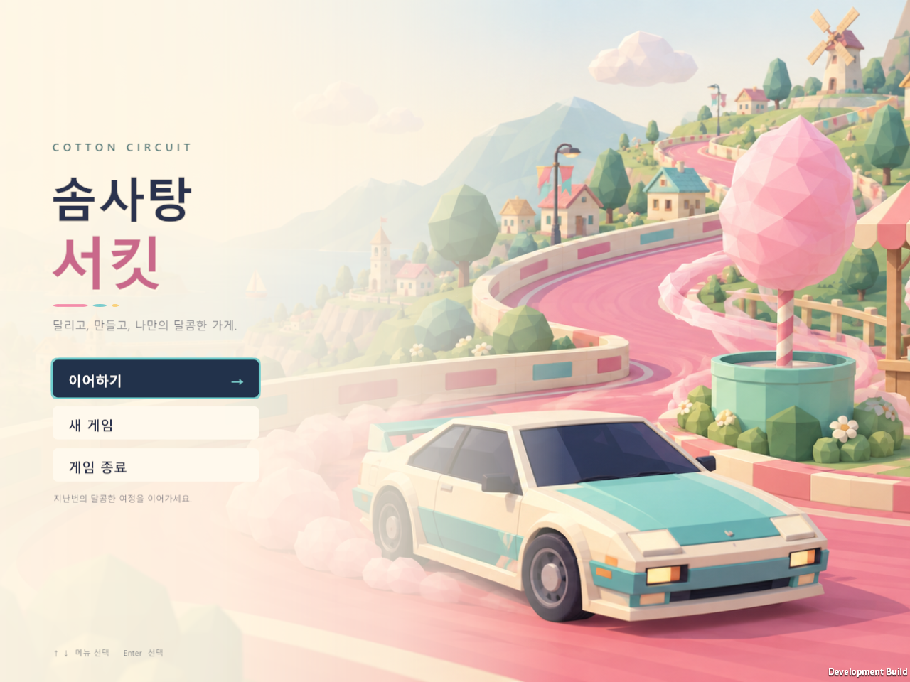

# 일시정지 메뉴에서 타이틀로 돌아가기

2026-09-28, Unity 6000.5.3f1 Windows.

## 변경

- Esc 메뉴의 `새 가게 시작`을 `타이틀 화면으로`로 교체했다.
- 현재 제작 상태와 튜토리얼 단계를 저장한 뒤 게임 UI·튜토리얼·월드를 숨기고 주행 소리를 끈다. 타이틀에 있는 동안 영업과 제작은 진행하지 않는다.
- 타이틀의 `이어하기`는 같은 저장 폴더를 사용한다. 게임 UI는 기존 캔버스를 다시 활성화하며, 타이틀과 게임 각각의 키보드 입력 설정을 복원한다.
- 저장 가능한 파일에 쓰기 실패가 발생하면 현재 일시정지 세션을 유지하고 오류를 표시한다. 기존에 읽기 실패로 보호된 저장은 바꾸지 않고 타이틀로 돌아갈 수 있다.
- 새 게임은 타이틀의 기존 확인 절차를 통해서만 시작한다. 이 변경은 저장 형식을 바꾸지 않는다.

## 화면 품질 조사

첨부된 말풍선·튜토리얼 강조선·화살표는 이미지 파일이 아닌 런타임 uGUI 도형이다. `ShopStreetGraphic.DrawSpeechBubble`은 네이비 외곽 도형과 크림색 내부 도형을 겹치며 둥근 모서리는 코너당 다섯 조각으로 구성한다. `TutorialGuideGraphic`은 9/4 두께의 겹친 선과 삼각형으로 화살표를, 8/3 두께의 사각형 네 변으로 강조선을 그린다. 곡선 분할과 가장자리의 부드러운 처리가 부족해 각과 대각선이 거칠게 보인다. 이번 요청의 그래픽 부분은 구현 원인 설명이며, 해당 도형은 수정하지 않았다.

## 검증

개발 및 최종 Release 빌드가 성공했고 에디터 통합 검사 102개를 통과했다. 배포 실행 파일은 `Builds/Tutorial-Release/CottonCircuit.exe`다.

기존 빌드에서 새 타이틀 복귀 버튼이 없다는 실패를 먼저 재현했다 (`Logs/Pause-title-red`, 94개 통과 후 실패). 수정 후 개발 플레이어에서 실제 UI 레이캐스트·클릭 및 EventSystem 키보드 이동·제출을 사용했다. Esc 자체는 동일한 `TogglePause` 핸들러로 호출했으며 OS 키 입력을 합성한 검사는 아니다. 모든 저장은 실행별 GUID 테스트 폴더를 사용한다.

| 시나리오 | 해상도 | 통과 수 | 기록 |
|---|---:|---:|---|
| 기존 저장 반복 복귀·준비 화면·저장 실패 시 세션 유지 | 1600×900 | 228 | `Logs/Pause-title-saved` |
| 새 게임·튜토리얼 중 제작 상태 복원·일반 영업 반복 복귀 | 1280×960 | 300 | `Logs/Pause-title-fresh` |
| 손상 저장의 원본 보존·타이틀 왕복·준비 화면 복원 | 1920×820 | 213 | `Logs/Pause-title-corrupt` |

왕복 검사에는 돈·날짜·영업 단계·설탕·제작량·튜토리얼 단계와 전체 저장 상태, 타이틀 대기 중 진행/파일 변경 방지, 저장 초기화 방지, 중복 캔버스 방지, 키보드 포커스 복원도 포함한다. 저장 실패 검사의 첫 실행은 아직 렌더링되지 않은 버튼을 레이캐스트해 실패했으며, 실제 화면 캡처가 완료된 뒤 클릭하도록 다른 시나리오와 타이밍을 맞춰 통과했다. 프로덕션 코드를 바꿔서 이 테스트 타이밍 문제를 우회하지 않았다. 읽기 전용 전환 코드 리뷰에서도 추가 결함이 발견되지 않았다.

```powershell
./Tools/build.ps1 -BuildFolder Builds/PauseTitle
./Tools/verify-title.ps1 -BuildFolder Builds/PauseTitle -Case saved -OutputFolder Logs/Pause-title-saved -Width 1600 -Height 900
./Tools/verify-title.ps1 -BuildFolder Builds/PauseTitle -Case fresh -IntroSkipAt 0 -OutputFolder Logs/Pause-title-fresh -Width 1280 -Height 960
./Tools/verify-title.ps1 -BuildFolder Builds/PauseTitle -Case corrupt -OutputFolder Logs/Pause-title-corrupt -Width 1920 -Height 820
./Tools/build.ps1 -Release -BuildFolder Builds/Tutorial-Release
```




