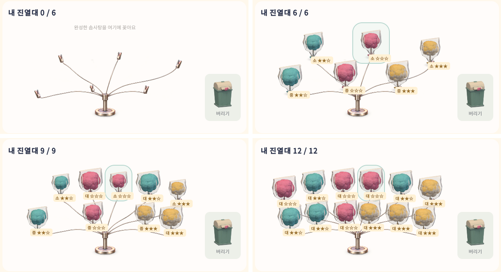
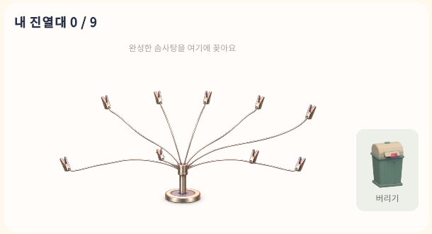

# 보유 칸 수에 맞춘 진열대 · 2026-09-29

## 문제

- 영업 화면의 진열대 받침 이미지는 수용량과 관계없이 집게 12개를 그렸다. 시작 수용량은 6칸이므로 빈 집게 6개가 쓸 수 없는 칸처럼 보였다.
- 매장 3D 진열대 모델은 구버전 필드 `Economy.ShelfLevel`로 켜졌다. 성장 지도의 "진열대 확장"은 성장 레벨만 올리고 이 필드를 바꾸지 않으므로, 확장을 사도 진열대 모델은 1개만 보였다. 7번째 이후의 3D 솜사탕은 꺼진 진열대 아래에 놓여 보이지 않았다.

## 변경

- `WorldView.ShowInventory`는 `StockCapacity`로 진열대 수를 정한다. 첫 진열대가 6개를 담고, 확장마다 3개짜리 진열대가 하나씩 켜진다. 구버전 모드와 성장 모드 모두 같은 값을 쓴다.
- `Business.uss`는 `rack-six`, `rack-nine` 상태에서 각각 `CottonCandyFanStand6.png`, `CottonCandyFanStand9.png`를 받침으로 쓴다. 12칸은 기존 원본을 쓴다. C#은 기존처럼 수용량 클래스만 바꾼다.
- 6개·9개 받침은 `Tools/fan-stand-variants.py`가 원본에서 가지와 집게를 지워 만든다. 남는 집게는 USS의 제품 위치와 같은 자리다. 지운 집게 뒤에 가려져 있던 철사 두 구간은 같은 철사의 단면으로 다시 그렸다. 출처 기록은 `Assets/CottonCircuit/UI/Art/CottonCandyFanStand.md`에 있다.
- `ToolkitAssets.Ensure`는 세 받침 이미지에 같은 가져오기 설정을 적용한다.

## 검증

수정 전 개발 빌드에서 새 검사가 실패하는 것을 먼저 확인했다.

- `-Case rack`: `rack art CottonCandyFanStand shows one clip per slot at capacity 6` 실패
- `-Case full`: 성장 지도에서 진열대 확장을 산 뒤 `shop shows 1 display racks for capacity 9` 실패

수정 후 개발 빌드(`Builds/ShelfDisplay`) 결과:

| 검사 | 결과 | 기록 |
|---|---|---|
| 진열대 · 1600×900 | 861 통과 / 0 실패 | `Logs/ShelfDisplay-rack/result.txt` |
| 진열대 · 1280×720 | 861 통과 / 0 실패 | `Logs/ShelfDisplay-rack1280/result.txt` |
| 전체 게임 흐름 · 1600×900 | 845 통과 / 0 실패 | `Logs/ShelfDisplay-full/result.txt` |
| HUD / 이전 모드 / 음악 | 82 / 19 / 11 통과 | `Logs/ShelfDisplay-hud`, `-legacy`, `-music` |

진열대 검사는 수용량 6·9·12마다 받침 이미지 이름과 켜진 3D 진열대 수를 확인한다. 전체 흐름 검사는 성장 지도의 진열대 확장 버튼을 실제로 눌러 산 뒤, 영업 화면이 9칸 받침과 3D 진열대 2개를 보이는지 확인한다.

## 실제 화면

빈 6칸, 가득 찬 6·9·12칸:

성장 지도에서 진열대 확장을 산 뒤 영업 화면:

