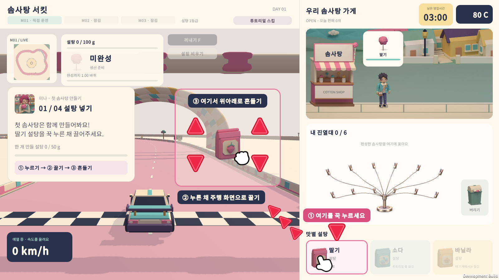
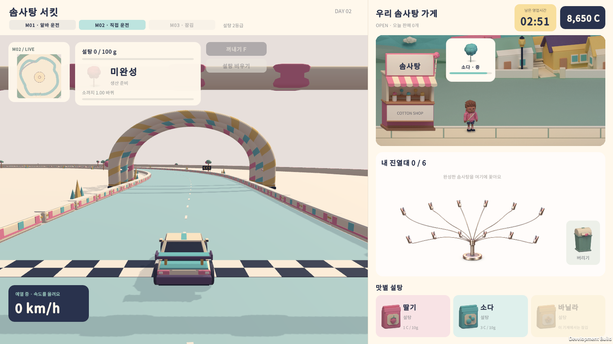
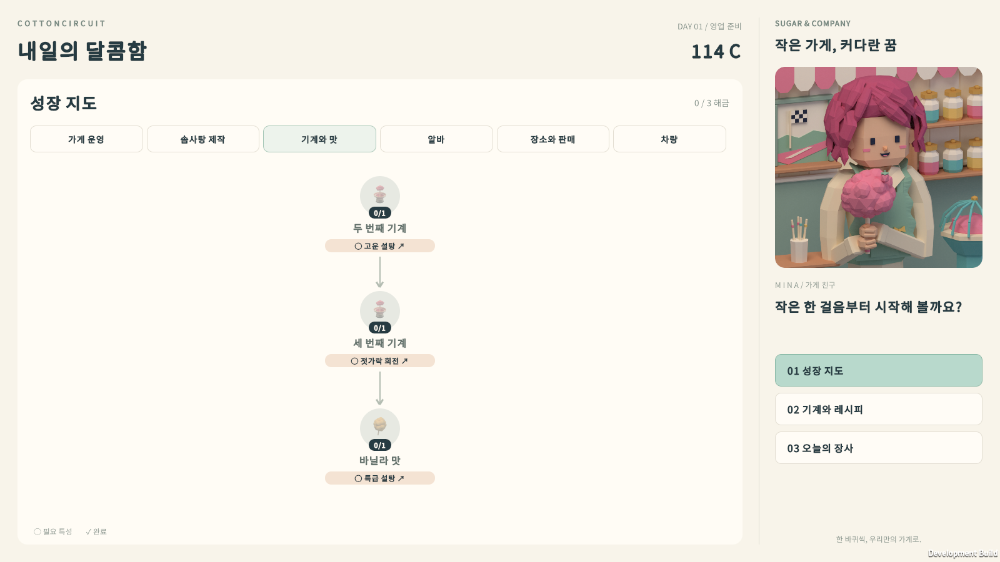

# 시작 소다 맛 · 2026-09-29

사용자 요청에 따라 딸기와 함께 소다 맛으로 게임을 시작한다. 사용자가 고른 A안대로 성장 지도의 '소다 맛' 특성은 삭제했다.

## 규칙

- 새 게임과 기존 저장 모두에서 딸기와 소다를 처음부터 쓸 수 있다. 소다는 기본 기계(1등급)에서도 만들 수 있고, 바닐라는 지금처럼 '바닐라 맛' 특성과 특급 기계가 필요하다.
- 소다 설탕의 재료비(1등급 10g당 2 C)와 판매가 보너스(+7%)는 바꾸지 않았다. 손님 주문과 알바 레시피에도 처음부터 소다가 포함된다.
- 첫 판매 튜토리얼은 딸기로만 진행하므로 튜토리얼 중에는 소다를 잠근다. 소다 봉지 아래에는 "튜토리얼 중 잠김"이 표시되고, 튜토리얼을 마치거나 건너뛰면 열린다. 바닐라처럼 기계 조건 때문에 잠긴 봉지는 계속 "이 기계에서는 잠김"으로 표시한다.
- 튜토리얼 잠금은 `ShopShift.CanMakeFlavor` 한 곳에 있어서 봉지 표시, 드래그, 설탕 넣기, 주문 선택이 모두 같은 판정을 쓴다. 기계 조건만 보는 판정은 `MachineMakesFlavor`로 분리했다.

## 성장 지도

- '소다 맛' 특성을 지웠다. '맛 홍보'는 '가게 간판'만, '장식 기술'은 '예쁜 말기'만 선행 조건으로 남는다.
- 특성은 30개, 총 60단계가 되었다. '기계와 맛' 탭은 두 번째 기계 → 세 번째 기계 → 바닐라 맛이 한 줄로 이어진다.
- 쓰이지 않게 된 `Trait_FlavorSoda` 아이콘은 `TraitIcons.All`, GameAssets 아이콘 목록, Blender 스프라이트 명세·아이콘 매니페스트와 그 테스트, USS 아이콘 규칙에서 뺐다. 아트 검증 도구는 목록에 없는 PNG를 오류로 보므로 PNG와 `.meta`도 삭제했다. 파일은 git 기록에서 되살릴 수 있다.

## 기존 저장

저장 버전을 9로 올렸다. V7–V8 저장은 불러올 때 먼저 옛 소다 규칙으로 검사한다.

- 소다 맛 구매 기록은 1단계 하나뿐이어야 하고, 두 번째 기계를 가지고 있어야 한다.
- 소다 맛이 없는데 '맛 홍보'나 '장식 기술'을 가진 파일은 거부한다.
- 소다 맛이 없으면 기계의 레시피·설탕·반죽과 거리 기반 재고에 소다가 있으면 안 된다. 소다 맛이 있어도 기본 기계(첫 번째 기계)에는 소다가 있으면 안 된다.

이 검사를 통과하면 구매 기록을 지운다. 이어서 기존 검증이 옛 파일의 원래 잔액으로 모두 통과한 뒤에만 310 C를 돌려준다. 따라서 잔액이 음수인 옛 파일은 환급으로 통과하지 못한다. 환급 뒤 금액은 저장 상한(10억 C)을 넘지 않게 맞춘다. V9 파일에 소다 맛 기록이 있으면 거부한다.

## 검증 결과

| 검사 | 결과 | 기록 |
|---|---|---|
| 핵심 규칙 테스트 17개 묶음 | 모두 통과 | `Tools/test-*.ps1` |
| 성장 규칙 | 17 통과 / 0 실패 | `Tools/test-progression.ps1` |
| 튜토리얼 | 15 통과 / 0 실패 | `Tools/test-tutorial.ps1` |
| 성장 저장·이전 | 26 통과 / 0 실패 | `Tools/test-progression-save.ps1` |
| Blender 스프라이트 명세 | 29 통과 (1 건너뜀) | `Art/Blender/tests` |
| 아이콘 스프라이트 검증 | 22/22 유효 | `validate_ui_sprites.py --owner icons` |
| 에디터 통합 점검 | 141 통과, UI 스프라이트 65개 | 빌드 로그 |
| UITK 전체 흐름 · 1600×900 | 824 통과 / 0 실패 | `Logs/StartingSoda-1600/result.txt` |
| UITK 전체 흐름 · 1920×820 | 824 통과 / 0 실패 | `Logs/StartingSoda-wide/result.txt` |
| UITK 전체 흐름 · 1280×960 | 824 통과 / 0 실패 | `Logs/StartingSoda-4x3/result.txt` |
| Unity 개발 빌드 | 성공 | `Builds/StartingSoda/CottonCircuit.exe` |

새로 추가한 검사 항목은 다음과 같다.

- 시작 경제에서 딸기와 소다를 쓸 수 있고, 기본 기계가 딸기와 소다는 만들지만 바닐라는 만들지 않는지 확인한다.
- 튜토리얼 중에는 소다가 잠기고, 완료하거나 건너뛰면 10g당 2 C로 열리는지 확인한다.
- 튜토리얼이 없는 첫날 주문에 딸기와 소다가 섞이고 바닐라는 없는지 확인한다.
- V8 소다 구매자는 310 C를 한 번만 돌려받고 다른 구매는 그대로인지 확인한다. 옛 규칙을 어긴 V8 파일, 잔액이 음수인 V7·V8 소다 구매 파일, 소다 기록이 있는 V9 파일은 거부되어야 한다. 상한 근처 잔액의 환급은 상한에 맞춰야 한다.
- UI 흐름에서는 튜토리얼 중 소다 봉지가 비활성이고 "튜토리얼 중 잠김", 바닐라 봉지가 "이 기계에서는 잠김"인지 확인한다. 튜토리얼 직후에는 기본 기계의 소다 봉지가 "2 C / 10g"로 열려야 하고, 성장 지도에는 소다 특성과 칩이 없어야 한다.

성장 균형 시뮬레이션(`Tools/simulate-progression.ps1`)은 모든 특성 완료가 37일 2.97시간에서 39일 3.05시간으로 조금 늦어졌다. 소다 설탕 재료비가 늘었기 때문이며, 두 번째 기계는 0.81시간에서 0.75시간으로 오히려 당겨졌다. 자세한 값은 [성장 균형 기록](progression-balance.md)에 있다.

## 실제 화면 캡처

