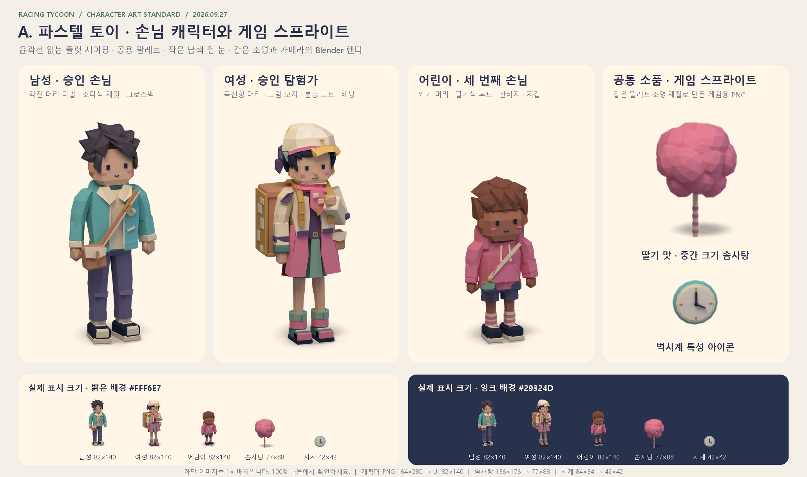
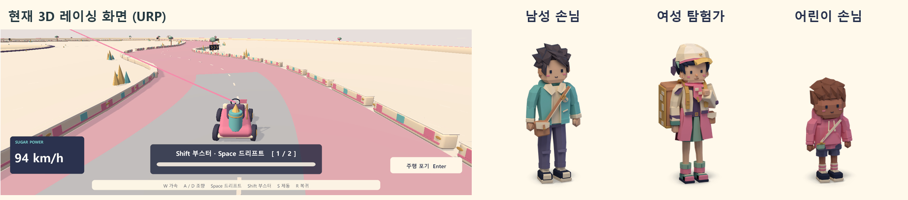

# 로우폴리 아트 컨셉: 파스텔 토이

작성일: 2026-09-26. 캐릭터 기준 갱신일: 2026-09-27. 사용자 결정: **게임에 들어간 2D 이미지를 모두 "파스텔 토이" 로우폴리 렌더로 교체한다.** 왼쪽 3D 레이싱 화면은 이미 같은 계열이므로 바꾸지 않는다.

현재 승인된 캐릭터 기준은 남자 `Customer_01_Faceted.png`와 머리카락·점 눈 수정을 반영한 여자 `Customer_02_Explorer.png`다. 이번 갱신은 이 두 캐릭터를 명세와 비교 이미지의 기준으로 채택한 것이다. Unity 런타임의 손님 스프라이트 교체·연결 완료를 뜻하지 않으며, 전체 2D 그림 교체 범위와 이후 적용·검증 기준은 아래에 유지한다.

## 결정 과정
- 교체 전 게임에는 시각 언어가 세 가지 섞여 있었다. 미나 초상화는 애니메이션풍 페인팅이고, 가게와 아이콘은 코드로 그린 기하학 도형이며, 레이싱 화면은 파스텔 로우폴리 3D다.
- 처음 제안한 SVG 컨셉 네 가지(슈가 러시 데칼, 크레용 캔디숍, 유원지 포스터, 솜구름 동화)는 사용자가 모두 기각했다.
- 실제 게임 24종의 Steam 스크린샷을 비교한 뒤, 사용자는 "좋은 피자, 위대한 피자"의 2D 카툰과 로우폴리 3D를 후보로 골랐다.
- 로우폴리를 두 가지 표현으로 시험 렌더링했다. A는 윤곽선 없는 파스텔 토이, B는 윤곽선이 있는 카툰 로우폴리다. 사용자는 B를 골랐다가, 현재 레이싱 화면이 A 계열임을 확인하고 A로 확정했다. 3D 화면을 고치지 않고도 2D와 3D가 같은 게임처럼 보이기 때문이다.
- B에서 기대한 작은 크기의 가독성은 A 안에서 림 라이트, 대비 규칙, 접지 그림자로 보완한다.
- 이후 남자는 넓은 다각형 면과 긴 몸 비율을 가진 소다색 재킷 손님으로, 여자는 새 탐험가 참고 이미지의 의상·자세를 옮긴 캐릭터로 수정했다. 여자의 머리카락을 곡선형 입체 다발로 다듬고 남자와 같은 작은 남색 점 눈을 적용한 현재 버전을 기준으로 확정한다. 초기 2.5등신 규칙은 이 승인본으로 대체한다.
- 2026-09-27 사용자 결정: 세 번째 손님은 키가 작은 **어린이**로 만든다. 화난 손님은 **찡그린 눈썹**을 더해 표현한다. 미나의 머리카락에는 팔레트에 새로 추가한 **자홍색**을 쓴다.

초기 A/B 시험 보드는 [A/B 시험 렌더 보관본](../../screenshots/archive/2026-09-26/art-concept-lowpoly-test.png)과 [레이싱 비교 보관본](../../screenshots/archive/2026-09-26/art-concept-vs-racing.png)에 남긴다. 보관본의 시험 색상과 초기 캐릭터는 제작 기준으로 쓰지 않는다. 현재 기준은 아래 승인본과 공용 팔레트다.

## 승인된 캐릭터와 비교 이미지

| 기준 | 승인 PNG | Blender 원본 | 재생성 소스·설정 |
|---|---|---|---|
| 남자 손님 | [Customer_01_Faceted.png](../../../Art/Blender/GameCustomerFaceted/Customer_01_Faceted.png) | [GameCustomerFaceted.blend](../../../Art/Blender/GameCustomerFaceted/GameCustomerFaceted.blend) | [create_customer.py](../../../Art/Blender/GameCustomerFaceted/create_customer.py), [customer_head.py](../../../Art/Blender/GameCustomerFaceted/customer_head.py), [manifest.json](../../../Art/Blender/GameCustomerFaceted/manifest.json) |
| 여자 탐험가 | [Customer_02_Explorer.png](../../../Art/Blender/GameCustomerFemaleExplorer/Customer_02_Explorer.png) | [GameCustomerFemaleExplorer.blend](../../../Art/Blender/GameCustomerFemaleExplorer/GameCustomerFemaleExplorer.blend) | [create_explorer.py](../../../Art/Blender/GameCustomerFemaleExplorer/create_explorer.py), [explorer_head.py](../../../Art/Blender/GameCustomerFemaleExplorer/explorer_head.py), [manifest.json](../../../Art/Blender/GameCustomerFemaleExplorer/manifest.json) |

- **남자:** 각진 얼굴과 넓은 면, 비대칭으로 쓸어 넘긴 어두운 다각형 머리카락, Soda 재킷, Cream 셔츠·깃·배지, Wood 메신저백, Pants1 바지, Navy/Cream 운동화를 유지한다. 참고 원본에 맞춘 약 3.6등신 비율을 기준으로 한다.
- **여자:** Cream 모자와 Vanilla색으로 말린 앞 장식, Strawberry 목도리, Cream 재킷과 두 갈래의 긴 Strawberry 코트 자락, Pants3/Mint 녹색 치마, 맨다리와 접힌 부츠, 큰 Wood 배낭을 유지한다. 한 손으로 배낭 끈을 잡은 비대칭 자세와 참고 원본의 긴 몸 비율을 따른다. 모자 아래 Navy 머리카락은 이어진 두피와 끝이 가늘어지는 곡선형 다발 12개로 구성하고, 눈과 귀를 드러내며 목덜미에서 짧게 끝낸다.
- **공통 얼굴:** Navy `#29324D`의 작은 세로 점 눈 두 개를 사용한다. 모서리를 1단 깎은 형태로, 두 캐릭터의 눈은 생성 좌표계에서 같은 크기·간격을 쓴다. 흰자·홍채·반사광·속눈썹·눈썹은 넣지 않는다. 볼 터치와 작은 입은 유지한다.
- **화난 얼굴:** 화남 스프라이트에만 Navy 눈썹 조각 두 개를 눈 위에 안쪽이 내려가게 기울여 넣고, 입은 아래로 처진 짧은 선으로 바꾼다. 게임 크기에서 눈썹이 한 픽셀 두께 이상으로 보여야 한다. 기본 스프라이트와 같은 모델·카메라·자세를 쓰고 얼굴 표시 조각만 바꾼다. 노이즈 제거기가 넓은 영역을 함께 처리하므로 얼굴 밖 픽셀은 채널당 8 이하의 미세한 차이만 허용한다.
- **출력:** 두 캐릭터 모두 표시 82×140, 투명 RGBA PNG 164×280이다. 같은 카메라의 `-large.png` 656×1120은 확대 검토용이며 게임 표시 크기를 바꾸는 기준이 아니다.

아래 첫 보드는 승인된 남자·여자 손님과 어린이 손님(`V1`)의 확대 렌더, 게임 스프라이트 `CottonCandy_Strawberry_Medium`(156×176)과 `Trait_Hours`(84×84) 캔버스를 2배로 키운 모습을 보여 주고, 다섯 그림의 실제 표시 크기(손님 82×140, 솜사탕 77×88, 아이콘 42×42)를 크림 배경 `#FFF6E7`과 잉크 배경 `#29324D`에서 비교한다. 배경의 `#FFF6E7`은 가독성 확인용 색이며 캐릭터 재질의 Cream `#FFF1D4`와 구분한다.



아래 둘째 보드는 왼쪽에 기존 레이싱 캡처, 오른쪽에 세 손님(남자, 여자 탐험가, 어린이)을 배치해 스타일을 비교한다. 두 보드는 아트 방향을 확인하는 자료이며 Unity 플레이 화면은 아니다. 게임에 적용한 화면은 `docs/lowpoly-sprites-verification.md`에 있다.



## 목표와 범위
- 2D 화면에 쓰이는 그림을 모두 같은 로우폴리 스타일의 사전 렌더 스프라이트로 바꾼다.
- 레이싱 화면의 3D 모델, 재질, 조명은 바꾸지 않는다.
- 기능 그래픽(미니맵, 성장 지도 연결선, 속도선, 패널)과 UI 틀은 그림이 아니므로 교체하지 않는다.
- 게임 규칙, UI 배치, 조작은 바꾸지 않는다. 그림의 표시 위치와 크기는 현재 값을 유지한다.

## 스타일 규칙
- **형태:** 넓은 면이 보이는 플랫 셰이딩 로우폴리로 만든다. 윤곽선은 쓰지 않는다. 얼굴과 옷은 승인본처럼 직접 설계한 다각형 면을 쓰고, 각진 소품은 모서리를 살짝 깎는다. 아이코스피어는 둥근 소품에 쓸 수 있지만 캐릭터 머리의 필수 기본형은 아니다. 머리카락은 남자의 넓은 입체 쐐기 면 또는 여자의 끝이 가늘어지는 곡선형 입체 다발처럼 두께와 흐름이 읽히게 만든다.
- **캐릭터 비율:** 승인된 두 캐릭터처럼 머리를 크게 유지하면서 몸과 다리가 길어진 비율을 따른다. 남자는 약 3.6등신이며, 여자는 탐험가 참고 원본의 비율과 승인 실루엣을 기준으로 한다. 모든 손님을 하나의 고정 등신 수로 맞추지 않는다. 얼굴은 위의 공통 점 눈, 볼 터치, 작은 입으로 표현하고 머리 모양, 모자, 옷, 피부색으로 구분한다.
- **솜사탕:** 조금 큰 중심 구 위에 작은 구 20개 안팎을 무작위로 붙이고, 꼭짓점을 조금씩 흔들어 폭신한 덩어리로 만든다. 막대는 크림색에 맛 색 줄무늬를 넣는다.
- **색:** 아래 공용 팔레트만 쓴다. 조명을 받은 면은 밝아지고 그늘진 면은 어두워지지만, 기준 색은 팔레트 값이어야 한다.
- **재질:** 새로 만드는 모든 에셋은 승인 캐릭터와 같은 재질 레시피(Principled BSDF, Roughness 0.85, Specular IOR Level 0.08)를 쓴다. 초기 샘플의 0.83/0.18 레시피는 쓰지 않으며, 솜사탕과 벽시계 샘플도 이 레시피로 다시 렌더링한다.
- **조명:** 모든 에셋이 같은 조명 세트를 쓴다.
  - 키 라이트: 왼쪽 위 앞에서 비추는 따뜻한 면광원이다. 위치 (-2, -3, 7), 세기 900W, 크기 4, 색 `#FFF1DD`다.
  - 필 라이트: 오른쪽 앞에서 비추는 차가운 면광원이다. 위치 (4.5, -3.5, 3), 세기 250W, 크기 5, 색 `#DDE6FF`다.
  - 림 라이트: 피사체 뒤쪽 위에서 비추는 약한 흰색 면광원이다. 위치 (1.5, 3, 5), 세기 70W, 크기 3, 색 `#FFFFFF`이며 두 승인본의 목록 파일에 기록되어 있다.
  - 환경광: `#F3ECF7`, 세기 0.75.
- **카메라:** 직교 카메라를 쓴다. 피사체를 정면에서 왼쪽으로 20° 돌려 보고, 15° 내려다본다. 특성 아이콘은 정면에서 10° 이내로 돌려 형태가 바로 읽히게 한다.
- **그림자:** 손님, 제품, 가게처럼 바닥에 놓이는 대상은 그림자 캐처 평면으로 짧은 접지 그림자를 스프라이트에 포함한다. 그림자가 캔버스 가장자리에서 잘리지 않도록 여백을 둔다. 아이콘과 감정 표시에는 그림자를 넣지 않는다.
- **가독성:** 손님과 제품은 배경보다 한 단계 진한 색을 쓴다. 림 라이트로 실루엣을 배경에서 분리한다. 모든 스프라이트는 실제 표시 크기로 줄여서 밝은 배경과 어두운 잉크색 배경 위에서 모두 형태가 읽혀야 한다.
- **렌더 설정:** Cycles 64 샘플과 노이즈 제거를 쓴다. 색 변환은 `Standard`, 룩은 `None`, 노출은 -1.8, 감마는 1이다. 배경은 투명(film transparent)이며 RGBA PNG로 저장한다.
- **해상도:** UI 기준 해상도가 1600×900이므로 실제 표시 크기의 2배로 렌더링한다. Unity의 고품질 압축은 4×4 블록 단위이므로, 2배 크기가 4의 배수가 아니면 캔버스를 다음 4의 배수로 늘린다.

## 공용 팔레트
3D 머티리얼과 UI 코드(`Palette`)가 이미 같은 값을 쓰고 있다. 2D 렌더도 이 값을 쓴다.

| 이름 | 값 | 쓰임 |
|---|---|---|
| 딸기 (Strawberry, `Palette.Pink`) | `#F48DAB` | 딸기 맛, 강조 |
| 소다 (Soda, `Palette.Soda`) | `#7ACDCE` | 소다 맛 |
| 바닐라 (Vanilla, `Palette.Yellow`) | `#F9D27D` | 바닐라 맛 |
| 잉크 (Navy, `Palette.Ink`) | `#29324D` | 눈, 어두운 부품 |
| 크림 (Cream) | `#FFF1D4` | 막대, 밝은 부품 |
| 화이트 (White) | `#FFF9ED` | 가장 밝은 면 |
| 민트 (Mint) | `#99C4AE` | 식물, 보조 강조 |
| 플럼 (Plum) | `#6C577F` | 머리카락, 어두운 보조색 |
| 골드 (Gold) | `#DBAE61` | 등급, 장식 |
| 우드 (Wood) | `#D59C79` | 나무, 크라프트 종이 |
| 타이어 (Tire) | `#414059` | 바퀴, 기계 부품 |
| 베이스 (Base) | `#9DBBAF` | 받침, 바닥 |

캐릭터 보조 색은 현재 손님 그림의 값을 이어받아 팔레트에 추가한다.

| 이름 | 값 |
|---|---|
| 피부 1, 2, 3 | `#F1C6A6`, `#B87A65`, `#E8AF88` |
| 머리 1, 2, 3 | `#574F59`, `#8D5B4A`, `#45475B` |
| 바지 1, 2, 3 | `#7C789D`, `#65688B`, `#5F968F` |
| 자홍 (Magenta) | `#C2577E` |

자홍은 미나의 머리카락에만 쓴다. 현재 초상화의 머리카락 평균색 `#9A535A`는 조명과 그늘이 섞인 값이며, 노출 -1.8에서 렌더링했을 때 이와 비슷한 밝기가 나오도록 재질 기준색을 한 단계 밝게 정했다.

새 색이 필요하면 이 표에 먼저 추가하고, 3D 머티리얼에서도 같은 색이 필요하면 같은 값을 쓴다.

## 교체 대상
렌더 캔버스는 표시 크기의 2배를 4의 배수로 맞춘 크기다. 한 그림이 비율이 다른 여러 칸에 쓰이면 가장 많이 쓰이는 칸을 기준으로 캔버스를 정한다. 파일은 `Assets/CottonCircuit/Sprites/<폴더>/<이름>.png`에 둔다.

| 대상 | 현재 코드 | 표시 크기 | 캔버스 | 폴더와 이름 | 이미지 수 |
|---|---|---|---|---|---|
| 손님 | `ShopStreetGraphic` Customer | 82×140 | 164×280 | `Customers/Customer_V{0,1,2}_{Neutral,Angry}` | 3종 × 기본·화남 = 6 |
| 가게 외관 | `ShopStreetGraphic` Storefront | 169×230 | 340×460 | `Shop/Storefront` | 1 |
| 거리 배경 (성장 모드가 없을 때) | `ShopStreetGraphic` Backdrop | 596×314 | 없음 | `Location_0_Street`를 함께 쓴다 | 0 |
| 지역 풍경 | `ProgressionArtGraphic` scene | 588×354 (준비), 596×314 (영업) | 1176×708, 1192×628 | `Locations/Location_{0..3}_{Prep,Street}` | 4곳 × 두 구도 = 8 |
| 솜사탕 | `ShopArtGraphic` CottonCandy | 77×88 (제작 중), 80×77 (주문 말풍선) | 156×176 | `Items/CottonCandy_{Strawberry,Soda,Vanilla}_{Small,Medium,Large}` | 맛 3 × 크기 3 = 9 |
| 포장 솜사탕 | `ShopArtGraphic` BaggedCottonCandy | 84×98, 74×92, 62×86 (진열대 6·9·12칸), 118×124 (드래그) | 148×184 | `Items/BaggedCandy_{맛}_{크기}` | 맛 3 × 크기 3 = 9 |
| 설탕 봉지 | `ShopArtGraphic` SugarBag | 82×100 (카드), 118×124 (드래그) | 164×200 | `Items/SugarBag_{Strawberry,Soda,Vanilla}` | 3 |
| 쓰레기통 | `ShopArtGraphic` Trash | 68×82 | 136×164 | `Shop/Trash` | 1 |
| 감정 표시 | `ShopStreetGraphic` Heart·AngryEmote | 72×66 | 144×132 | `Shop/Emote_{Heart,Angry}` | 2 |
| 기계 | `ProgressionArtGraphic` machine | 126×126 | 252×252 | `Machines/Machine_{0,1,2}` | 3 |
| 특성 아이콘 | `ProgressionArtGraphic` (특성 ID) | 42×42 | 84×84 | `Icons/Trait_<아이콘>` | 23 |
| 미나 초상화 | `Resources/Progression/NpcPortrait.png` | 404×391 | 808×784 | `Characters/Mina_Portrait` | 1 |
| 합계 | | | | | 66 |

- **손님:** 변형 번호는 현재 코드의 `Variant % 3`과 같게 대응시킨다. `V0`은 소다색 재킷의 남자 승인본, `V1`은 딸기색 옷을 입은 새 어린이 손님, `V2`는 모자를 쓴 여자 탐험가 승인본이다. `V1`은 기존 두 번째 스타일의 색(딸기색 상의, 머리 2, 피부 2, 바지 2)을 이어받고, 키가 작은 어린이 비율로 실루엣부터 구분한다. 남자와 여자의 기본 스프라이트는 승인 PNG와 픽셀이 같아야 한다.
- **지역 풍경:** 네 지역은 서로 다른 랜드마크로 구분한다. 동네 골목은 낮은 주택과 가로등, 시장 앞은 차양이 있는 노점들, 강변 축제는 강물과 깃발 줄·축제 부스, 별빛 광장은 해 질 무렵의 광장과 관람차다. 지역마다 준비 화면 구도와 영업 화면 구도를 따로 렌더링한다. 두 구도 모두 캔버스를 꽉 채운 불투명 배경이다. 영업 화면 구도는 왼쪽 약 30%에 가게 외관, 가운데에 손님 세 명과 말풍선이 올라가므로 그 영역을 비워 두고, 아래쪽 11% 띠에는 상태 문구가 읽히도록 차분한 보도를 둔다.
- **솜사탕 성장:** 크기 단계(소·중·대) 사이의 성장은 현재처럼 달린 거리에 따라 스프라이트 크기를 조절해 표현한다. 크기 구분이 없는 초기 상태는 크기 "소" 스프라이트를 쓴다. 낱개 솜사탕은 막대 아래 끝을, 포장 솜사탕은 묶은 매듭을 기준점으로 크기를 조절한다.
- **포장 솜사탕:** 셀로판 봉지의 묶은 매듭을 캔버스 아래에서 14% 높이에 둔다. 진열대 칸의 고정 위치(`CandyRackGraphic.ClipPoint`)가 이 높이이기 때문이다.
- **기계:** 세 기계는 크기와 색으로 등급을 구분한다. 기본 기계는 작은 딸기색 통, 소다 기계는 소다색 통과 거품 돔, 특급 기계는 골드 장식과 별이 달린 큰 통이다.
- **가게 외관:** 기존 `Kiosk` 모델의 구성을 참고하되, 스프라이트용으로 색과 형태를 새로 다듬는다. 게임 안의 3D `Kiosk` 모델은 바꾸지 않는다. 부모 UI가 간판(아래에서 71.5~92.5% 높이)에 "솜사탕"을, 계산대(18~32% 높이)에 "COTTON SHOP"을 겹쳐 쓰므로 두 띠는 글자가 읽히는 밝은 단색 면으로 둔다.
- **미나 초상화:** 같은 로우폴리 규칙의 상반신 렌더로 바꾼다. 알아볼 수 있도록 현재 초상화의 특징인 짧은 웨이브 자홍색 머리, 크림색 셔츠, 민트색 앞치마, 두 손으로 가슴 앞에 든 딸기 솜사탕을 유지한다. 배경은 캔버스를 꽉 채운 단순한 솜사탕 가게 실내(진열 병, 차양)로 둔다. 파일은 `GameAssets`로 연결하고 `Resources/Progression/NpcPortrait.png`는 삭제한다.

## 특성 아이콘
특성 31개를 아이콘 21종으로 묶는다. 등급이나 맛이 다른 두 아이콘은 변형 이미지를 따로 만들어 모두 23장이다.

| 아이콘 | 파일 (`Icons/`) | 특성 |
|---|---|---|
| 벽시계 | `Trait_Hours` | 영업시간 (`hours`) |
| 모래시계 | `Trait_Patience` | 손님 기다림 (`patience`) |
| 확성기 | `Trait_Ads` | 동네 광고 (`ads`) |
| 하트 말풍선 | `Trait_RepeatAds` | 입소문 (`repeat_ads`) |
| 진열대 | `Trait_Shelf` | 진열대 확장 (`shelf`) |
| 간판 | `Trait_Sales` | 가게 간판 (`sales`) |
| 가격표 | `Trait_PriceTag` | 맛 홍보 (`flavor_price`), 지역 단골 (`location_price`) |
| 엔진 | `Trait_Engine` | 차량 엔진 (`engine`) |
| 핸들 | `Trait_Handling` | 차량 조향 (`handling`) |
| 클래식 카트 | `Trait_Kart` | 클래식 카트 (`coupe`) |
| 회전하는 막대 | `Trait_StickSpeed` | 젓가락 회전 (`stick_speed`) |
| 계량 스푼 | `Trait_Spoon` | 설탕 절약 (`stick_saving`), 설탕 계량 (`sugar_saving`) |
| 리본 솜사탕 | `Trait_Ribbon` | 예쁜 말기 (`stick_quality`), 장식 기술 (`quality_focus`) |
| 설탕 봉지와 별 2개 / 3개 | `Trait_Sugar2` / `Trait_Sugar3` | 고운 설탕 (`sugar_2`) / 특급 설탕 (`sugar_3`) |
| 솜사탕 기계 | `Trait_Machine` | 두 번째 기계 (`machine_2`), 세 번째 기계 (`machine_3`) |
| 소다색 솜사탕 / 바닐라색 솜사탕 | `Trait_FlavorSoda` / `Trait_FlavorVanilla` | 소다 맛 (`flavor_soda`) / 바닐라 맛 (`flavor_vanilla`) |
| 알바 | `Trait_Worker` | 첫 번째 알바 (`worker_1`), 두 번째 알바 (`worker_2`) |
| 학사모 | `Trait_GradCap` | 알바 2등급 교육 (`worker_grade_2`), 알바 3등급 교육 (`worker_grade_3`) |
| 장갑 | `Trait_Glove` | 알바 손놀림 (`worker_speed`) |
| 지도 핀 | `Trait_MapPin` | 시장 앞 (`location_1`), 강변 축제 (`location_2`), 별빛 광장 (`location_3`) |
| 손님 무리 | `Trait_Group` | 단체 손님 (`group_visit`) |

아이콘은 현재처럼 분류 색 원판(`disc`) 위에 올린다. 원판과 선택 강조 원은 UI 요소이므로 그대로 둔다. 특성 ID와 아이콘의 대응은 부분 문자열 검사 대신 명시적인 대응표로 관리한다. 원판 색이 분류마다 다르므로(예: 제작 분류는 분홍 `#EBA5B3`), 아이콘은 크림·잉크 배경뿐 아니라 자기 분류의 원판 색 위에서도 형태가 읽혀야 한다.

## 교체하지 않는 요소
- 말풍선은 주문을 담는 UI 틀이므로 평면 도형으로 둔다. 색만 공용 팔레트에 맞춘다.
- 미니맵, 성장 지도 연결선, 속도선, 둥근 패널, 진열대 철사 거치대는 기능 그래픽이므로 그대로 둔다.
- 레이싱 HUD의 솜사탕 미리보기(`CandyPreview` 렌더 텍스처)는 이미 실시간 3D이므로 그대로 둔다.
- 레이싱 화면의 3D 모델, 재질, 조명은 바꾸지 않는다.

## 제작 방식
Blender에서 사전 렌더링한 PNG를 Unity 스프라이트로 쓴다.

- 기존 Blender 파이프라인(생성 스크립트, 검증 스크립트, 목록 파일)을 그대로 이어 쓸 수 있다.
- 실행 중에는 이미지 한 장을 그리는 비용만 들고, 색이나 크기를 바꾸면 스크립트로 다시 렌더링하면 된다.
- Unity 안에서 실시간 3D로 그리는 방식은 이미지마다 카메라와 렌더 텍스처가 필요해 구조가 복잡해진다. 커지는 솜사탕도 크기 단계별 스프라이트로 충분히 표현되므로 혼합 방식도 쓰지 않는다.

## 파일 구조
- `Art/Blender/GameCustomerFaceted/`, `Art/Blender/GameCustomerFemaleExplorer/`: 위 승인본의 독립 Blender 원본, 생성 코드, 렌더, 설정·검증 기록이다. 현재 캐릭터 제작 기준이며, 게임용 `Customer_V0_*`과 `Customer_V2_*`도 이 원본으로 렌더한다. 화난 얼굴 조각은 각 원본에 숨겨 둔다.
- `Art/Blender/GameCustomerChild/`: 세 번째 손님인 어린이(`V1`)의 Blender 원본, 생성 코드(`create_child.py`, `child_head.py`), 목록 파일, 렌더 측정 스크립트(`measure_child.py`)다.
- `Art/Blender/render_customer_sprites.py`: 세 손님 원본으로 `Customer_V{0,1,2}_{Neutral,Angry}` 6장을 렌더한다.
- `Art/Blender/MinaPortrait/`: 미나 초상화 `Mina_Portrait`의 Blender 원본, 생성 코드(`create_mina.py`, `mina_head.py`), 목록 파일, 기존 페인팅과의 비교 보드 생성기(`make_comparison.py`)다. 삭제한 페인팅은 git 기록에서 읽는다.
- `Art/Blender/ui_sprite_spec.py`: Blender 없이 읽는 기준값이다. 공용 팔레트, 조명, 노출, 재질 레시피, 종류별 규칙, 66장 카탈로그(`CATALOG`), 특성 아이콘 목록을 담는다.
- `Art/Blender/ui_sprite_common.py`: 승인본 생성기와 새 파이프라인이 공유하는 조명·카메라·렌더 설정 함수다.
- `Art/Blender/ui_sprite_render.py`: 스프라이트 렌더 함수(`render_sprite`)다. 접지 그림자가 있는 종류는 승인본과 같은 방식으로 합성한다.
- `Art/Blender/create_ui_sprites.py`: 두 승인본 생성기가 호출하는 호환용 접지 그림자 렌더 함수다. 초기 대표 샘플 3종의 형태 코드는 커밋 `966cf73`에 남아 있다.
- `Art/Blender/toy_kit.py`: 승인본의 도형 함수와 같은 서명을 쓰는 도형 도구다. 재질은 위 레시피로 만든다.
- `Art/Blender/build_ui_sprites.py`: 분류 모듈 하나를 읽어 에셋마다 장면을 만들고 렌더한 뒤, 분류별 `.blend`와 목록 파일을 저장하는 드라이버다.
- `Art/Blender/ui_sprites/<분류>.py`: 제품(`items`), 가게(`shop`), 지역 풍경(`locations`), 기계(`machines`), 특성 아이콘(`icons`)의 형태 코드다. 같은 폴더의 `<분류>.blend`는 에셋마다 장면을 나눈 편집 원본이고, `<분류>.manifest.json`은 에셋 이름, 캔버스, 카메라, 조명, 렌더 설정, 재질을 기록한 목록 파일이다.
- `Art/Blender/ui-sprite-passes/<분류>/`: 접지 그림자 합성 전의 렌더 패스다.
- `Art/Blender/validate_ui_sprites.py`: 카탈로그와 실제 PNG·목록 파일을 대조해 개수, 크기, 투명 여백, 불투명 배경, 목록 파일의 렌더 설정과 팔레트를 검사한다. `--complete`는 66장이 모두 있어야 통과하며, 결과는 `Art/Blender/ui-sprites-validation.json`에 쓴다.
- `Art/Blender/preview_ui_sprites.py`: 모든 스프라이트를 2배 캔버스와 실제 표시 크기로 밝은 배경, 잉크 배경, 특성 원판 색 위에 놓은 검토 보드를 만든다.
- `Art/Blender/previews/`: 전체 검토 보드 `all.png`(`preview_ui_sprites.py`로 만드는 생성물, git에서 제외), 분류별 보드, 분류별 추가 확인 이미지다.
- `Art/Blender/tests/`: 카탈로그, 검사기, 손님 스프라이트의 단위 시험과 드라이버·렌더 동일성 시험이다.
- `Art/Blender/UI_SPRITES.md`: 파이프라인 설정과 명령 안내다.
- `Art/Blender/update_art_concept_boards.py`: 승인본과 새 스프라이트로 이 문서의 두 비교 보드를 다시 만든다. 확대에는 `-large.png`, 실제 표시 크기에는 164×280 PNG를 82×140으로 축소한 이미지를 쓴다.
- `Art/Blender/art-concept-boards-validation.json`: 보드에 사용한 원본 경로·해시와 해상도, 실제 크기 합성 및 레이싱 캡처 픽셀 보존 검사 결과다.
- `Assets/CottonCircuit/Sprites/`: Unity용 PNG를 `Customers`, `Shop`, `Items`, `Icons`, `Locations`, `Machines`, `Characters`로 나누어 둔다.

## 승인본과 비교 보드 재생성

프로젝트 루트에서 실행한다. 승인본은 8 스레드로 저장·렌더해야 하므로 첫 줄에서 `UI_SPRITE_THREADS`를 지운다(현재 `setup_scene()`은 이 변수를 읽지 않지만, 같은 세션에서 UI 스프라이트 명령을 돌렸다면 남아 있을 수 있다). 앞의 두 Blender 명령은 현재 생성 코드로 승인본 원본과 두 해상도의 렌더를 다시 만든다. 어린이 손님, 손님 스프라이트 6장(`Customer_V0~V2`)과 게임 스프라이트는 [어린이 README](../../../Art/Blender/GameCustomerChild/README.md)와 [UI 스프라이트 안내](../../../Art/Blender/UI_SPRITES.md)의 명령으로 다시 만든다. 마지막 명령은 현재 PNG로 이 문서의 두 비교 보드와 검사 기록을 갱신한다. 첫 보드는 승인된 남자·여자와 어린이 손님(`V1`)의 확대 렌더와 82×140 표시 크기, 게임 스프라이트 `CottonCandy_Strawberry_Medium`(156×176)과 `Trait_Hours`(84×84)를 크림·잉크 배경에서 보여 준다. 둘째 보드는 기존 레이싱 캡처 옆에 세 손님을 놓는다.

```powershell
Remove-Item Env:UI_SPRITE_THREADS -ErrorAction SilentlyContinue
& 'C:/Program Files/Blender Foundation/Blender 5.2/blender.exe' -b --factory-startup --python-exit-code 1 -P Art/Blender/GameCustomerFaceted/create_customer.py
& 'C:/Program Files/Blender Foundation/Blender 5.2/blender.exe' -b --factory-startup --python-exit-code 1 -P Art/Blender/GameCustomerFemaleExplorer/create_explorer.py
python Art/Blender/GameCustomerFaceted/validate_png.py
python Art/Blender/GameCustomerFemaleExplorer/validate_png.py
python Art/Blender/update_art_concept_boards.py
```

Blender MCP에서 현재 편집한 모델을 유지한 채 재렌더하려면 각 [남자 README](../../../Art/Blender/GameCustomerFaceted/README.md)와 [여자 README](../../../Art/Blender/GameCustomerFemaleExplorer/README.md)의 `GC_ACTION='render'`, `EX_ACTION='render'` 사용법을 따른다. 여자 승인본은 `revisions/`의 수정 전 백업이 아니라 현재 폴더의 머리카락·점 눈 수정본이다.

## 코드 적용 원칙
- 코드로 도형을 그리던 그림은 `Image`와 스프라이트로 바꾸고, 대체된 그리기 코드는 삭제한다. 말풍선과 원판처럼 남는 UI 도형 코드는 유지한다.
- 스프라이트 참조는 기존 방식대로 `GameAssets` ScriptableObject에 모으고, 에디터 빌더가 연결한다.
- 스프라이트는 Texture Type `Sprite (2D and UI)`, 밉맵 없음, 알파 투명 사용, 고품질 압축으로 가져온다.
- 표시 위치와 크기, 화남 상태와 맛·크기에 따른 선택, 달린 거리에 따른 솜사탕 크기 변화, 진열대의 고정 위치 같은 현재 동작은 그대로 유지한다.

## 검증과 완료 기준
다음은 전체 게임 그림 교체 작업의 완료 기준이다. 이번 명세·비교 보드 갱신만으로 통과한 것으로 간주하지 않는다.

1. `validate_ui_sprites.py`가 통과한다. 목록 파일의 모든 에셋이 PNG로 존재하고, 크기와 투명 여백이 규칙에 맞는다.
2. 교체 대상 표의 모든 그림이 게임에서 스프라이트로 표시되고, 대체된 도형 그리기 코드가 남아 있지 않다.
3. Unity 에디터 검증에서 모든 스프라이트 참조가 연결되어 있음을 확인한다.
4. 준비 화면 세 페이지와 영업 화면을 1600×900과 1280×720에서 캡처해 교체 전과 비교한다. 겹침, 잘림, 크기 변화가 없어야 한다.
5. 모든 스프라이트를 실제 표시 크기에서 밝은 배경과 잉크색 배경 위에 놓고 형태가 읽히는지 확인한다. Unity는 선형 색 공간에서 알파를 섞으므로, 최종 판단은 PIL 비교 보드가 아니라 게임 캡처 화면으로 한다.
6. 레이싱 화면 옆에 영업 화면을 놓았을 때 색과 조명이 같은 게임으로 보인다.
7. 기존 테스트와 플레이 스모크가 통과한다.
8. README의 Blender 원본 목록에 새 스크립트와 결과물 위치를 추가한다.

## 이후 과제
- 손님 종류를 3종보다 늘리는 작업은 이번 범위에 넣지 않는다.
- 감정 표시와 손님을 움직이는 프레임 애니메이션은 이번 범위에 넣지 않는다. 감정 표시 이미지 두 장은 위 표대로 이번 범위에 포함한다.
- 솜사탕 실이 달린 거리에 따라 도는 현재 연출은 정지 스프라이트로 바뀌면서 사라진다.
- 레이싱 화면의 3D 에셋을 새 스프라이트 수준으로 다듬는 작업은 별도로 결정한다.
