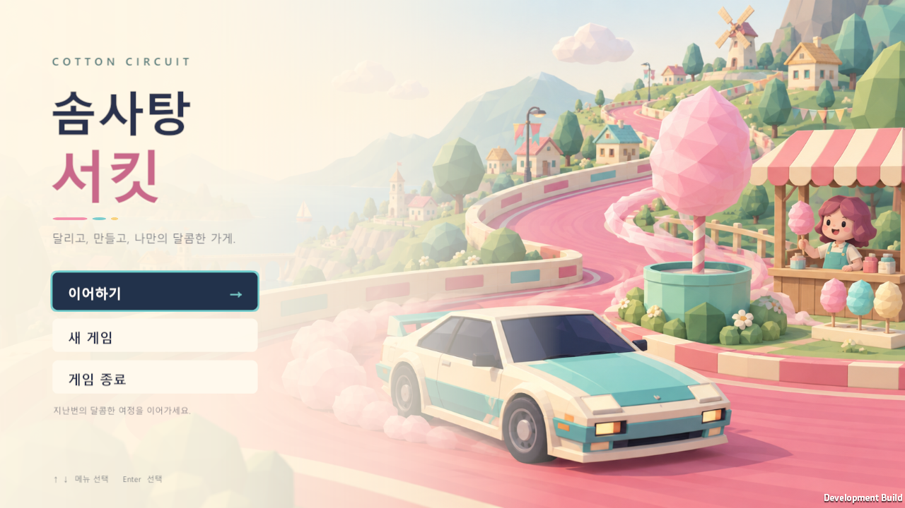
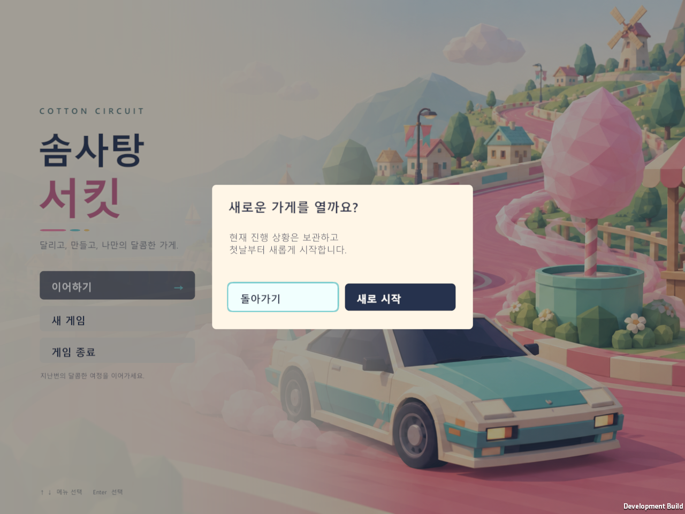
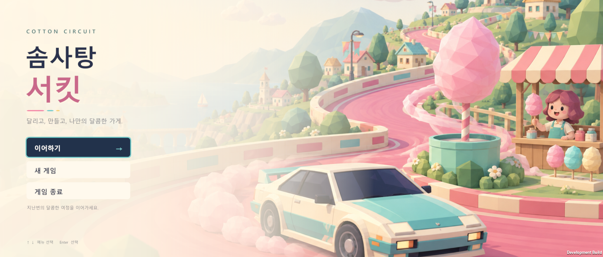

# 타이틀 화면

2026-09-27 · Unity 6000.5.3f1 · Windows

새 게임의 진입 흐름은 이후 추가한 [오프닝 스토리](intro-story-verification.md)를 거친다. 아래 검사 수와 캡처는 스토리 추가 전 타이틀 구현의 기록이며, 최신 실행 파일과 통합 검증은 스토리 문서에 있다.

승인된 `Assets/CottonCircuit/Sprites/Title/TitleBackground.png`를 첫 화면 배경으로 사용한다. 원본 PNG는 수정하지 않았다. 왼쪽에 크림색 그라데이션을 겹쳐 제목과 메뉴를 읽기 쉽게 하고, 오른쪽 자동차와 솜사탕 가게가 보이게 했다.

## 동작

- 저장이 없으면 **게임 시작**, 저장이 있으면 **이어하기 / 새 게임**이 보인다. **게임 종료**는 두 경우 모두 제공한다.
- 새 게임을 누르면 확인 창이 열린다. 돌아가기는 기존 파일을 그대로 두고, 새로 시작은 오프닝 스토리를 연다. 스토리를 완료하거나 스킵하면 기존 저장을 보관한 다음 첫날을 시작한다.
- 화살표와 Enter로 선택할 수 있다. Esc는 확인 창을 닫고, 타이틀에서는 종료 버튼에 초점을 옮긴다. 빈 배경을 클릭해도 키보드 선택이 다시 가능하다.
- 타이틀에서는 세션 생성, 게임 시간 진행, 저장 파일 로드·복구·쓰기를 하지 않는다. 실제 진입 시 기존 초기화와 저장 복원 흐름을 사용한다.
- 배경은 화면을 채우면서 원본 비율을 유지한다. 16:9와 다른 비율에서는 가장자리 일부가 잘린다. 메뉴는 별도 Canvas 좌표로 표시한다.

## 검증

개발 플레이어 `Builds/TitleScreen/CottonCircuit.exe`에서 다음 항목을 확인했다. 실제 사용자 저장 대신 각 실행마다 GUID가 다른 테스트 폴더를 사용했다.

| 시나리오 | 해상도 | 검사 수 | 결과 폴더 |
|---|---:|---:|---|
| 저장 없는 첫 시작 | 1600×900 | 47 | `Logs/TitleScreen-final-fresh` |
| 기존 저장 이어하기 | 1280×720 | 88 | `Logs/TitleScreen-final-saved` |
| 새 게임 확인·취소·보관 | 1280×960 | 96 | `Logs/TitleScreen-final-reset` |
| 손상된 저장의 원본·쓰기 보호 | 1920×820 | 87 | `Logs/TitleScreen-final-corrupt` |

타이틀 **318개**, 기존 성장·영업 흐름 **434개**(`Logs/TitleScreen-progression/result.txt`), 저장 회귀 검사 **20개**(`Logs/progression-save-tests.txt`)가 통과했다. 에디터 통합 검사는 **101개**가 통과했다. 네 해상도의 캡처에서 제목·메뉴·확인 창을 육안으로 확인했으며 배경 비율, 화면 채우기, 버튼 경계, 실제 포인터 레이캐스트, 키보드 이동과 초점 복구도 자동 검사한다.

타이틀 테스트는 준비 단계 저장을 이어간다. 영업 단계의 복원은 기존 성장 스모크와 저장 회귀 검사에서 확인한다. 종료는 기존 Application.Quit 호출을 사용하며 자동 검사는 테스트 프로세스 종료 경로를 사용한다.

## 재현

```powershell
./Tools/build.ps1 -BuildFolder Builds/TitleScreen
./Tools/verify-title.ps1 -Case fresh -Width 1600 -Height 900
./Tools/verify-title.ps1 -Case saved -OutputFolder Logs/TitleSaved -Width 1280 -Height 720
./Tools/verify-title.ps1 -Case reset -OutputFolder Logs/TitleReset -Width 1280 -Height 960
./Tools/verify-title.ps1 -Case corrupt -OutputFolder Logs/TitleCorrupt -Width 1920 -Height 820
./Tools/verify-progression.ps1 -BuildFolder Builds/TitleScreen -OutputFolder Logs/TitleScreen-progression
./Tools/build.ps1 -Release -BuildFolder Builds/TitleScreen-Release
```

`TitleScreenUI.cs`가 메뉴와 확인 창을 만들고 `GameController.ShowTitle`이 첫 진입을 담당한다. `GameAssets.TitleBackground`는 `SpriteCatalog`에서 연결하며 기존 명시적 `Initialize` 호출은 바로 게임에 진입하는 동작을 유지한다.

아래 캡처는 검사용 개발 빌드다.







