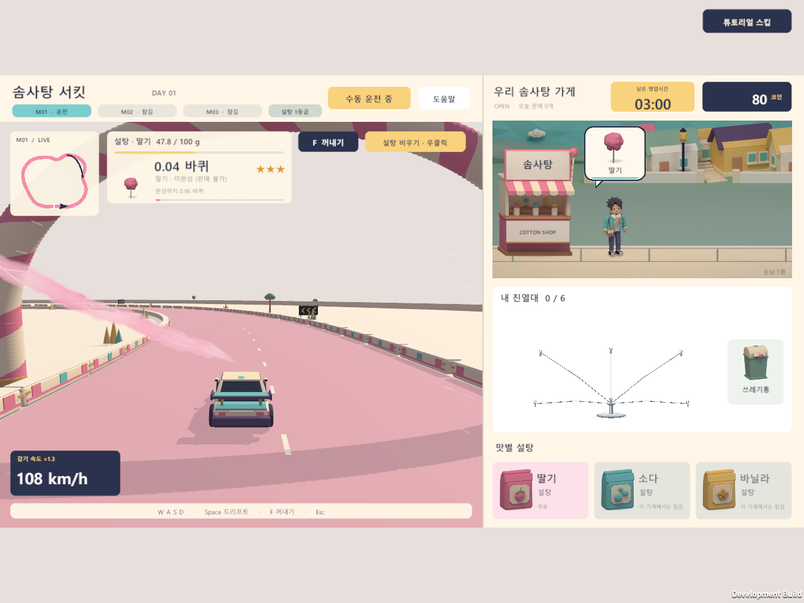
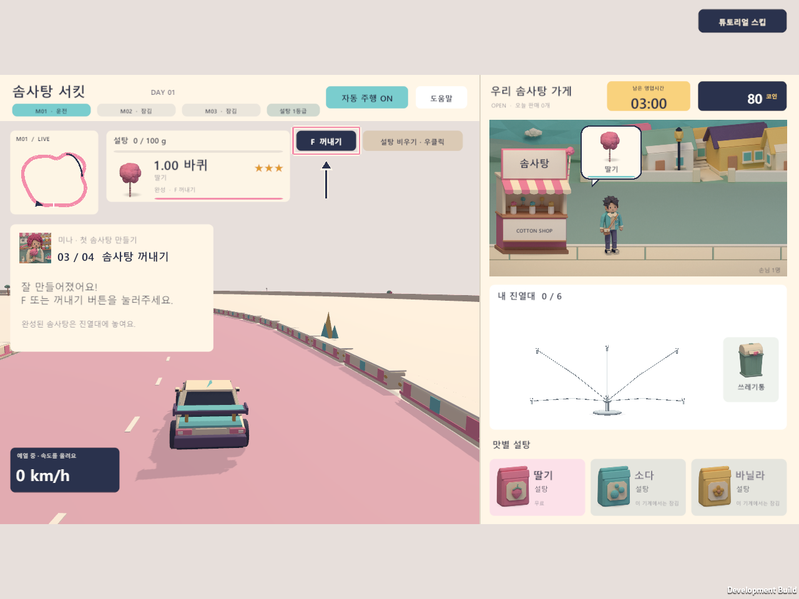
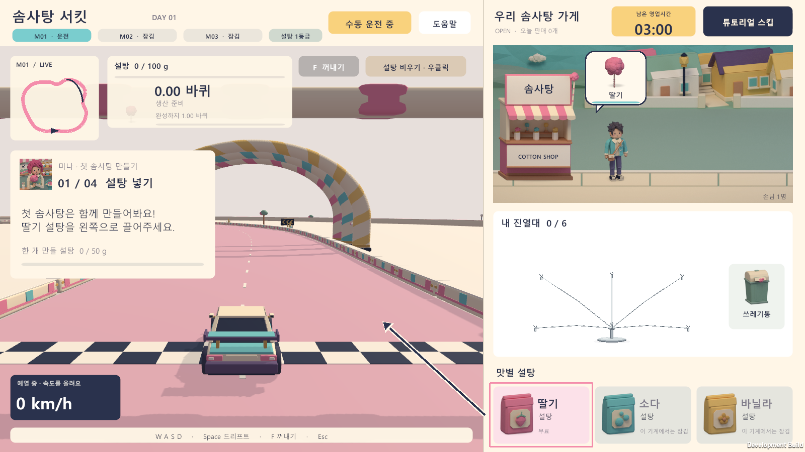
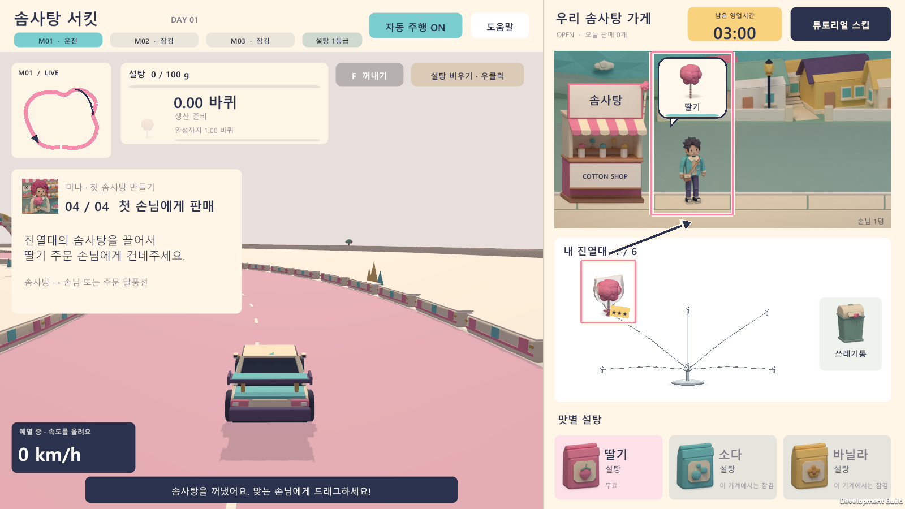
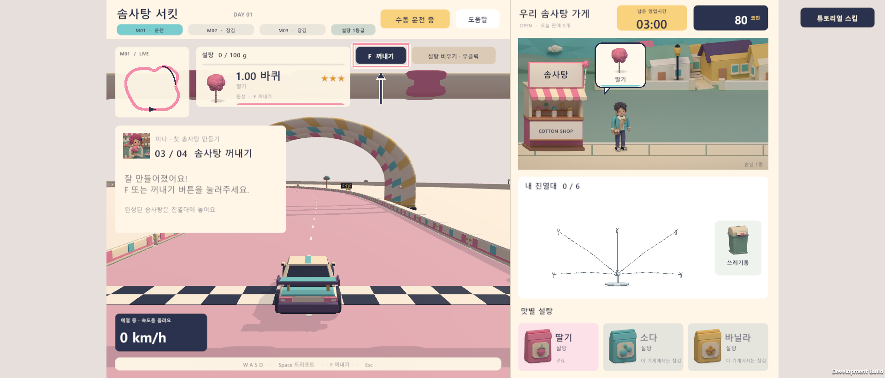
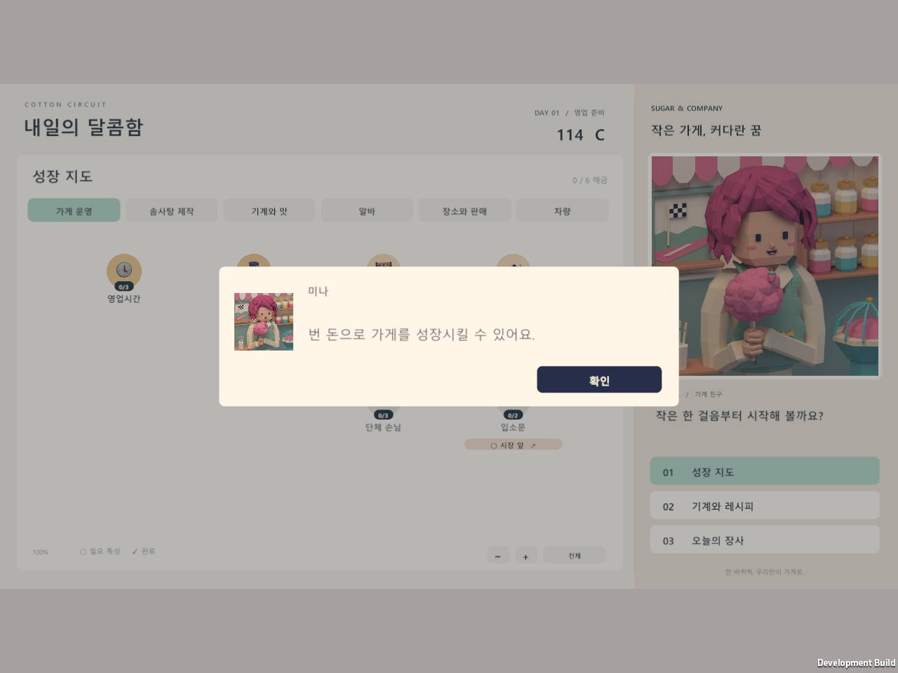

# 첫 판매 튜토리얼 검증

> **현재 정책 (2026-09-28):** 플레이어 자동 주행과 튜토리얼 자동 주행 도움은 제거했다. 알바가 없는 기계와 튜토리얼은 직접 운전하며, 고용하고 배치한 알바만 자기 기계를 자동으로 운전·제작한다. 알바 기계를 선택해도 작업은 계속된다. 아래 자동 도움·수동 전환 관련 수치, 명령, 캡처는 변경 전의 역사적 검증 기록이다. 현재 정책의 검증은 [알바 주행 검증](worker-driving-verification.md)을 따른다.

2026-09-27, Unity 6000.5.3f1 Windows 플레이어 기준. 실행 파일은 `Builds/Tutorial-Release/CottonCircuit.exe`이며 같은 폴더의 Data와 DLL도 필요하다.

## 2026-09-28 주행 조작과 시야 수정 (이전 정책 기록)

자동 운전 중 가속·좌우 조향·제동·드리프트·부스터 입력이 들어오면, 자동 입력을 계산하기 전에 수동 운전으로 전환한다. 같은 프레임부터 입력이 차에 전달되고, 키를 놓아도 자동 운전이 다시 켜지지 않는다. 상단 버튼으로 명시적으로 자동 운전을 다시 켤 수 있다. 일시정지·영업 종료·쓰기 불가·튜토리얼의 다른 단계에서는 이 전환을 실행하지 않는다.

주행 단계의 미나 안내창은 정지한 출발 전에는 보이지만, 차가 실제로 움직이기 시작하면 숨겨진다. 잠깐 정지하거나 일시정지해도 같은 주행 단계에서는 다시 나타나지 않는다. 솜사탕이 완성돼 꺼내기 단계가 되면 다음 안내가 나타난다. 오른쪽 위 스킵과 상단 운전 전환 버튼은 계속 접근할 수 있다.

기존 코드에서 수동 입력이 자동 입력으로 덮어써지는 실패(`Driving-red-control`, 55번째 검사)와 주행 중 안내창이 보이는 실패(`Driving-red-view`, 72번째 검사)를 각각 재현한 뒤 수정했다. 최종 개발 빌드의 결과는 다음과 같다.

| 검사 | 해상도 | 통과 수 | 결과 폴더 |
|---|---:|---:|---|
| 튜토리얼·일반 영업의 수동 입력 우선과 자동 재개 방지 | 1920×820 | 116 | `Logs/Driving-final-control` |
| 기존 연속 제작 모드의 수동 입력 우선 | 1280×720 | 36 | `Logs/Driving-final-legacy` |
| 수동·자동 출발, 이동·정지 시 팝업 숨김, 버튼 접근, 꺼내기 안내 복원 | 1280×960 | 250 | `Logs/Driving-final-view` |
| 첫 판매 전체 과정과 첫날 정산 문구의 일회성 유지 | 1600×900 | 238 | `Logs/Driving-final-hint` |

기존 성장·영업 런타임 434개도 `Logs/Driving-progression`에서 통과했다. 입력 검사는 실제 GameController.Tick과 운전 모델을 실행하며, 클릭은 실제 UI의 EventSystem을 통과한다. 물리 키보드 입력 자체를 자동화한 검사는 아니다. 초기 빌드는 시스템 메모리 부족과 Burst 컴파일 정체를 겪어 재현용 빌드에서만 프로세스 환경 변수 `UNITY_BURST_DISABLE_COMPILATION=1`을 임시 사용했다. 최종 개발 빌드는 해당 우회 없이 기본 설정으로 성공했고, 위 네 검사는 그 빌드로 실행했다.

```powershell
./Tools/build.ps1 -BuildFolder Builds/Tutorial
./Tools/verify-tutorial.ps1 -BuildFolder Builds/Tutorial -Case drive-control -OutputFolder Logs/Driving-final-control -Width 1920 -Height 820
./Tools/verify-tutorial.ps1 -BuildFolder Builds/Tutorial -Case drive-legacy -OutputFolder Logs/Driving-final-legacy -Width 1280 -Height 720
./Tools/verify-tutorial.ps1 -BuildFolder Builds/Tutorial -Case drive-view -OutputFolder Logs/Driving-final-view -Width 1280 -Height 960
./Tools/verify-tutorial.ps1 -BuildFolder Builds/Tutorial -Case hint -OutputFolder Logs/Driving-final-hint -Width 1600 -Height 900
```





최종 `Builds/Tutorial-Release`도 기본 설정으로 다시 빌드했다. 에디터 통합 검사 102개와 `COTTON_RELEASE_SUCCESS`를 확인했으며 실행 파일에 두 수정을 포함한다.

## 적용한 흐름

새 게임에서 스토리를 끝내거나 스킵하면 **설탕 넣기 → 직접 주행 → 꺼내기 → 첫 손님에게 판매**를 실제로 수행한다. 미나의 짧은 안내와 실제 조작 대상의 테두리·화살표를 표시한다. 최초 딸기 설탕은 솜사탕 한 개를 만들 수 있는 50g까지 넣으며, W로 가속하고 A/D로 조향해 직접 만든다. 튜토리얼에는 자동 주행 도움이나 운전 전환 버튼이 없다. 주행 안내는 출발 후 숨겨지고, 솜사탕을 꺼낼 단계에서 다음 안내가 나타난다.

배우는 동안 영업 시간·손님 인내심·추가 손님 도착 시간은 멈춘다. 주행 단계에서만 차가 움직이고 솜사탕이 자란다. 미완성 꺼내기, 잘못된 판매, 설탕 비우기, 상품 버리기는 연습 재료를 잃지 않도록 막는다. 첫 판매 성공 뒤 **영업 시작**을 누르면 정상적인 첫날 영업을 계속한다.

오른쪽 위 **튜토리얼 스킵**은 스토리 스킵과 별개다. 첫 판매 전 스킵은 연습 내용을 비우고 정상적인 첫날을 시작한다. 판매 후 완료는 첫 판매 실적과 수입을 유지한다. 각 단계는 저장되며 이어하기 시 해당 안내가 복원된다. 기존 V8 저장에 없는 새 필드는 Disabled/false로 읽어 기존 플레이에는 튜토리얼을 끼워 넣지 않는다.

첫날 정산 화면에서 준비 화면으로 돌아오면 아래 문장과 **확인** 버튼만 표시한다.

> 번 돈으로 가게를 성장시킬 수 있어요.

표시한 시점에 일회성 플래그를 저장한다. 확인 전 종료해도 반복되지 않으며, 둘째 날 이후에는 나타나지 않는다. 구매 유도나 추가 성장 안내 단계는 없다.

## 실행 검증

최종 개발 빌드 `Builds/Tutorial`에서 아래 시나리오가 모두 PASSED였다. 각 실행은 GUID가 다른 별도 저장 폴더를 사용한다.

| 시나리오 | 해상도 | 검사 수 | 결과 폴더 |
|---|---:|---:|---|
| 실제 설탕 드래그·주행·꺼내기·판매·완료 | 1600×900 | 200 | `Logs/Tutorial-final-full` |
| 첫날 정산 문구·닫기·재실행·둘째 날·기존 저장 | 1280×960 | 238 | `Logs/Tutorial-final-hint` |
| 연습의 다섯 단계 저장·불러오기·완료 후 재실행 | 1920×820 | 212 | `Logs/Tutorial-final-resume` |
| 다섯 단계의 스킵 또는 완료와 정상 영업 복귀 | 1280×720 | 581 | `Logs/Tutorial-final-skip` |
| 새 게임 → 스토리 전체 → 튜토리얼 | 1600×900 | 357 | `Logs/Tutorial-title-fresh` |
| 기존 저장 새 게임 확인·취소 → 스토리 중 스킵 → 튜토리얼 | 1280×960 | 314 | `Logs/Tutorial-title-reset` |
| 기존 저장 이어하기 | 1280×720 | 95 | `Logs/Tutorial-title-saved` |
| 손상 저장 이어하기·쓰기 보호 | 1920×820 | 94 | `Logs/Tutorial-title-corrupt` |

별도 코어 검사도 통과했다: 튜토리얼 13개, 영업 46개, 성장 458개, 성장 저장 20개. 저장 왕복, 시간 정지, 단계별 보호, 스킵, 잘못된 단계 거부, 새 필드 없는 기존 V8 저장을 포함한다. 기존 성장·영업 런타임 434개도 `Logs/Tutorial-progression`에서 통과했다. 에디터 통합 검사 102개와 Development/Release 빌드가 성공했다.

구현 전 코어 검사는 튜토리얼을 시작할 수 없다는 실패를 확인했고, 런타임 검사는 `Logs/Tutorial-red/result.txt`에서 `new-game opt-in starts the sugar tutorial` 실패를 확인했다. 코드 검토에서 조기 꺼내기 메시지를 보완했고, 화면 확인 후 튜토리얼 중 알림을 아래로 옮겨 미나 안내와 겹치지 않게 했다.

## 검사 범위

런타임 검사는 실제 UI의 EventSystem 드래그·레이캐스트·Submit과 GameController의 Tick을 사용한다. 설탕 흔들기와 상품 전달은 실제 핸들러를 통과하며, 주행은 수동 전진과 실제 자동 주행 모델을 실행한다. OS 키보드의 물리 키 입력을 자동화한 검사는 아니다.

화면 경계, 글자 높이, 조작 대상 접근, 일시정지 시 안내 숨김, 모달 포커스 복원, 픽셀 렌더링과 해상도를 검사한다. 16:9·4:3·가로로 긴 화면의 실제 캡처를 확인했다. 테스트에서는 숨김 D3D12 창의 검은 프레임을 방지하기 위해 목표보다 16px 넓게 시작하고, 빠르게 진행한 주행 후 캡처 전에 카메라가 따라올 시간을 준다. 이러한 조정은 테스트에만 들어간다.

## 실행 명령

```powershell
./Tools/test-tutorial.ps1
./Tools/test-shop-shift.ps1
./Tools/test-progression-shift.ps1
./Tools/test-progression-save.ps1
./Tools/build.ps1 -BuildFolder Builds/Tutorial
./Tools/verify-tutorial.ps1 -BuildFolder Builds/Tutorial -Case full -OutputFolder Logs/Tutorial-final-full -Width 1600 -Height 900
./Tools/verify-tutorial.ps1 -BuildFolder Builds/Tutorial -Case hint -OutputFolder Logs/Tutorial-final-hint -Width 1280 -Height 960
./Tools/verify-tutorial.ps1 -BuildFolder Builds/Tutorial -Case resume -OutputFolder Logs/Tutorial-final-resume -Width 1920 -Height 820
./Tools/verify-tutorial.ps1 -BuildFolder Builds/Tutorial -Case skip -OutputFolder Logs/Tutorial-final-skip -Width 1280 -Height 720
./Tools/verify-title.ps1 -BuildFolder Builds/Tutorial -Case fresh -OutputFolder Logs/Tutorial-title-fresh -Width 1600 -Height 900
./Tools/verify-title.ps1 -BuildFolder Builds/Tutorial -Case reset -OutputFolder Logs/Tutorial-title-reset -Width 1280 -Height 960 -IntroSkipAt 3
./Tools/verify-title.ps1 -BuildFolder Builds/Tutorial -Case saved -OutputFolder Logs/Tutorial-title-saved -Width 1280 -Height 720
./Tools/verify-title.ps1 -BuildFolder Builds/Tutorial -Case corrupt -OutputFolder Logs/Tutorial-title-corrupt -Width 1920 -Height 820
./Tools/verify-progression.ps1 -BuildFolder Builds/Tutorial -OutputFolder Logs/Tutorial-progression
./Tools/build.ps1 -Release -BuildFolder Builds/Tutorial-Release
```

## 화면








