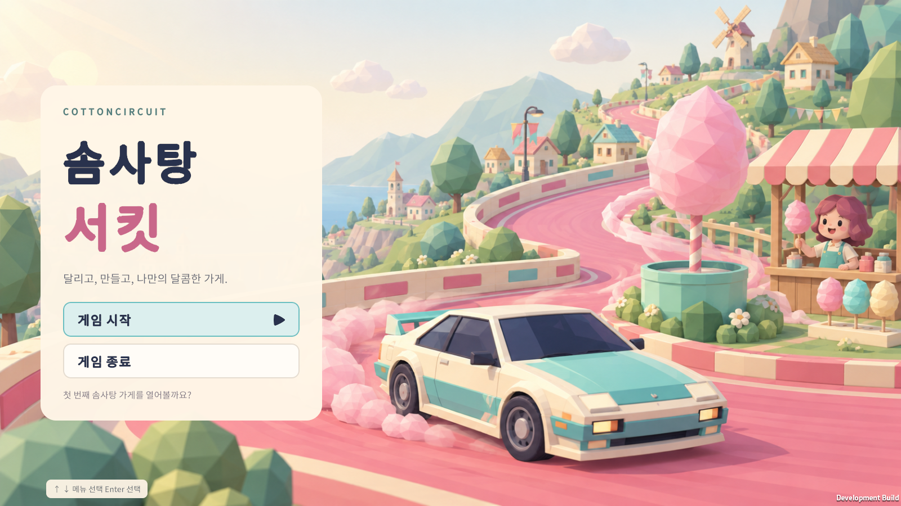
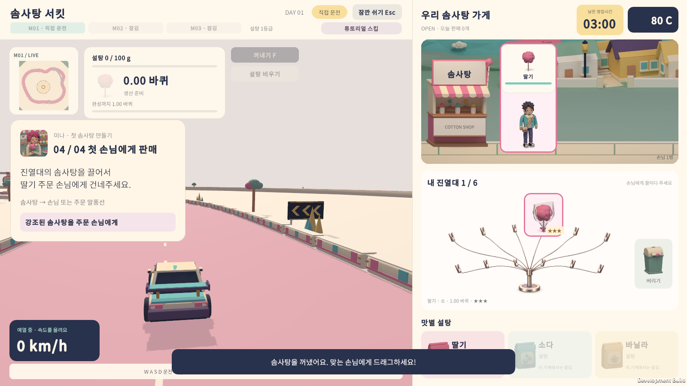
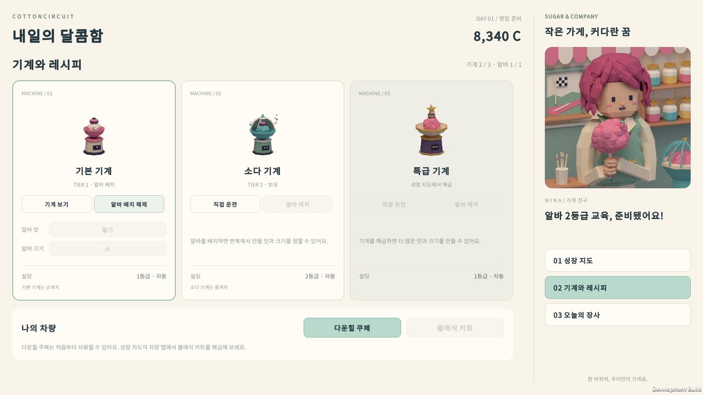
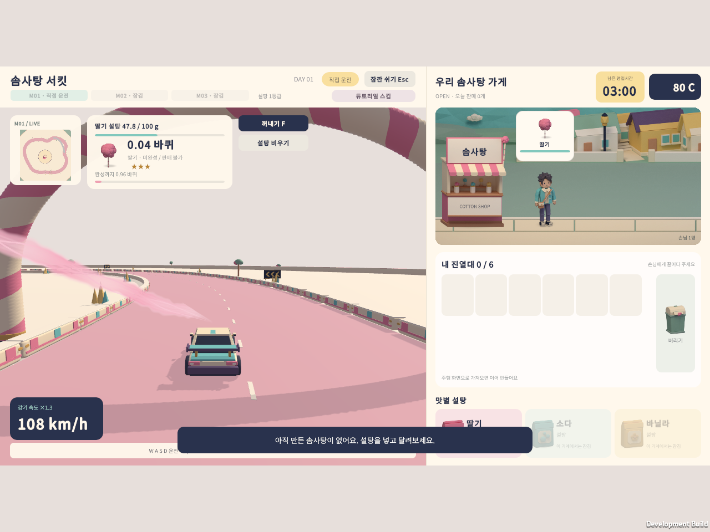

# UI Toolkit 전환 검증

사용자 요청에 따라 기존 런타임 화면을 UI Toolkit으로 교체했다. 타이틀·새 게임 확인·스토리·튜토리얼·영업·진열대·주문·정산·성장·기계/레시피·지역·일시정지와 이전 게임 모드가 모두 `Assets/Resources/UI/`의 UXML/USS를 사용한다.

## 구현 범위

- UI Builder에서 편집할 수 있는 문서와 스타일에 화면 구조를 저장한다. C#은 문서 로드, 데이터, 이벤트, 표시 상태만 연결한다.
- 기존 Canvas 조립 코드와 말풍선·강조선·화살표·진열대·성장 지도·미니맵 등을 직접 그리던 커스텀 UI 렌더러를 삭제했다.
- 주문은 둥근 카드, 튜토리얼 대상은 스타일로 강조한다. 성장 지도는 처음에 탭별 특성 카드와 스크롤로 전환했으며, 이후 UXML/USS로 작성한 트리 그래프로 복원했다([성장 지도 그래프 검증](upgrade-graph-verification.md)).
- 미니맵은 실제 3D 코스를 카메라로 촬영한다. 도로·자동차·솜사탕·실의 3D 게임 렌더링은 유지한다.
- Kenney CC0 아이콘과 OFL 한글 글꼴의 출처·라이선스는 `Assets/CottonCircuit/UI/THIRD-PARTY.md`에 기록했다.

## 검증 방식

`Tools/verify-uitk.ps1`은 개발 빌드에서 실제 UITK 패널의 hit testing과 포인터 이벤트를 통해 버튼·설탕 흔들기·제품 드래그를 검사한다. 운영체제 마우스를 자동 조작하는 검사는 아니며, 운전은 개발 빌드 전용 테스트 입력으로 진행한다. 저장은 실행별 임시 폴더를 사용한다.

전체 흐름은 새 게임의 여섯 대사, 첫 판매 튜토리얼, 출발 후 팝업 숨김, 일시정지→타이틀→이어하기, 첫날 성장 안내 한 번, 특성 구매, 알바 배치·레시피, 다음 날, 선택/비선택 알바 생산, 무인 기계 수동 운전, 스토리/튜토리얼 스킵, 이전 게임 모드를 포함한다.

## 최종 검증 결과 · 2026-09-28

| 검사 | 결과 | 기록 |
|---|---|---|
| 영업/성장 핵심 로직 | 490 통과 / 0 실패 | `Tools/test-progression-shift.ps1` |
| 튜토리얼 핵심 로직 | 13 통과 / 0 실패 | `Tools/test-tutorial.ps1` |
| 성장/저장 핵심 로직 | 21 통과 / 0 실패 | `Tools/test-progression-save.ps1` |
| UITK 전체 흐름 · 1600×900 | 445 통과 / 0 실패 | `Logs/UIToolkit-final/result.txt` |
| UITK 전체 흐름 · 1920×820 | 445 통과 / 0 실패 | `Logs/UIToolkit-wide/result.txt` |
| UITK 전체 흐름 · 1280×960 | 445 통과 / 0 실패 | `Logs/UIToolkit-4x3/result.txt` |
| Unity 개발 빌드 | 성공 · 종료 코드 0 | `Logs/uitk-development-build.log` |
| Windows 배포 빌드 | 성공 · 종료 코드 0 | `Logs/uitk-release-build.log` |

배포 파일은 `Builds/Tutorial-Release/CottonCircuit.exe`이며 같은 폴더의 데이터와 DLL을 함께 사용한다. 빌드 기록은 `build-info.json`에 남겼다. Unity 6000.5.3f1에서 빌드했다. 이 전환 검증 이후 노점 사진을 참고한 진열대 재구성이 적용되었으며, 최신 화면·검증·빌드 정보는 [진열대 검증 기록](bouquet-rack-verification.md)에 기록한다.

한글은 실제 Regular 굵기의 Noto Sans KR을 사용하며 빌드에서 `COTTON_UI_FONT_REGULAR=True`를 확인했다. 스크롤 휠 입력·영역 밖 hit testing 차단, 스킵 버튼의 전용 공간과 시계/지갑 비겹침, 음소거, 성장 안내 중 뒤쪽 준비 화면의 키보드 접근 차단과 확인 후 복구도 검사했다. 화면 배율에 따른 기본 UITK 픽셀 반올림은 위치 검사에서 실제 2픽셀까지 허용한다.

최종 코드 리뷰에서 발견한 성장 안내의 키보드 접근 문제를 수정했으며, 재검사에서 관련 회귀 검사를 포함한 전체 흐름이 통과했다. 소스 검색과 런타임 검사에서 기존 Canvas와 커스텀 UI 메시 렌더러가 남아 있지 않음을 확인했다.

## 실제 화면 캡처

이전 `title-screen-verification.md`, `tutorial-verification.md` 등의 캡처와 개수는 당시 uGUI 버전의 기록이다. 현재 UI 검증에는 이 문서와 최신 `Logs/UIToolkit-*` 결과를 사용한다.
