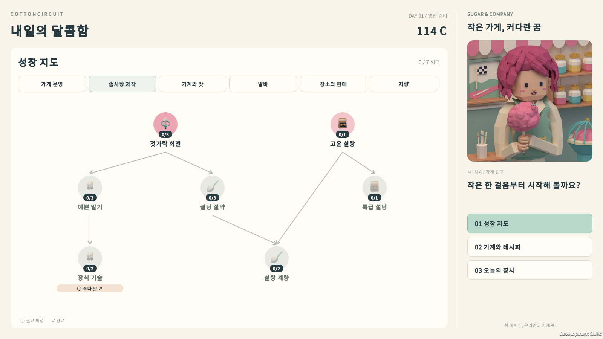
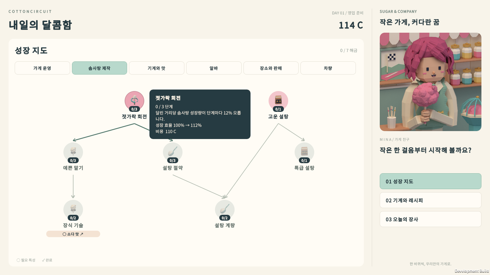
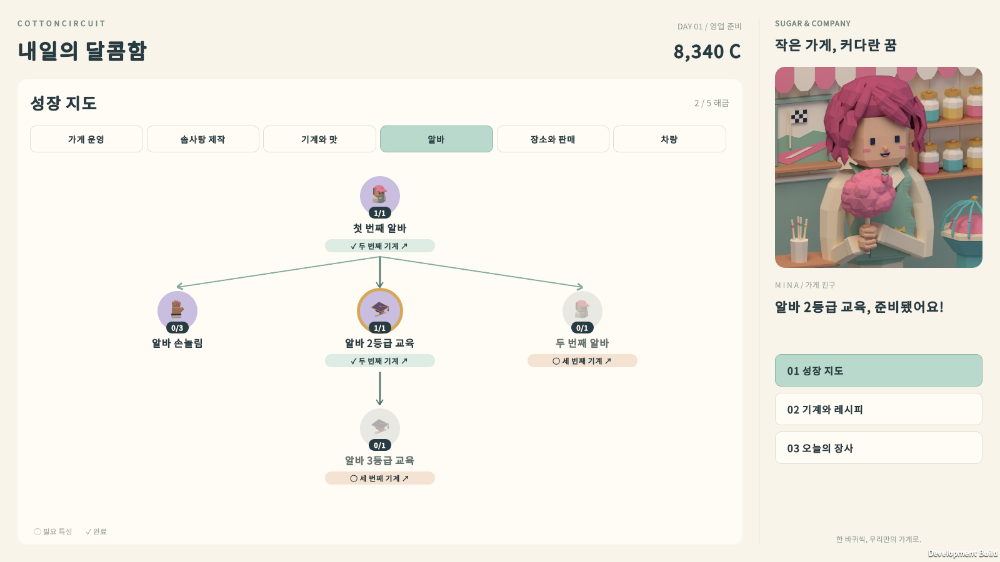
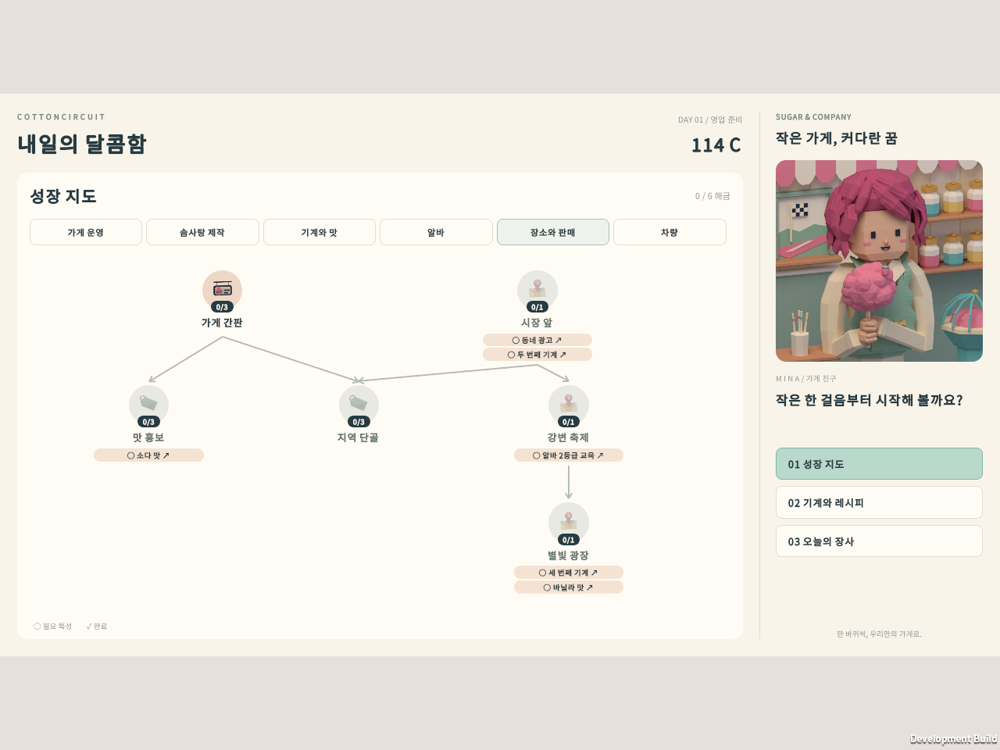

# 성장 지도 그래프 복원 · 2026-09-29

UI Toolkit 전환 때 카드 목록으로 바뀐 성장 지도를 이전 uGUI 버전과 같은 탭별 트리 그래프로 되돌렸다. 사용자 요청에 따라 확대/축소 버튼(− + 전체)은 넣지 않았다. PanelSettings가 1600×900 Expand 모드여서 1048×550 지도가 어떤 해상도에서도 한 화면에 모두 들어가므로, 스크롤 없이 지도를 가운데에 고정했다.

## 구성

- 탭마다 `TraitGraph_<탭>` 안에 노드와 화살표를 둔다. 노드는 분류색 원판, 아이콘, `단계/최대` 배지, 이름으로 이루어진다.
- 원판 색은 구매함·지금 구매 가능(분류색), 선행 조건만 충족(옅은 분류색), 잠김(회색)을 구분한다. 마지막으로 구매했거나 필요 특성 칩으로 이동한 특성에는 금색 링을 두른다.
- 같은 탭의 선행 관계는 화살표로 잇는다. 선행 특성을 구매하면 화살표가 민트색이 되고, 마우스를 올린 특성과 이어진 화살표는 진하게 표시한다.
- 다른 탭의 선행 특성은 노드 아래 칩(`○ 이름 ↗` / `✓ 이름 ↗`)으로 표시한다. 칩을 누르면 해당 탭으로 이동하고 그 특성을 강조한다.
- 이전 그래프처럼 원판(링 포함 74px)만 누를 수 있고, 누르면 바로 구매한다. 원판 옆 빈 공간이나 이름을 눌러도 구매되지 않는다. 구매할 수 없는 특성은 호버·누름 효과와 클릭음이 없고 눌러도 구매되지 않는다.
- 원판이나 칩에 마우스를 올리면 설명·효과·비용·필요 특성·부족 금액을 담은 상세 팝업이 옆에 나타난다. 지도 오른쪽 특성에서는 왼쪽으로, 아래쪽 특성에서는 위로 펼쳐진다.

## UI 규칙 준수

노드 31개, 화살표 22개, 필요 특성 칩 15개는 모두 `Preparation.uxml`에 작성했고, 위치는 `UpgradeGraph.uss`의 `#이름` 선택자로 지정했다. 화살표는 얇은 요소를 USS `rotate`로 기울이고, 화살촉은 짧은 막대 두 개를 접어 만든다. C#은 요소를 만들거나 선을 그리지 않고, 상태 클래스·텍스트·팝업 위치만 바꾼다. 좌표는 `UpgradeTreeLayout`의 원판 중심 좌표를 옮긴 값이며, 런타임 검사가 두 값이 일치하는지 확인한다.

## 검증 결과

| 검사 | 결과 | 기록 |
|---|---|---|
| 성장 지도 배치(교차·겹침 없음) | 15 통과 / 0 실패 | `Tools/test-upgrade-tree-layout.ps1` |
| UITK 전체 흐름 · 1600×900 | 845 통과 / 0 실패 | `Logs/UpgradeGraph-1600/result.txt` |
| UITK 전체 흐름 · 1920×820 | 845 통과 / 0 실패 | `Logs/UpgradeGraph-wide/result.txt` |
| UITK 전체 흐름 · 1280×960 | 845 통과 / 0 실패 | `Logs/UpgradeGraph-4x3/result.txt` |
| 진열대 · 1600×900 | 849 통과 / 0 실패 | `Logs/UpgradeGraph-case-rack/result.txt` |
| 영업 HUD · 1600×900 | 82 통과 / 0 실패 | `Logs/UpgradeGraph-case-hud/result.txt` |
| 음악 반복 · 1600×900 | 11 통과 / 0 실패 | `Logs/UpgradeGraph-case-music/result.txt` |
| UITK 전체 흐름 재실행 · 1600×900 | 845 통과 / 0 실패 | `Logs/UpgradeGraph-case-full/result.txt` |
| Unity 개발 빌드 | 성공 | `Builds/UpgradeGraph/CottonCircuit.exe` |

전체 흐름의 `UpgradeGraph` 단계는 여섯 탭을 실제 버튼으로 차례로 연다. 각 탭에서 해당 지도만 보이는지, 지도 전체가 영역 안에 들어가는지 확인한다. 또 모든 원판 중심이 `UpgradeTreeLayout`과 2픽셀 이내로 일치하는지, 누를 수 있는 영역이 원판 크기인지, 이름과 칩이 화살표 시작점보다 위에서 끝나는지, 모든 화살표의 시작점과 끝점이 부모 아래와 자식 위에 오는지 확인한다. 다른 탭의 선행 특성은 칩으로 존재해야 한다. 이어서 잠긴 원판이 회색이고 조건을 충족한 원판은 분류색인지, 구매할 수 없는 특성 클릭이 구매와 클릭음을 만들지 않는지 검사한다. 또 호버하면 상세 팝업과 화살표 강조가 나타나고 벗어나면 사라지는지, 왼쪽 위와 오른쪽 아래 특성에서 팝업이 지도 안쪽으로 펼쳐지는지, 칩이 해당 탭으로 이동해 선행 특성을 강조하는지 검사한다. 구매 뒤에는 화살표와 칩이 완료 색으로 바뀌는지 확인한다.

검증 중 테스트 창 위에 실제 마우스 커서가 있으면 결과가 흔들렸다. 튜토리얼 설탕 드래그 검사와 새 팝업 위치 검사가 해상도를 바꿔 가며 실패했다. UI Toolkit의 기본 이벤트 시스템이 실제 커서 이동을 패널에 전달해, 잡고 있는 설탕 봉지를 움직이거나 호버를 끝냈기 때문이다. 그래서 스모크 실행기가 입력 모듈 없는 `EventSystem`을 추가하도록 했다. 이 컴포넌트가 UI Toolkit 입력을 넘겨받으므로 실제 커서는 무시되고, 테스트의 합성 포인터 이벤트는 그대로 실제 패널을 거친다. 이 변경 뒤 세 해상도와 `rack`·`hud`·`music` 검사가 모두 통과했다. 빌드 도중 두 번은 다른 프로그램 때문에 시스템 가상 메모리가 부족해서 Unity가 종료되었다.

## 실제 화면 캡처

