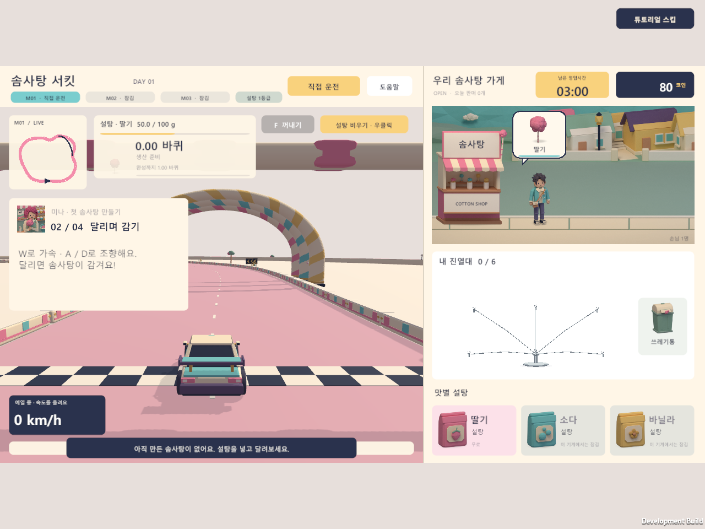
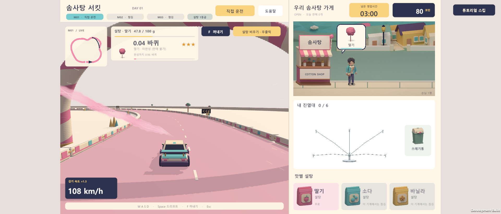
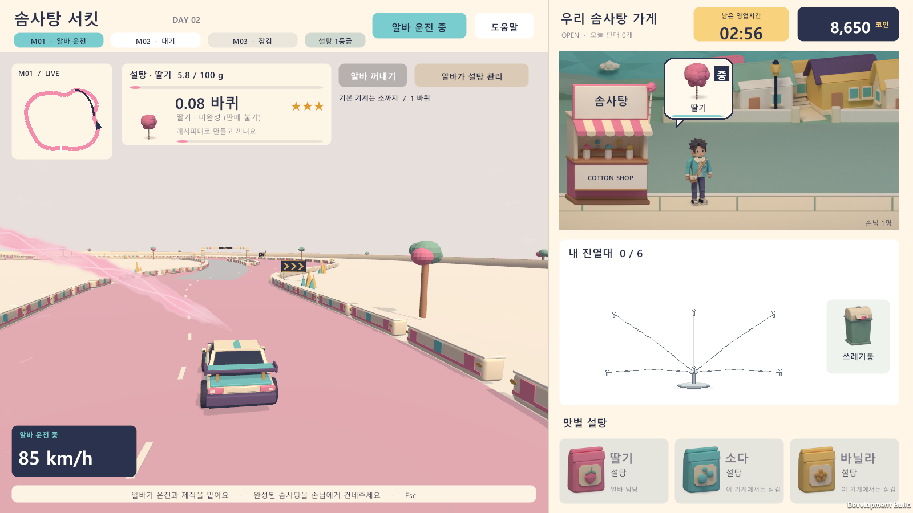
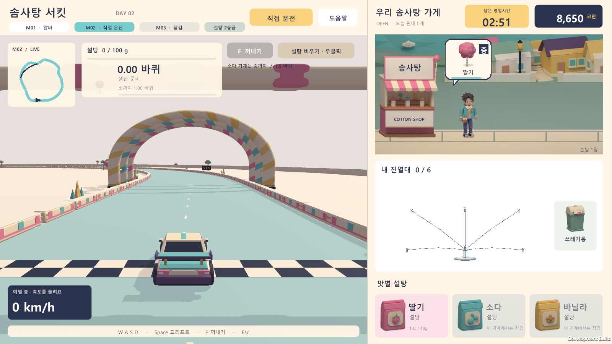

# 알바 전용 자동 주행 검증

2026-09-28, Unity 6000.5.3f1 Windows 기준. 현재 배포 실행 파일은 `Builds/Tutorial-Release/CottonCircuit.exe`이며 같은 폴더의 Data와 DLL도 필요하다.

## 적용한 동작

- 플레이어 자동 주행 상태와 전환 API, 상단 전환 버튼, 튜토리얼의 ‘자동 주행 도움’을 제거했다. 튜토리얼과 알바 없는 기계는 직접 운전한다.
- 실제 고용 인원과 교육 조건에 맞게 알바가 배치된 기계만 자동 운전·제작한다. 고용만 하고 배치하지 않은 기계는 자동으로 움직이지 않는다.
- 알바 기계를 선택해서 보고 있어도 작업을 계속한다. 선택 여부와 관계없이 같은 생산 속도와 재료 비용을 사용하며, 화면 속 자동차의 이동 거리로 생산량을 중복 가산하지 않는다.
- 알바 기계의 수동 운전·설탕 투입·비우기·꺼내기·재제작은 차단한다. 다른 기계 보기와 완성품 판매는 가능하다.
- 진열대가 가득 차거나 재료 비용이 부족하면 알바는 기다린다. 이미 지불한 설탕으로 작업을 이어갈 수 있으며, 일시정지·영업 종료·튜토리얼 중에는 자동 작업하지 않는다.
- 주행을 시작하면 튜토리얼 팝업이 숨겨지고, 잠시 정지해도 다시 나타나지 않는다. 완성 후 꺼내기 단계에서 다음 안내가 나타난다. 첫날 정산 후 ‘번 돈으로 가게를 성장시킬 수 있어요.’는 한 번만 표시한다.

기존에는 플레이어 자동 주행 입력 경로가 별도로 있었고, 알바 생산 루프는 선택 중인 기계를 제외했다. 해당 플레이어 경로를 삭제하고 알바 생산을 선택 여부와 분리했다. `AutoDrive.Input`의 제품 코드 호출은 알바 배치와 작업 가능 여부를 확인하는 `ShiftController` 경로에만 남겼다.

## 확인 결과

선택 중인 알바가 직접 조작 없이 생산해야 한다는 코어 검사의 실패를 먼저 확인한 뒤 수정했다. 최종 코어 검사는 영업·알바 490개, 저장 21개, 튜토리얼 13개를 통과했다. 저장 검사에는 V8 저장 복원 후 선택 중인 알바의 생산 지속이 포함된다.

최종 개발 빌드 `Builds/WorkerDriving`에서 다음 런타임 검사를 통과했다.

| 시나리오 | 통과 수 | 결과 폴더 |
|---|---:|---|
| 고용·배치 조건, 선택/비선택 기계 생산, 수동 조작 차단, 재료·진열대 대기와 재개 | 87 | `Logs/Worker-driving` |
| 직접 운전으로 첫 판매 완료, 첫날 정산 안내와 재표시 방지 | 228 | `Logs/Worker-tutorial-hint` |
| 자동 도움 제거, 주행·정지 중 팝업 숨김, 꺼내기 안내 복원 | 108 | `Logs/Worker-tutorial-view` |
| 성장·영업 회귀 | 379 | `Logs/Worker-progression` |
| 기존 연속 제작 모드의 수동 운전과 자동 주행 UI 제거 | 37 | `Logs/Worker-legacy-manual` |
| 영업 전체 회귀 | 3319 | `Logs/Worker-shop-regression` |
| 기존 주행·연속 제작·진열대 회귀 | 620 | `Logs/Worker-legacy-regression` |

개발 빌드와 Release 빌드는 기본 설정으로 성공했다. 최종 Release 로그는 에디터 검사 102개 통과와 `COTTON_RELEASE_SUCCESS`를 기록했다. 빌드 영수증의 UTC 시간은 `2026-09-27T16:19:31.0890302Z`다.

런타임 검사는 실제 컨트롤러와 UI를 실행하고 별도의 테스트 저장 폴더를 사용한다. 운전 구간은 개발 빌드에만 포함되는 테스트 보조 코드가 일반 수동 입력 경로에 입력을 전달한다. 이는 실제 키보드 하드웨어 입력 검사가 아니며, Release에는 테스트 보조 코드가 포함되지 않는다. 화면 검사는 1600×900, 1280×960, 1920×820, 1280×720에서 수행했다.

## 재현 명령

```powershell
./Tools/test-progression-shift.ps1
./Tools/test-progression-save.ps1
./Tools/test-tutorial.ps1
./Tools/build.ps1 -BuildFolder Builds/WorkerDriving
./Tools/verify-tutorial.ps1 -BuildFolder Builds/WorkerDriving -Case worker-driving -OutputFolder Logs/Worker-driving -Width 1600 -Height 900
./Tools/verify-tutorial.ps1 -BuildFolder Builds/WorkerDriving -Case hint -OutputFolder Logs/Worker-tutorial-hint -Width 1280 -Height 960
./Tools/verify-tutorial.ps1 -BuildFolder Builds/WorkerDriving -Case drive-view -OutputFolder Logs/Worker-tutorial-view -Width 1920 -Height 820
./Tools/verify-tutorial.ps1 -BuildFolder Builds/WorkerDriving -Case drive-legacy -OutputFolder Logs/Worker-legacy-manual -Width 1280 -Height 720
./Tools/verify-player.ps1 -BuildFolder Builds/WorkerDriving -OutputFolder Logs/Worker-shop-regression -ShopShift
./Tools/verify-player.ps1 -BuildFolder Builds/WorkerDriving -OutputFolder Logs/Worker-legacy-regression
./Tools/build.ps1 -Release -BuildFolder Builds/Tutorial-Release
```

## 실제 화면








